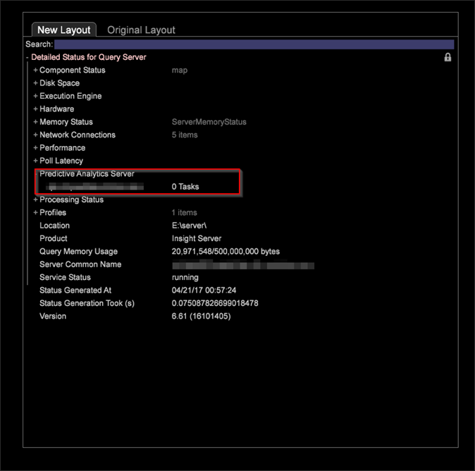

# Bezoekersclustering{#visitor-clustering}

{{eol}}

Door middel van clustering bij bezoekers kunt u klantkenmerken gebruiken om bezoekers dynamisch te categoriseren en clustersets te genereren op basis van geselecteerde gegevensinvoer. Zo kunt u groepen identificeren die vergelijkbare belangen en gedragingen hebben voor klantanalyse en -gerichtheid.

**Clusterproces**

Het clusterende proces vereist u om metriek en afmetingselementen te identificeren als input te gebruiken, en staat u toe om een specifieke doelbevolking te kiezen om deze elementen toe te passen om gespecificeerde clusters tot stand te brengen. Wanneer u het het groeperen proces in werking stelt, gebruikt het systeem metrische en afmetingsinput om aangewezen aanvankelijke centra voor het gespecificeerde aantal clusters te bepalen. Deze centra worden dan gebruikt als uitgangspunt om het K-Means algoritme toe te passen.

* De eerste centra worden op intelligente wijze gekozen via een Canopy Clustering-pas.
* Gegevensclusters worden gemaakt door elk gegevenspunt aan het dichtstbijzijnde midden te koppelen.
* Het gemiddelde van elk van de clusters van K wordt het nieuwe centrum.
* Het algoritme wordt herhaald in stap 2 en 3 tot convergentie wordt bereikt. Dit kan meerdere stappen duren.

De **[!UICONTROL Maximum Iterations]** in de **[!UICONTROL Options]** kan de analist het maximumaantal herhalingen specificeren dat door het clusterende algoritme moet worden uitgevoerd. Het instellen van deze optie kan resulteren in een snellere voltooiing van het clusteringproces op basis van het plafond voor maximale herhalingen ten koste van de exacte convergentie van de clustercentra.

>[!NOTE]
>
>Zodra de clusters zijn bepaald, kan de Dimension van de Cluster voor gebruik enkel als om het even welke andere dimensie worden bewaard. Het kan ook in de Ontdekkingsreiziger van de Cluster worden geladen om de scheiding van clustercentra te onderzoeken.

In de Bouwer van de Cluster, kunt u selecteren **[!UICONTROL Options]** > **[!UICONTROL Algorithm]** om algoritmen te selecteren bij het definiëren van clusters. Er zijn momenteel drie ondersteunde algoritmen:

* KMeans
* Kant`++`
* Maximalisatie verwachting

Er zijn twee manieren om het het groeperen proces in werking te stellen:

* Methode 1 - klik **[!UICONTROL Go]** in het venster voor clustervisualisatie.
* Methode 2 - klik **[!UICONTROL Submit]** in het venster van de clustervisualisatie, dat direct de het groeperen baan naar de Server verzendt. U kunt de vooruitgang volgen door de &quot;Gedetailleerde Status voor Vraag&quot;optie.

Het algoritme heeft de volgende beperkingen:

1. Als u Methode 1 gebruikt, kunt u om het even welke gesteunde het groeperen algoritmen selecteren.
1. Als u Methode 2 gebruikt, kunt u kiezen of de middelen++. De optie Maximalisatie verwachtingen is niet beschikbaar.

>[!NOTE]
>
>In de [!DNL DPU.cfg] bestand, wordt de waarde voor &#39;Query, Geheugenlimiet&#39; standaard ingesteld op 500 MB. Deze waarde moet worden verhoogd wanneer meerdere clusteringtaken worden uitgevoerd. Bijvoorbeeld, als u 5 het groeperen banen parallel in werking stelt, verhoog deze waarde tot 1 GB. Er is geen manier om de het groeperen baan te annuleren zonder de Server opnieuw te beginnen.

**Aanbevelingen**

Het aantal herhalingen (aantal tijden het gegeven wordt gescand) en de convergentiedrempel die u vormt, beïnvloedt grosso modo de het groeperen prestaties. In de volgende tabel vindt u een uitgebreidere richtlijn die u kunt volgen:

| Aantal clusters | Algorithm | Herhalingen | Convergentiedrempel | Normalisatie |
|---|---|---|---|---|
| 6 | Kant | 25 50 | 1e-3 | Min. max |
| 6 | Kant | 25 50 | 1e-6 | Min. max |
| 6 | Kmeans++ | 50 | 1e-6 | Min. max |
