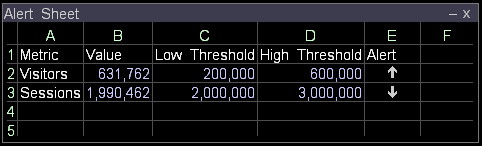

# Een metrische indicator maken{#create-a-metric-indicator}

U kunt werkbladen gebruiken om erop te wijzen dat metrisch een bepaalde drempel heeft bereikt.

Bovendien kunt u [!DNL Report] gebruiken om een rapport automatisch te produceren en te verspreiden wanneer metrisch een bepaalde drempel binnen een gespecificeerd tijdkader bereikt.

Voor meer informatie over [!DNL Report], zie *de Gids van het Rapport van de Data Workbench*.

* [Indicator omhoog of omlaag](../../../../home/c-get-started/c-analysis-vis/c-wksts/c-metric-ind.md#section-40d7a2c3df0d40d4a7bb1a7e856abcba)
* [Indicator controleren](../../../../home/c-get-started/c-analysis-vis/c-wksts/c-metric-ind.md#section-98c5298a74f34dcbaaf151549fcc7090)

**Een metrische indicator maken met behulp van een werkblad**

1. Definieer de inhoud van de cellen in het werkblad.

   1. Voer in Kolom A de naam in van de gewenste metrische waarde (bijvoorbeeld [!DNL Visitors]).
   1. Voer in Kolom B de waarde in van de gewenste metrische waarde (bijvoorbeeld [!DNL =Visitors]).
   1. In Kolom C, ga de lage drempel van metrisch in.
   1. Voer in Kolom D de hoge drempelwaarde van de meting in.
   1. Voer in kolom E een toepasselijke formule in. Zie [Indicator Omhoog of Omlaag](../../../../home/c-get-started/c-analysis-vis/c-wksts/c-metric-ind.md#section-40d7a2c3df0d40d4a7bb1a7e856abcba) of [Indicator controleren](../../../../home/c-get-started/c-analysis-vis/c-wksts/c-metric-ind.md#section-98c5298a74f34dcbaaf151549fcc7090) voor voorbeelden.
   1. Klik in de cel met formule (kolom E) met de rechtermuisknop en klik op **[!UICONTROL Format]** > **[!UICONTROL Indicator]** en klik vervolgens op een van de volgende opties:

      * **[!UICONTROL None]**: Hiermee geeft u de exacte berekening weer in plaats van een indicator.
      * **[!UICONTROL Check]**: Gebruikt een vinkje of een X om erop te wijzen dat de waarde of boven of onder de drempel is u, afhankelijk van uw formule plaatst. Zie [Indicator controleren](../../../../home/c-get-started/c-analysis-vis/c-wksts/c-metric-ind.md#section-98c5298a74f34dcbaaf151549fcc7090).
      * **[!UICONTROL Up or Down]**: Hiermee geeft u met een pijl-omhoog of -omlaag aan of de waarde onder de lage drempel (pijl-omlaag), boven de hoge drempel (pijl-omhoog) of tussen de lage en hoge drempelwaarden (leeg) ligt. Zie [Indicator Omhoog of Omlaag](../../../../home/c-get-started/c-analysis-vis/c-wksts/c-metric-ind.md#section-40d7a2c3df0d40d4a7bb1a7e856abcba).

1. Herhaal Stap 1 voor andere metriek waarvoor u indicatoren wilt creëren.

Het resulterende werkblad zou er ongeveer als volgt uitzien:

## Indicator {#section-40d7a2c3df0d40d4a7bb1a7e856abcba} omhoog of omlaag

Gebruik voor [!DNL Up] of [!DNL Down indicator] de volgende formule:

[!DNL (metric value - low threshold)/(high threshold - low threshold)*2 - 1]

Bijvoorbeeld: [!DNL =(b2-c2)/(d2-c2)*2-1]

Er zijn drie resultaten mogelijk voor elke meting wanneer deze formule wordt gebruikt met de [!DNL Up] of [!DNL Down indicator]:

* Als de metrische waarde tussen de lage en hoge drempels ligt, evalueert de formule tot een aantal tussen -1 en 1 (exclusief). De pijl-omhoog of -omlaag wordt niet weergegeven in het werkblad.
* Als de metrische waarde kleiner dan of gelijk aan de lage drempel is, evalueert de formule tot een waarde minder dan of gelijk aan -1. De metrische indicator verandert in een benedenpijl.
* Als de metrische waarde groter dan of gelijk aan de hoge drempel is, evalueert de formule tot een aantal groter dan of gelijk aan 1. De metrische indicator verandert in omhoog pijl.

In het volgende werkblad ziet u wat de voorbeeldformule [!DNL =(b2-c2)/(d2-c2)*2-1] zou weergeven:

## Indicator {#section-98c5298a74f34dcbaaf151549fcc7090} controleren

Voor [!DNL Check indicator], gebruikt u een formule die erop wijst of u wilt worden op de hoogte gebracht wanneer de metrische waarde boven of onder de drempel is u specificeert. Bijvoorbeeld:

* Als u een melding wilt ontvangen wanneer de waarde onder de ingestelde drempel ligt, kunt u de volgende notatie gebruiken:

   * [!DNL threshold - metric]

      Bijvoorbeeld: [!DNL =(c2-b2)]

* Als u een melding wilt ontvangen wanneer de waarde boven de ingestelde drempel ligt, kunt u de volgende formule gebruiken:

   * [!DNL metric - threshold]

      Bijvoorbeeld: [!DNL =(b3-c3)]

Als een vinkje wordt weergegeven, wordt de formule geëvalueerd op een positief getal. Wanneer een X wordt weergegeven, wordt de formule geëvalueerd naar een negatief getal.

Er zijn twee mogelijke resultaten voor elke metrisch wanneer het gebruiken van [!DNL Check indicator]:

* Als de formule erop wijst dat het houden van de metrische waarde boven de drempel wenselijk is, toont een vinkje wanneer de metrische waarde groter dan of gelijk aan de drempel is, en X toont wanneer de waarde minder dan de drempel is.
* Als de formule erop wijst dat het houden van de metrische waarde onder de drempel wenselijk is, toont een vinkje wanneer de metrische waarde minder dan of gelijk aan de drempel is, en X toont wanneer de waarde groter dan de drempel is.

In het volgende werkblad ziet u wat de voorbeeldformules [!DNL =(c2-b2)] en [!DNL =(b3-c3)] zouden weergeven:

