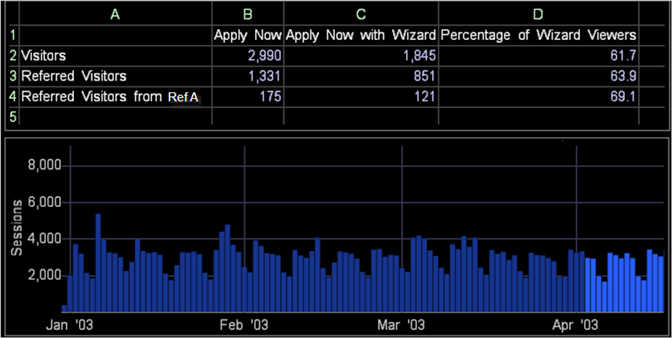

# Werkbladexpressies{#worksheet-expressions}

Conceptuele informatie over werkbladexpressies en het gebruik van celverwijzingen.

In het volgende werkblad vindt u informatie over de bezoekers die de pagina Application Wizard weergeven die wordt weergegeven op het online aanvraagformulier van de website van een bank.

* Kolom A bevat een lijst van de categorieën bezoekers die worden geëvalueerd: bezoekers, doorverwezen bezoekers en doorverwezen bezoekers van Referrer A.
* In kolom B wordt het aantal bezoekers in elke categorie weergegeven dat de pagina Nu toepassen heeft weergegeven.
* De kolom C toont die bezoekers die zowel Apply nu als de pagina&#39;s van de Tovenaar van de Toepassing bekeken.
* Kolom D bevat de percentages van Toepassen nu kijkers in de drie categorieën die ook de pagina van de Tovenaar van de Toepassing bekeken.

Het aantekenvel toont dat ongeveer 55 percent van de bezoekers van Referrer A die de Apply nu pagina ook bekeken de pagina van de Tovenaar van de Toepassing.

De volgende tabel bevat voorbeeldformules voor het werkblad in het vorige voorbeeld:

<table id="table_0F5EFDB58040465AB599E6BE93324822"> 
 <thead> 
  <tr> 
   <th colname="col1" class="entry"> Werkbladcel </th> 
   <th colname="col2" class="entry"> Formule </th> 
  </tr> 
 </thead>
 <tbody> 
  <tr> 
   <td colname="col1"> 
B2 
 
Bezoekers die de pagina Nu toepassen hebben weergegeven 
 </td> 
   <td colname="col2"> 
 =Bezoekers[pagina="/applynow/default.asp"] 
 </td> 
  </tr> 
  <tr> 
   <td colname="col1"> 
B3 
 
Verwezen bezoekers die de pagina Nu toepassen hebben bekeken 
 </td> 
   <td colname="col2"> 
 =Referred_Visitors[page="/applynow/default.asp"] 
 </td> 
  </tr> 
  <tr> 
   <td colname="col1"> 
B4 
 
Verwezen bezoekers van Referrer A die Apply nu pagina bekeken 
 </td> 
   <td colname="col2"> 
  =Referred_visitors[page="/applynow/default.asp"   
 
 AND  Referrer="Ref A"] 
 </td> 
  </tr> 
  <tr> 
   <td colname="col1"> 
C2 
 
Bezoekers die de pagina Nu toepassen en de pagina Application Wizard hebben weergegeven 
 </td> 
   <td colname="col2"> 
  =Bezoekers[pagina="/applynow/default.asp"   
 
 EN  Page="/applynow/appwizard.asp"] 
 </td> 
  </tr> 
  <tr> 
   <td colname="col1"> 
C3 
 
Verwezen Bezoekers die de pagina Nu toepassen en de pagina Wizard Toepassing hebben bekeken 
 </td> 
   <td colname="col2"> 
  =Referred_visitors[page="/applynow/default.asp"   
 
 EN  Page="/applynow/appwizard.asp"] 
 </td> 
  </tr> 
  <tr> 
   <td colname="col1"> 
C4 
 
Verwezen Bezoekers van Referrer A die Apply nu pagina en de pagina van de Tovenaar van de Toepassing bekeken 
 </td> 
   <td colname="col2"> 
  =Referred_visitors[page="/applynow/default.asp" 
 
 EN  Page="/applynow/appwizard.asp" 
 
 AND  Referrer="Ref A"] 
 </td> 
  </tr> 
  <tr> 
   <td colname="col1"> 
D2 
 
Percentage bezoekers dat de pagina Toepassen nu en de pagina van de Tovenaar van de Toepassing bekeken 
 </td> 
   <td colname="col2"> 
 =C2/B2*100 
 </td> 
  </tr> 
  <tr> 
   <td colname="col1"> 
D3 
 
Percentage van de Referred Visitors die de pagina Toepassen nu en de pagina van de Tovenaar van de Toepassing bekeken 
 </td> 
   <td colname="col2"> 
 =C3/B3*100 
 </td> 
  </tr> 
  <tr> 
   <td colname="col1"> 
D4 
 
Percentage Referred Visitors van Referrer A die Apply nu pagina en de pagina van de Tovenaar van de Toepassing bekeken 
 </td> 
   <td colname="col2"> 
 =C4/B4*100 
 </td> 
  </tr> 
 </tbody> 
</table>

Net als bij andere visualisaties worden werkbladen automatisch bijgewerkt wanneer u een selectie maakt in een andere visualisatie in de werkruimte. Zie [Selecties maken in visualisaties](../../../../home/c-get-started/c-vis/c-sel-vis/c-sel-vis.md#concept-012870ec22c7476e9afbf3b8b2515746) voor meer informatie over het maken van selecties.

In het volgende voorbeeld met webgegevens zijn verschillende dagen met sessiegegevens geselecteerd in de visualisatie Sessies by Day. Het aantekenvel toont dat tijdens het geselecteerde tijdkader, ongeveer 69 percent van de bezoekers van Referrer A die de Apply nu pagina bekeken ook de pagina van de Tovenaar van de Toepassing bekeken. Zonder deze selectie (zoals aangetoond in het bovenstaande voorbeeld), bekeken ongeveer 55 percent van de bezoekers van Referrer A de pagina nu toepassen evenals de pagina van de Tovenaar van de Toepassing.

## Celverwijzingen gebruiken {#section-0004e315c9c94d359b1a8a39794ba555}

U kunt elke tekenreeks, zelfstandig of in een andere expressie in het werkblad, vervangen door een celverwijzing.

* **Eenvoudige celverwijzing:** Cel A2 bevat de tekst Bezoekers, die als kop wordt gebruikt. Cel B2 bevat [!DNL eval(A1)], die aan [!DNL =Visitors] evalueert.

* **Referentie filtercel:** Cel A5 bevat de datum van gisteren. Cel B5 bevat [!DNL Visitors[ Day=A5 ]], die het aantal bezoekers gisteren evalueert.

* **Samengevoegde cel referentie:** cel A5 bevat de datum van vandaag en cel A6 bevat de tijdsperiode van één uur van 08:00 tot 08:59. Cel B6 bevat [!DNL Visitors[ Uur=A5+&quot;&quot;+A6 ]], die aan het aantal Bezoekers vandaag tussen 8:00 AM en 9:00 AM evalueert.
