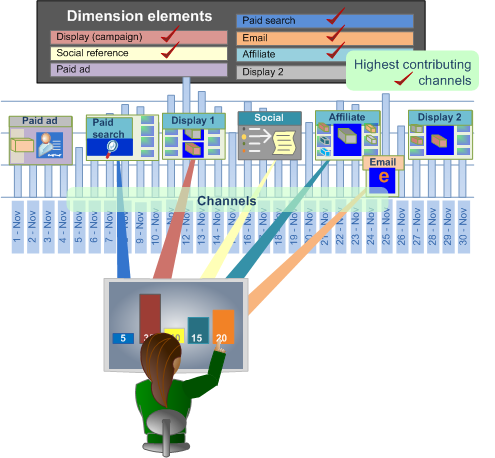

# Best Fit Attribution{#best-fit-attribution}

Best Fit Attribution is een machine-leert benadering om attributiewaarden over de verschillende kanalen van een succesvolle omzettingsgebeurtenis toe te wijzen. De Werkbank van gegevens evalueert automatisch bijdragen aan succes over een venster van tijd per kanaal, en bouwt dan een attributiemodel dat op de daadwerkelijke de interactiepatronen van uw klanten wordt gebaseerd.

**[!UICONTROL Best Fit Attribution]** laat u de interacties, of de aanrakingen vergelijken, die tot een succesvolle verkoop, e-mailaanmelding, of andere prestatiesindicatoren hebben bijgedragen. De attributieanalyse wijst automatisch gewicht aan de belangrijkste aanrakingen toe en verstrekt een toewijzingsmodel per kanaal dat op uw gegevens wordt gebaseerd en ontvankelijk aan uw markt en interne protocollen.

Bijvoorbeeld, als een klant uw plaats door een organisch onderzoek bezoekt, dan begint met een campagne, en dan ondertekent voor een e-mail, zou de op [regel-gebaseerde Attributie](/help/home/c-get-started/c-attribution-profiles/c-rules-attrib/c-rules-attrib.md) de eerste aanraking of laatste aanraking identificeren, of gelijkmatig succesattributie over alle aanrakingspunten verdelen gebruikend vooraf ingestelde attributiemodellen. Wanneer de op regels gebaseerde attributie door de gebruiker wordt bepaald, bepaalt de attributen Best Fit waarden door een algoritme door de waarschijnlijkheid van een omzetting als functie van de waargenomen aanrakingspunten te berekenen.

>[!NOTE]
>
>Om de **Beste Toewijzing** van de Geschikte in de Werkbank van Gegevens in werking te stellen, moet u uw servercertificaat ( [!DNL .pem file]) bijwerken om de Premie van de Analyse van Adobe te steunen. U moet ook **Premium** aan uw douane [!DNL Profile.cfg] voor de cliënt toevoegen en nieuwe certificaten van Adobe ClientCare voor de Server en de Server van het Rapport ontvangen.

## Basisinstallatie {#section-db597eaee462412ea7280d1426366c61}

Zie [Bouwen een Beste Passende Attributie](../../../../home/c-get-started/c-attribution-profiles/c-attrib-algorithmic/c-attrib-building.md#concept-fede6fc4f592475fa8b351b1765a522d) voor geleidelijke instructies.

**Plaats metrisch** Bepaal van het Succes metrisch het vertegenwoordigen van een succesgebeurtenis.

Metrisch van het Succes is vaak *Orden*, hoewel u de Werkbank van hefboomwerkingenGegevens kunt om een zeer gecompliceerd succes te bepalen metrisch samen met het Venster van het Succes.

**Plaats metrisch** Aanraakvlak (facultatief)

Identificeer interacties om te volgen die tot een succesvolle omzetting leidden, dan plaats metrische Aanraking waarover de attributen zullen worden berekend.

>[!NOTE]
>
>Het plaatsen van metrische Aanraking wordt slechts vereist als u het gebruikt om de Metriek van het Kanaal van belemmering af te leiden en de elementen van de Dimensie te laten vallen in plaats van het gebruiken van bestaande metriek van het Kanaal.

Als u geen metrisch hebt die voor campagnes of kanalen wordt bepaald, maar afmetingen hebben die kanalen vertegenwoordigen, kan de Beste Geschikte Attributie hen voor u bouwen automatisch gebaseerd op metrische Aanraking.

Bijvoorbeeld, met de metrische reeks van de Aanraking als *Hits*, en gegeven een dimensie genoemd het Type *van* Media met elementen die *E-mail*, de Versie *van de* Pers, de *Druk Ad***[!DNL Hits where Media Type = Email] , en  Media omvatten, zal de visualisatie de metriek van het Kanaal van de vorm produceren wanneer u sleept en de elementen op de visualisatie laat vallen.

De metrisch Touch bepaalt dan de toewijzing van toewijzingsscores om marketing interactie te identificeren die voor succes wordt beschouwd, die u toestaan om marketing te kwalificeren tochten voor de bevolking die in het venster van het Succes wordt geïdentificeerd. U kunt metrisch zoals de Meningen *van de* Pagina of de *Hits* plaatsen, of de aangepaste aanrakingsmetriek gebruiken specifiek voor uw behoeften.

In veel gevallen, zou het venster van de Aanraking het venster van het Succes moeten omvatten om een lange aanlooptijd in de verkoopcyclus te evalueren.

**Plaats metrisch de Opbrengst.**

U kunt verkiezen om opbrengst over aanrakingspunten te identificeren door aangewezen opbrengst metrisch te plaatsen. Indien gespecificeerd, zal het model de distributie van opbrengst over de inputkanalen tonen. 

U kunt opbrengst metrisch met de types van muntgegevens plaatsen om succes over alle hoogste die aanrakingspunten toe te wijzen en worden bepaald en worden geanalyseerd. Deze metrische verdeling onderverdeeld de definitieve verkoopopbrengst en wijst gebaseerd op de weging toe die door het algoritme wordt toegewezen.

**Stel het succes in en tik op Windows.**

Het venster van het Succes bepaalt de te onderzoeken bevolking en de periode voor succesvolle gebeurtenissen, die u toestaan om op de vensters van tijd en breedte van bevolking te wijzen om voor de analyse door een werkruimteselectie te overwegen. Het venster van het **Succes** bepaalt de periode en de populatie om voor succesgebeurtenissen te onderzoeken. Het venster **Touch** specificeert de historische tijdspanne om voor kanaalinteractie te onderzoeken die tot de succesgebeurtenissen leiden.

>[!NOTE]
>
>Het plaatsen van een Metrisch van de Aanraking wordt slechts vereist als u probeert om de metriek van het Succes automatisch te bouwen door afmetingselementen op de visualisatie te slepen.

U kunt een dag, maand, jaar, of om het even welk beschikbaar tijdkader plaatsen om uw evaluatie van succes te beperken en gebeurtenissen over de verkoopcyclus of voor specifiek publiek te raken dat uw plaats ingaat. Het creëren van vensters om attributie te beperken staat u toe om uw analyse op de relevante periodes van tijd voor uw specifieke behoeften te concentreren.

In veel gevallen, zult u het venster van de Aanraking willen om het venster van het Succes te omvatten om u te laten uw analyse over een lange aanlooptijd uitbreiden die op uw verkoopvenster wordt gebaseerd. Of u kunt aanrakingen van de succesgebeurtenis volgen en analyseren afzonderlijk.

**Selecteer de Kanalen.**

Wanneer het ingaan van kanalen hebt u twee keuzen.

**Voeg de Metrische Aanraking toe en voeg de Elementen van de Dimensie aan de Kanalen toe**

In veel gevallen, zult u de hoogste aanrakingspunten door afmetingselementen willen onderverdelen om specifieke kanalen te bepalen. Gebaseerd op de elementenwaarden, zal de Beste Passende Attributie automatisch de hoogste uitvoerders selecteren en hen rangschikken volgens percentage en hen tonen in een grafiekvisualisatie.

Een attributiemodel wordt gemaakt door gebruik te maken van de bezoekers die tijdens het venster Succes hebben gecommuniceerd en door de kanaalaanraakacties tijdens het aanraakvenster te bekijken, wat al dan niet heeft geleid tot een geslaagde gebeurtenis.

## Onderbrekend door Kanalen {#section-a30592b84bc84f57bd2b988824e852d4}

Wanneer u kanalen invoert, hebt u twee opties:

* Voeg een Metrische **** Aanraking toe en voeg dan de Elementen **van de** Dimensie voor de Kanalen toe.

   **of**

* Creeer metriek die filter voor de kanaalelementen die u wilt evalueren.

**Optie 1: Voeg een Metrische Aanraking toe en voeg de Elementen van de Dimensie voor Kanalen** toe.

Dat is de gemakkelijkste aanpak. Beste Geschikte Attributie leidt tot de metriek automatisch om voor attributie te evalueren. In het voorbeeld hieronder is de Metrische Aanraking ***Hits*** en de Kanalen zijn: De ***Campagnes*** van de vertoning, ***E-mailCampagnes***, en ***SEM campagnes***.

Gebruikend deze methode, leidt de Beste Geschikte Attributie tot metrisch op de achtergrond voor de evaluatie van de attributen over de kanalen (maar u ziet nooit auto-geproduceerde metrisch en zij worden niet bewaard). In het voorbeeld hieronder, worden drie metriek gecreeerd waar de Hits voor elk van de drie kanalen (b.v., de Campagnes *van de* Vertoning, *E-mailCampaigns*, en *SEM Campaigns*) wordt gefiltreerd. Dit is het gemakkelijkst omdat u de Beste Geschikte Attributie laat tot de metriek voor u leiden.

**Optie 2: Maak een metrisch**.

In de tweede optie, creeert u en bewaart de metriek voor de kanalen die u wilt evalueren door een specifiek kanaal te filtreren. Een voorbeeld van zulk metrisch wordt getoond hieronder.

Dan, in plaats van het ingaan van een Elementen van de Metrisch van de Aanraking en van de Dimensie voor de Kanalen kunt u op de menubar in de visualisatie klikken en **Ingangen** > **toevoegen Kanaal** selecteren en dan de metriek selecteren die u creeerde.

Zie het voorbeeld van de tweede hieronder methode. U kunt zien dat de resultaten van beide opties identiek zijn.
