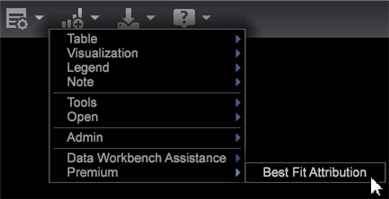

# Een passend kenmerkmodel maken{#build-a-best-fit-attribution-model}

Open kenmerk Best Fit in het menu Premium en voer de volgende stappen uit om een model voor kenmerk Best Fit te maken.

Zie een overzicht van [Best Fit Attribution](../../../../home/c-get-started/c-attribution-profiles/c-attrib-algorithmic/c-attrib-algorithmic.md#concept-237feb6e9c4d49efaf75399297dcb9d1).

1. Open **Best Fit Attribution**.

   Open een werkruimte en klik op **[!UICONTROL Premium]** > **[!UICONTROL Best Fit Attribution]**.

   

   >[!NOTE]
   >
   >De kenmerk Best Fit is een Adobe Analytics Premium-functie waarvoor u Premium in uw profiel moet inschakelen. Hiervoor moet u uw certificaat bijwerken en het Premium-profiel toevoegen aan het bestand profile.cfg. Zie [DWB-serverupgrade: 6.2 tot 6.3](https://experienceleague.adobe.com/docs/data-workbench/using/install/upgrade-dwb/c-6-2-to-6-3-upgrade.html) voor DWB 6.3.

1. Stel de metrische waarde **[!UICONTROL Success]** in.

   >[!NOTE]
   >
   >U kunt of metrisch van een **[!UICONTROL Finder]** lijst aan de linkerruit van de visualisatie van de Attributie slepen, of van &lt;a1 selecteren/>Inputs **menu.**

   Klik op **[!UICONTROL Inputs]** > **[!UICONTROL Set Success]**. Het menu Metrisch wordt geopend. 

   Selecteer metrisch die een succesvolle omzetting identificeert.

1. (facultatief) plaats **Inkomsten** metrisch.

   Plaats metrisch om opbrengst over het omzettingsproces te evalueren.

1. Stel de **Touch**-meting in.

   >[!NOTE]
   >
   >Het instellen van een aanraakmetrisch is alleen vereist als u cijfers voor succes automatisch probeert te maken door dimensie-elementen naar de visualisatie te slepen.

   Klik op het menu **[!UICONTROL Inputs]** en selecteer **Aanraking instellen** of sleep een metrische waarde uit de Finder. 

   Dit zal worden gebruikt om kanaalmetriek af te leiden wanneer de afmetingselementen als input worden gebruikt.

1. Stel een venster **Succes** in.

   Klik op [!DNL Inputs > Success Window]. Selecteer een datumbereik in een tabel en geef het venster Succes een naam. Klik **[!UICONTROL Workspace Selection]** en de geselecteerde data zullen als tijdwaaier voor metrisch Succes worden toegewezen.

   

   >[!NOTE]
   >
   >Aangezien het venster van het Succes een werkstationselectie is, kunt u om het even welke afmeting(en) aan uw venster van het Succes omvatten.

1. Stel een **[!UICONTROL Touch Window]** in.

   Klik op [!DNL Inputs > Touch Window]. Selecteer een datumbereik in een tabel en geef het venster Touch een naam. Klik **[!UICONTROL Workspace Selection]** en de geselecteerde data zullen als tijdwaaier voor metrisch Succes worden toegewezen.

   

   Standaard wordt het venster **Touch** op dezelfde periode ingesteld als het venster **[!UICONTROL Success]**.

1. (optioneel) Stel een trainingsfilter in.

   U kunt ook een **Trainingsfilter** in de werkruimte opgeven om bezoekersgegevens te filteren.

   >[!NOTE]
   >
   >Bij het instellen van zowel het venster Succes als het venster Touch kunt u het filter Training toepassen op de selecties van de huidige werkruimte om uw gegevens verder te beperken.

   

   >[!NOTE]
   >
   >De trainingsset is altijd afkomstig van bezoekers die aan het venster Succes voldoen. Door te filteren met de Filtereditor kunt u een subset bezoekers maken die in het venster Succes wordt gerapporteerd.

1. Geef kanaalmetriek op die touches vertegenwoordigen.

   Sleep metrische gegevens naar de visualisatie of kies ze in het menu [!DNL Inputs] > [!DNL Add Channel]. Als u nog geen metriek hebt die voor campagnes of kanalen wordt bepaald, maar afmetingen die kanalen vertegenwoordigen hebben, kan visualisatie hen voor u automatisch met de specificatie van metrisch van de Aanraking bouwen.

   Als bijvoorbeeld de aanraakmeting is ingesteld op [!DNL Hits] en als [!DNL dimension] is aangeroepen op [!DNL Media Type] met elementen zoals [!DNL Email], [!DNL Press Release], [!DNL Print Ad] en [!DNL Social Media], genereert de visualisatie kanaalmetriek van het formulier [!DNL Hits where Media Type = Email] wanneer u het element of de elementen naar de visualisatie sleept en neerzet.

1. Druk op **Go**.

   Het Best Fit Analysis-proces wordt uitgevoerd en een grafiek geeft de toewijzingen per kanaal weer op basis van de geselecteerde invoer.

   >[!NOTE]
   >
   >Klik met de rechtermuisknop **Model Complete** op de voltooide analyse om statistieken voor het toewijzingsmodel weer te geven.

   

Wanneer de grafiek volledig is, zal een attributiemodel tonen dat per kanaal wordt berekend, en een verdeling van *Inkomsten* metrisch (als reeks). Het model kan intern worden opgeslagen of naar andere systemen worden geëxporteerd.

>[!NOTE]
>
>**[!UICONTROL Streaming]**,  **[!UICONTROL Online]** en  **[!UICONTROL Offline]** modi hebben verschillende effecten bij het samenstellen van een toewijzingsmodel op basis van de latentie van de gegevens die worden geëvalueerd. In de streamingmodus wordt het gedetailleerde **[!UICONTROL Model Complete]**-bericht weergegeven. In de modi Online en Offline worden de details **[!UICONTROL Local Model Complete]** weergegeven.

## Menu Opties {#section-22288867f6c8483a8a38410f4b948346}

Het menu **Opties** biedt geavanceerde functies voor het instellen en weergeven van de analyse Best Fit Attribution.

<table id="table_8F6F517B7DBF4259814BEC6D07A72EAC"> 
 <thead> 
  <tr> 
   <th colname="col1" class="entry"> Menu Opties </th> 
   <th colname="col2" class="entry"> Beschrijving </th> 
  </tr>
 </thead>
 <tbody> 
  <tr> 
   <td colname="col1"> Trainingsfilter instellen   </td> 
   <td colname="col2"> Het trainingsfilter wordt samen met het venster Succes gebruikt om de populatie te filteren bij het maken van het toewijzingsmodel. Dit levert een subset gegevens op die alleen de bezoekers bevat die u wilt analyseren. 
Opmerking: Ervaren gebruikers kunnen ook gebruikmaken van de flexibiliteit van filters om zich na de tijdlijn van het venster Succes en Touch Windows te concentreren. Naast het selecteren van een tijdbereik kunt u bijvoorbeeld een set met <i>Refering Domains</i> selecteren om alleen de toewijzing voor gebruikers uit die domeinen te bekijken. 
 </td> 
  </tr> 
  <tr> 
   <td colname="col1"> Omschrijving complex filter tonen   </td> 
   <td colname="col2"> Hiermee geeft u de filtercode weer voor Trainingsfilter, Venster Voltooien en Venster aanraken. </td> 
  </tr> 
  <tr> 
   <td colname="col1"> Model opslaan   </td> 
   <td colname="col2"> Hiermee slaat u het huidige toewijzingsmodel op voor toekomstig gebruik. </td> 
  </tr> 
  <tr> 
   <td colname="col1"> Model laden   </td> 
   <td colname="col2"> Opent een eerder opgeslagen attributiemodel. </td> 
  </tr> 
  <tr> 
   <td colname="col1"> Presentatieweergave   </td> 
   <td colname="col2"> Hiermee verbergt u de bovenste menubalk voor de presentatie. </td> 
  </tr> 
  <tr> 
   <td colname="col1"> 
<b>Opties &gt; </b> Geavanceerd bevat functies waarmee u de omvang van de trainingsset kunt instellen en de aanpak kunt opgeven die moet worden gevolgd bij een onbalans tussen klassen. 
 </td> 
   <td colname="col2"> </td> 
  </tr> 
  <tr> 
   <td colname="col1"> Geavanceerd &gt; Formaat trainingsset   </td> 
   <td colname="col2"> 
Hiermee stelt u de grootte van de trainingsset in. 
 
Opmerking:  De standaardtrainingsgrootte is Groot voor 250.000 bezoekers. 
 
    <ul id="ul_5F17C60227C34A85A2C476A32F2B5DCD"> 
     <li id="li_A076FC2AD0214ADDBFCFD82AEA5F0880">Tiny = 50.000 </li> 
     <li id="li_17E77E01D5374068BEBC80B3AD4CCD41">Klein = 75.000 </li> 
     <li id="li_7F6B4834742A4BFCBC3DB214425B88C3">Normaal = 100,000 </li> 
     <li id="li_0BB7F791603745028CFC661EBC94D8B4">Groot = 250,00 </li> 
     <li id="li_34B60233C84F48F1BCB8040C5195411A">Groot = 500.000 </li> 
    </ul> </td> 
  </tr> 
  <tr> 
   <td colname="col1"><b>Geavanceerd &gt; Klassebalans  </b> </td> 
   <td colname="col2"> 
Identificeert en bepaalt het aantal inputverslagen voor een kwestie van de klassenonbalans te produceren die op de grootte van dataset wordt gebaseerd. 
 </td> 
  </tr> 
 </tbody> 
</table>

| Opties voor Opnieuw instellen en verwijderen | Beschrijving |
|---|---|
| **[!UICONTROL Reset Model]** | Selecteer **[!UICONTROL Reset]** in het menu **[!UICONTROL Reset Model]** om de visualisatie te wissen, maar invoermetriek te behouden. |
| **[!UICONTROL Reset All]** | Selecteer **[!UICONTROL Reset]** in het menu **[!UICONTROL Reset All]** om de visualisatie en de invoermeetgegevens te wissen. |
| **[!UICONTROL Remove]** | Klik met de rechtermuisknop op invoer en selecteer **[!UICONTROL Remove]** om de metrische waarde uit de geselecteerde invoer te wissen. |
| **[!UICONTROL Remove All]** | Klik met de rechtermuisknop op *Kanalen* en selecteer **[!UICONTROL Remove All]** om alle invoermetriek te wissen. |
