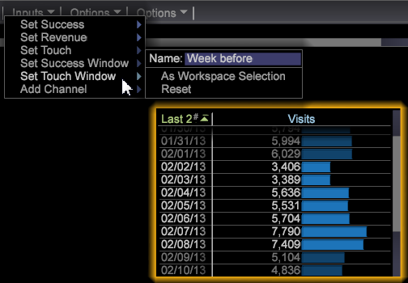

# Bouw een Model van de Attributie van het Beste Geschikte{#build-a-best-fit-attribution-model}

Open Best Fit Attribution uit het menu Premium en volg deze stappen om een model voor Best Fit Attribution te maken.

Zie een overzicht van de Attributie van de [Beste Geschikte](../../../../home/c-get-started/c-attribution-profiles/c-attrib-algorithmic/c-attrib-algorithmic.md#concept-237feb6e9c4d49efaf75399297dcb9d1).

1. Open **Best Fit Attribution**.

   Open een werkruimte en klik **[!UICONTROL Premium]** > **[!UICONTROL Best Fit Attribution]**.

   

   >[!NOTE]
   >
   >De beste Passende Attributie is een eigenschap van de Premie van de Analyse van Adobe die u vereist om Premium in uw Profiel toe te laten. U dient uw certificaat bij te werken en het Premium-profiel aan uw profiel.cfg-bestand toe te voegen. Zie [DWB-serverupgrade: 6.2 tot 6.3](https://docs.adobe.com/content/help/en/data-workbench/using/install/upgrade-dwb/c-6-2-to-6-3-upgrade.html) voor DWB 6.3.

1. Stel de **[!UICONTROL Success]** metrisch in.

   >[!NOTE]
   >
   >U kunt of metrisch van een **[!UICONTROL Finder]** lijst aan de linkerruit van de visualisatie van de Attributie slepen, of van het menu van **Ingangen** selecteren.

   Klik op **[!UICONTROL Inputs]** > **[!UICONTROL Set Success]**. Het metrische menu zal openen. 

   Selecteer metrisch die een succesvolle omzetting identificeert.

1. (facultatief) plaats metrisch de **Inkomsten** .

   Plaats metrisch om opbrengst over het omzettingsproces te evalueren.

1. Plaats metrisch de **Aanraking** .

   >[!NOTE]
   >
   >Het plaatsen van een Metrisch van de Aanraking wordt slechts vereist als u probeert om de metriek van het Succes automatisch te bouwen door afmetingselementen op de visualisatie te slepen.

   Klik het **[!UICONTROL Inputs]** menu en selecteer de **Vastgestelde Aanraking**, of sleep metrisch van de Vinder. 

   Dit zal worden gebruikt om kanaalmetriek af te leiden wanneer de afmetingselementen als input worden gebruikt.

1. Plaats een venster van het **Succes** .

   Klik op [!DNL Inputs > Success Window]. Selecteer een datumwaaier van een lijst en noem dan het venster van het Succes. Klik **[!UICONTROL Workspace Selection]** en de geselecteerde data zullen als waaier van tijd voor metrisch Succes worden toegewezen.

   

   >[!NOTE]
   >
   >Aangezien het venster Succes een werkstationselectie is, kunt u alle dimensies aan uw venster Succesvol toevoegen.

1. Stel een **[!UICONTROL Touch Window]** knop in.

   Klik op [!DNL Inputs > Touch Window]. Selecteer een datumbereik in een tabel en noem het aanraakvenster. Klik **[!UICONTROL Workspace Selection]** en de geselecteerde data zullen als waaier van tijd voor metrisch Succes worden toegewezen.

   

   Door gebrek, zal het venster van de **Aanraking** aan de zelfde tijdspanne worden geplaatst zoals het **[!UICONTROL Success]** venster.

1. (facultatief) plaats een Opleidingsfilter.

   U kunt een Filter van de **Opleiding** in de werkruimte aan de gegevens van de filterbezoeker ook specificeren.

   >[!NOTE]
   >
   >Bij het plaatsen van zowel de vensters van het Succes als van de Aanraking, kunt u de filter van de Opleiding op de huidige werkruimteselecties toepassen om uw gegevens verder te beperken.

   

   >[!NOTE]
   >
   >De trainingsset is altijd afkomstig van bezoekers die aan het venster Succes voldoen. Door het filtreren van het gebruiken van de Redacteur van de Filter, kunt u een ondergroep van bezoekers tot stand brengen die in het venster van het Succes wordt gemeld.

1. Specificeer kanaalmetriek die aanrakingen vertegenwoordigen.

   Of sleep metriek aan de visualisatie, of kies hen van het [!DNL Inputs] > [!DNL Add Channel] menu. Als u reeds geen metriek hebt die voor campagnes of kanalen wordt bepaald, maar afmetingen hebben die kanalen vertegenwoordigen, kan de visualisatie hen voor u automatisch met de specificatie van metrische Aanraking bouwen.

   Bijvoorbeeld, met de metrische Reeks van de Aanraking aan [!DNL Hits], en gegeven een [!DNL dimension] geroepen [!DNL Media Type] met elementen die dingen omvatten zoals [!DNL Email], [!DNL Press Release], [!DNL Print Ad], en [!DNL Social Media], zal de visualisatie de metriek van het Kanaal van de vorm produceren [!DNL Hits where Media Type = Email] wanneer u sleept en de elementen op de visualisatie laat vallen.

1. Druk op **Go**.

   Het proces van de Analyse van de Beste passen zal lopen, en een grafiek zal attributen per kanaal tonen die op de geselecteerde input wordt gebaseerd.

   >[!NOTE]
   >
   >Klik met de rechtermuisknop op **Model Voltooien** voor de voltooide analyse om statistieken voor het toewijzingsmodel te bekijken.

   

Wanneer volledig, zal een grafiek een attributiemodel tonen dat per kanaal wordt berekend, en een verdeling van de metrische *Opbrengst* (als reeks). Het model kan intern worden bewaard of naar andere systemen worden uitgevoerd.

>[!NOTE]
>
>**[!UICONTROL Streaming]**, **[!UICONTROL Online]** en de **[!UICONTROL Offline]** modi leiden tot verschillende effecten bij het samenstellen van een toewijzingsmodel op basis van de latentie van de te evalueren gegevens. In de Streaming-modus wordt het gedetailleerde **[!UICONTROL Model Complete]** bericht weergegeven. Op Online en Off-line wijzen, **[!UICONTROL Local Model Complete]** zal het detail tonen.

## Menu Opties {#section-22288867f6c8483a8a38410f4b948346}

Het menu **Opties** biedt geavanceerde functies voor de configuratie en weergave van de analyse van de kenmerken voor beste prestaties.

<table id="table_8F6F517B7DBF4259814BEC6D07A72EAC"> 
 <thead> 
  <tr> 
   <th colname="col1" class="entry"> Menu Opties </th> 
   <th colname="col2" class="entry"> Beschrijving </th> 
  </tr>
 </thead>
 <tbody> 
  <tr> 
   <td colname="col1"> Opleidingsfilter instellen  </td> 
   <td colname="col2"> De filter van de Opleiding wordt gebruikt met het Venster van het Succes om de bevolking te filtreren wanneer het bouw van het attributiemodel. Dit zal een ondergroep van gegevens verstrekken die slechts de bezoekers omvat die u wilt analyseren. 
Opmerking: De ervaren gebruikers kunnen hefboomwerking de flexibiliteit van filters ook om zich voorbij de tijdlijn van het Succes te concentreren en Vensters te drukken. Bijvoorbeeld, naast het selecteren van een tijdwaaier, kunt u een reeks van het <i>Verwijzen Domeinen</i> selecteren om de attributen voor gebruikers van die domeinen slechts te onderzoeken. 
 </td> 
  </tr> 
  <tr> 
   <td colname="col1"> Complexe filterbeschrijving weergeven  </td> 
   <td colname="col2"> Toont de filtercode voor de Filter van de Opleiding, het Venster van het Succes, en het Venster van de Aanraking. </td> 
  </tr> 
  <tr> 
   <td colname="col1"> Model opslaan  </td> 
   <td colname="col2"> Bewaart het huidige toewijzingsmodel voor toekomstig gebruik. </td> 
  </tr> 
  <tr> 
   <td colname="col1"> Laden model  </td> 
   <td colname="col2"> Opent een eerder opgeslagen toewijzingsmodel. </td> 
  </tr> 
  <tr> 
   <td colname="col1"> Presentatieweergave  </td> 
   <td colname="col2"> Verbergt de hoogste menubar voor presentatie. </td> 
  </tr> 
  <tr> 
   <td colname="col1"> 
<b>Opties &gt; Geavanceerd</b> omvat eigenschappen om de opleiding te plaatsen vastgestelde grootte en de benadering te specificeren om in het geval van een klassenonbalans te nemen. 
 </td> 
   <td colname="col2"> </td> 
  </tr> 
  <tr> 
   <td colname="col1"> Geavanceerd &gt; de Vastgestelde Grootte van de Opleiding  </td> 
   <td colname="col2"> 
Plaatst de opleiding vastgestelde grootte. 
 
Opmerking:  De standaard trainingsgrootte is groot voor 250.000 bezoekers. 
 
    <ul id="ul_5F17C60227C34A85A2C476A32F2B5DCD"> 
     <li id="li_A076FC2AD0214ADDBFCFD82AEA5F0880">Klein = 50.000 </li> 
     <li id="li_17E77E01D5374068BEBC80B3AD4CCD41">Klein = 75.000 </li> 
     <li id="li_7F6B4834742A4BFCBC3DB214425B88C3">Normaal = 100.000 </li> 
     <li id="li_0BB7F791603745028CFC661EBC94D8B4">Groot = 250,00 </li> 
     <li id="li_34B60233C84F48F1BCB8040C5195411A">Huge = 500.000 </li> 
    </ul> </td> 
  </tr> 
  <tr> 
   <td colname="col1"><b>Geavanceerd &gt; Klasse Balans </b> </td> 
   <td colname="col2"> 
Identificeert en bepaalt het aantal inputverslagen om voor een kwestie van de klassenonbalans te produceren die op datasetgrootte wordt gebaseerd. 
 </td> 
  </tr> 
 </tbody> 
</table>

| Opties opnieuw instellen en verwijderen | Beschrijving |
|---|---|
| **[!UICONTROL Reset Model]** | Van het **[!UICONTROL Reset]** menu, selecteer **[!UICONTROL Reset Model]** om de visualisatie te ontruimen maar inputmetriek te houden. |
| **[!UICONTROL Reset All]** | Van het **[!UICONTROL Reset]** menu, selecteer **[!UICONTROL Reset All]** om de visualisatie en de inputmetriek te ontruimen. |
| **[!UICONTROL Remove]** | Klik op om het even welke input met de rechtermuisknop aan en selecteer **[!UICONTROL Remove]** om metrisch van de geselecteerde input te ontruimen. |
| **[!UICONTROL Remove All]** | Klik op *Kanalen* met de rechtermuisknop en selecteer **[!UICONTROL Remove All]** om alle inputmetriek te ontruimen. |

