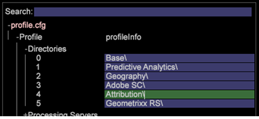

# Het instellen van het Attributieprofiel{#deploying-the-attribution-profile}

Het profiel van de Attributie is een geërft, klaar-aan-drop-in profiel. In combinatie met het de profiel en van de Analyse van Adobe SC (SC/Insight) gegeven voer, kan het profiel worden opgesteld om nieuwe attributiemodellen over digitale kanalen snel bloot te stellen.

Na het bewaren van het profiel van de Attributie aan de primaire server, zijn er twee extra stappen noodzakelijk om het in het huidige profiel binnen de [!DNL Profile] folder te integreren: (1) Opstelling het Profile.cfg- dossier, en (2) verklaar de Vereiste Gebieden.

## Profiel.cfg-bestand instellen {#section-7531cb865d994207baba692a6fc842d7}

Zoals alle profielen, moet het profiel van de Attributie aan het [!DNL profile.cfg] dossier worden toegevoegd. Omdat het profiel van de Attributie van het profiel van Adobe SC afhangt, moet het profiel van Adobe SC eerst in het configuratiedossier vóór het profiel van de Attributie worden vermeld.

>[!NOTE]
>
>Deze stappen zullen een re-transformatie van de dataset vereisen.

1. Open het [!DNL profile.cfg] bestand in de aangepaste profielmap. (Openen in [!DNL server\Profiles\(custom profile name)\profile.cfg].

1. Als het profiel van de Attributie niet vermeld in het configuratiedossier is, voeg het aan de lijst toe. 

1. Zorg ervoor het **[!UICONTROL Attribution]** koord onder het **[!UICONTROL Adobe SC]** profielkoord vermeld is.

1. Sparen het bijgewerkte [!DNL profile.cfg] dossier en sla dan het aan server van de Manager van het Profiel op.

## Het verklaren van de Vereiste Gebieden {#section-23d4273af0c34b7a85ae3430e2c9350e}

Het profiel van de Attributie neemt vooraf bepaalde gebieden en met een reeks transformaties stelt die gebieden op nieuwe en nuttige manieren door uitgebreide afmetingen bloot. Om de meest directe waarde te verstrekken hangt het profiel van de Attributie van gebieden af beschikbaar met het profiel van Adobe SC.

<table id="table_97751B73CCAA4B96BB162641A178A68A"> 
 <thead> 
  <tr> 
   <th colname="col1" class="entry"> Standaardvariabelen </th> 
   <th colname="col2" class="entry"> Veldnaam en decoderpositie (Adobe SC) </th> 
  </tr>
 </thead>
 <tbody> 
  <tr> 
   <td colname="col1"> Campagne </td> 
   <td colname="col2"> <p>x-campagne, #199 </p> </td> 
  </tr> 
  <tr> 
   <td colname="col1"> Marketingkanalen </td> 
   <td colname="col2"> <p>x-va_close_detail, #162 </p> <p>x-va_instance_event, #163 </p> </td> 
  </tr> 
  <tr> 
   <td colname="col1"> Ordergebeurtenis </td> 
   <td colname="col2"> <p>x-order, #206 </p> <p>x-aankoopaseid, #200 </p> </td> 
  </tr> 
  <tr> 
   <td colname="col1"> Ontvangsten </td> 
   <td colname="col2"> x-opbrengst, #205 </td> 
  </tr> 
  <tr> 
   <td colname="col1"> Eenheden </td> 
   <td colname="col2"> <p>x-eenheden, #204 </p> </td> 
  </tr> 
 </tbody> 
</table>

1. Verifieer dat deze gebieden in de Groep van de Decoder worden verklaard die wordt gebruikt om de gegevensbron van de Analyse van Adobe te bepalen. De standaarddecodergroep wordt verstrekt onder [!DNL Dataset\Log Procesing\Decoding Instructions.cfg].
1. Verifieer dat deze gebieden in de **[!UICONTROL Fields]** sectie van het [!DNL SC Fields.cfg] dossier worden verklaard. Dit dossier kan onder worden gevestigd [!DNL Dataset\Log Processing\SC Fields.cfg].

## Toevoegingen voor toewijzing en probleemoplossing {#section-168133a8a1a54e1281e532033878d246}

Het profiel van de Attributie voegde een configuratiedossier toe, [!DNL 0a_Marketing Channels.cfg], dat de waarde van het [!DNL x-va_closer_detail] in een nieuw geroepen gebied kopieert [!DNL x-marketing-channel], wanneer het [!DNL x-va_instance_event] gebied &quot;1&quot;aanpast. Zowel [!DNL x-va_closer_detail] als [!DNL x-va_instant_event] worden gedecodeerd door gebrek, en overgegaan van het decoderen in de geïnstalleerde pakketten beschikbaar wanneer u aan versie 6.2 bijwerkt.

Het [!DNL x-marketing-channel] gebied wordt dan gebruikt in de Eenvoudige afmeting genoemd het Kanaal van de Marketing.

>[!IMPORTANT]
>
>Als u uw profielen door eerder ongebruikte gebieden hebt veranderd te verwijderen die nu worden gebruikt, zult u willen verifiëren dat de [!DNL x-va_closer_detail] en [!DNL x-va_instance_event] gebieden worden gedecodeerd en door voor gebruik worden overgegaan.

Als velden ontbreken, krijgt u een bericht in uw gedetailleerde status:

```
<b>x-va_closer_detail</b> is not available
```

of

```
<b>x-va_instance_event</b> is not available
```

