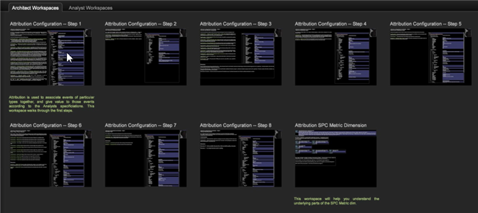

# Attributieprofiel{#attribution-profile}

Met het nieuwe op regels gebaseerde Attributieprofiel in de Data Workbench kunt u snel toewijzingsgebeurtenissen analyseren en de verantwoordelijkheid toewijzen die leidt tot een geslaagde conversie die door u is gedefinieerd. Het Attributieprofiel wordt geleverd met de informatie die nodig is om uw gegevensarchitect in staat te stellen zijn functies in te stellen en uit te breiden, en bevat vooraf gebouwde werkruimten waarmee uw analist meteen kan beginnen met analyseren.

Het profiel van de Attributie staat u toe om een nieuw perspectief op het verband tussen uw marketing inspanningen en een succesvolle productie van het klantenlood of verkoopomzetting te bereiken. Het attributieprofiel helpt u interacties te kwalificeren die toewijzing van krediet voor gerealiseerde opbrengst of participatie stroomafwaarts in de klantenreis zouden moeten ontvangen. Het helpt de gevolgen van uw marketing inspanningen en kosten identificeren door u toe te staan om attributiegebeurtenissen snel te analyseren, en dan verantwoordelijkheid voor eerste of laatste aanrakingen of andere gebeurtenissen toe te wijzen die tot een succesvolle verkoop leiden.

<!--  -->

>[!IMPORTANT]
>
>Het attributieprofiel is geconfigureerd voor onmiddellijk gebruik door gebruikers die het Adobe SC-profiel hebben geïmplementeerd dat de gegevensfeed Analytics (SC/Insight) gebruikt. Door gebrek, worden de de Marketing en gebeurtenissen van de Omzetting gebruikt als standaardtypes van interactie die in de verstrekte op regel-gebaseerde modellen worden geëvalueerd.

Zie [Het kenmerkprofiel](../../../../home/c-get-started/c-attribution-profiles/c-rules-attrib/c-attrib-profile-deploy.md#concept-fbcb5800cd6a40cc901e61f3882988c0) en [Attributiemodellen](../../../../home/c-get-started/c-attribution-profiles/c-rules-attrib/c-attrib-models.md#concept-e209c7e86a5c4008ad6d78fdf4ea032d) implementeren voor meer informatie.

## Werkruimten voor architecten en analisten {#section-27c6aff70ba147cca6e11451e127afb4}

Binnen het Attributieprofiel, hebt u de werkruimten van Architect en van de Analyst op afzonderlijke lusjes in de werkbank worden bepaald.

**Architectuurwerkruimten**

Klik op het tabblad **Attributie** om werkruimten te openen die specifiek zijn ontworpen voor het instellen van configuratiebestanden voor elementaire kenmerkmodellering.**[!UICONTROL Architect Workspace]**

Het lusje van de Architectuur omvat werkruimten om door elk van de configuratiedossiers in de omslag van de profieldataset te stappen. Met **[!UICONTROL Attribution Configuration - Step 1]** kunt u bijvoorbeeld de kenmerkwaarden identificeren in het gedeelte Transformatie van het [!DNL profile.cfg]-bestand.

**Analyst** WorkspacesKlik op het  **[!UICONTROL Analyst]** **[!UICONTROL Workspaces]** tabblad om vooraf gebouwde werkruimten te openen met behulp van de afmetingen en metriek die bij het Attributieprofiel worden geleverd.

Deze werkruimten zijn ingedeeld in vier categorieën:

1. **De basis** Rapporten maken één enkel model binnen een werkruimte op.
1. **Met vergelijkende** rapporten worden de analyses uitgebreid door meerdere modellen in één weergave te presenteren.
1. **Onderzoeksrapporten** breidt de rapportagesjablonen uit om de attributiemodellen in verschillende formaten te presenteren. In dit deel worden ook de op positie gebaseerde wegingsverhoudingen geïntroduceerd en belicht.
1. **De** Verslagen van het schilderen verstrekken zicht in de marketing van de klant met veelvoudige het kleven visualisaties om de processtromen en interactiepaden volledig te onderzoeken en uit te drukken

Het tabblad Analyse bevat werkruimten die vooraf zijn geconfigureerd met rapporten. Met **[!UICONTROL First Attribution]** kunt u bijvoorbeeld een **[!UICONTROL Campaign]**-tabel selecteren om de **[!UICONTROL Revenue]**-attributie weer te geven op basis van **[!UICONTROL Time]**.

