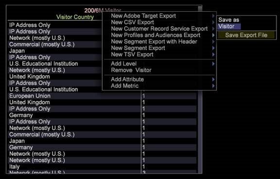

# Hoofdmarketingprofiel exporteren{#master-marketing-profile-export}

De Werkbank van gegevens laat u dossiers uitvoeren om met Profielen en Publiek als deel van een geïntegreerde Wolk van de Ervaring van Adobe te integreren.

<!-- <a id="section_731922BC8628479198A41EF3EA72F2FF"></a> -->

De profielen en het Publiek maken deel uit van de Dienst [van de Identiteit van de](https://docs.adobe.com/content/help/en/id-service/using/home.html)Ervaring Cloud, een kerndienst van de [!DNL Adobe Experience Cloud]. Met de exporteren Profielen en doelgroepen kunnen doelgroepen worden gedeeld in de cloud van de ervaring met behulp van een unieke Eenheid voor cloud-ID (EHID) die aan elke bezoeker wordt toegewezen en vervolgens wordt gebruikt door [Audience Manager](https://docs.adobe.com/content/help/en/audience-manager/user-guide/aam-home.html). De [!DNL ExportIntegration.exe] toepassing ( [!DNL E:\Server\Scripts]) wordt gebruikt om zowel MMP als de uitvoer van het Doel van Adobe te produceren.

**De FSU-server configureren om profielen en doelgroepen te gebruiken**

1. Heb toegang tot uw server van FSU.
1. Open het MMPExport.cfg- dossier. `Server/Admin/Export/MMPExport.cfg`.
1. Ga waarden op alle gebieden in zoals vereist. Bijvoorbeeld:

   >[!NOTE]
   >
   >De integratie van MMP/AAM is afhankelijk van de &#39;s-3 emmer van Amazon voor gegevensoverdracht.
   >
   >
   >De s3 informatie die voor overdracht MMP (s3) wordt vereist kan bij het team van de Manager van het Publiek worden verkregen.

   ```
   Sample MMPExport.cfg
   MMP Export Configuration = MMPExportConfiguration: 
   s3 Bucket = string: aws_bucket_for_mmp 
   s3 Object Directory = string: test/files/ 
   s3 Region = string: us-east-1 
   s3 Access Key = string: ZZKI62OO5YBA 
   s3 Secret Key = string: ioqwa3OpNE5 
   data Provider Name = string: 895 
   client ID = string: mcprofile2-test 
   client Secret = string: saea1287617212987q 
   username = string: mmptest 
   password = string: pass 
   numRecordsPerChunk = int:  
   numThreads = int:  
   maxRetriesOnSendFailure = unsigned int:
   ```

   >[!NOTE]
   >
   >Het [!DNL MMPExport.cfg]dossier laat u ook alle verslagen nemen, hen verdelen in reeksen, en tot blokken van verslagen leiden. De archieven worden vervolgens geëxporteerd naar Amazon S3. Er zijn drie verplichte parameters nodig om records te maken: [!DNL numRecordsPerChunk], [!DNL numThreads], en [!DNL maxRetriesOnSendFailure].

**Definitie van parameters**

<table id="table_DDEFBC45895A4663973F9C2EB9052FEF"> 
 <thead> 
  <tr> 
   <th colname="col1" class="entry"> Parameter </th> 
   <th colname="col2" class="entry"> Definitie </th> 
  </tr> 
 </thead>
 <tbody> 
  <tr> 
   <td colname="col1"> <i>s3 Bucket</i> </td> 
   <td colname="col2"> De emmer van AWS S3 waar de uitvoer naar wordt overgebracht. </td> 
  </tr> 
  <tr> 
   <td colname="col1"> <i>s3 objectmap</i> </td> 
   <td colname="col2"> Een weg om s3 dossiers op te slaan. Dit steunt subdirectories. <p> <p>Belangrijk:  De ruimte en de karakters van de multibyte worden niet toegestaan in de weg en zullen tot fouten in de uitvoer leiden. (Het koppelteken is toegestaan). </p> </p> </td> 
  </tr> 
  <tr> 
   <td colname="col1"> <i>s3 Regio</i> </td> 
   <td colname="col2"> Het Gebied van AWS s3 waar de uitvoer naar wordt verzonden. Ex. us-oost-1 </td> 
  </tr> 
  <tr> 
   <td colname="col1"> <i>s3 Toegangssleutel</i> </td> 
   <td colname="col2"> AWS s3-toegangssleutel </td> 
  </tr> 
  <tr> 
   <td colname="col1"> <i>s3 Geheime sleutel</i> </td> 
   <td colname="col2"> AWS s3 - Geheime sleutel </td> 
  </tr> 
  <tr> 
   <td colname="col1"> <i>Naam van gegevensleverancier</i> </td> 
   <td colname="col2"> Dit zal de omslagnaam zijn die voor het opslaan van segmenten en eigenschappen in AAM respectievelijk wordt gebruikt. Dit zou per klant uniek moeten zijn. </td> 
  </tr> 
  <tr> 
   <td colname="col1"> <i>client-id</i> </td> 
   <td colname="col2"> Dit is een unieke cliënt-identiteitskaart die aan een klant wordt verstrekt wanneer provisioned voor MMP. </td> 
  </tr> 
  <tr> 
   <td colname="col1"> <i>client geheim</i> </td> 
   <td colname="col2"> <p><i></i>Dit is een uniek cliëntgeheim dat aan een klant wordt verstrekt wanneer hij/zij provisioned voor MMP is. </p> </td> 
  </tr> 
  <tr> 
   <td colname="col1"> <i>gebruikersnaam</i> </td> 
   <td colname="col2"> MMP-gebruikersnaam </td> 
  </tr> 
  <tr> 
   <td colname="col1"> <i>wachtwoord</i> </td> 
   <td colname="col2"> MMP-wachtwoord </td> 
  </tr> 
  <tr> 
   <td colname="col1"> <i>numRecordsPerChunk</i> </td> 
   <td colname="col2"> <p>Bepaalt de brokgrootte in termen van aantal verslagen. </p> <p>De implementatie knipt de opgegeven waarde van de gebruiker op min = 1000 records&amp;nbsp;(~50 kB chunks)&amp;nbsp; en max = 5000 records (~2,5 MB chunks).&amp;nbsp;A standaardwaarde van 10000 wordt gebruikt voor het geval dat de gebruiker dit configuratiebezit niet specificeert. </p> </td> 
  </tr> 
  <tr> 
   <td colname="col1"> <i>numThreads</i> </td> 
   <td colname="col2"> <p>Bepaalt het parallellisme van de brok die deel verzendt. Het keurt een waarde tussen 1 tot 24 draden goed, en zijn standaardwaarde is 12 draden. </p> </td> 
  </tr> 
  <tr> 
   <td colname="col1"> <i>maxRetriesOnSendFailure</i> </td> 
   <td colname="col2"> <p>Bepaalt het aantal opnieuw probeert pogingen om worden gemaakt in het geval van brok verzendt mislukkingen. De standaardwaarde is 0 die geen herhalingen specificeert. </p> <p>Tussen herhalingen wordt een slaapinterval van 2 seconden gebruikt. </p> </td> 
  </tr> 
 </tbody> 
</table>

**Het produceren MMP de uitvoer van de cliënt**

1. Open vanuit de client een werkruimte en klik met de rechtermuisknop op **[!UICONTROL Tools]**> **[!UICONTROL Detail Table]**.
1. Voeg **Niveau** toe.
1. Klik de kopbal met de rechtermuisknop aan en selecteer **toevoegen Attributen**.
1. Klik de kopbal met de rechtermuisknop aan en selecteer de **Nieuwe HoofdUitvoer van het Profiel van de Marketing**. 
1. Breid **Vraag** uit.

   

1. Breid **Configuratie** MMP uit.
1. (vereist) ga de Naam **van het** Segment MMP en het Gebied **** van identiteitskaart van de Bezoeker MMP in. Deze parameters kunnen niet leeg worden gelaten.
1. De naam **van het segment** MMP zou identiteitskaart van het Segment moeten aanpassen die in MMP wordt bepaald.
1. De **identiteitskaart** van de Bezoeker MMP is de attributenkolom die in stap 4 wordt bepaald die aan identiteitskaart van de **Bezoeker beantwoordt**.
1. Zodra deze gebieden zijn ingegaan, kunt u de uitvoer bewaren door de kopbal voor de uitvoer met de rechtermuisknop aan te klikken en **sparen** als &quot;Gebruiker \.export&quot;te kiezen.
1. Open **Beheer** > **Profielbeheer** en sla de export naar het profiel op.

   Als alle gegevens correct zijn ingevoerd, wordt een exportbestand in de FSU ([!DNL Server/Exports]) gegenereerd en wordt de export naar het AWS ook doorgegeven met behulp van de informatie in [!DNL MMPExport.cfg]. Het logboek voor dit wordt verstrekt in [!DNL Server/Trace/]. bijv., [!DNL MMP-102014-133651- `<Segment Export Name>` .log]

```
Query = SegmentExportQuery: 
Command = string: ExportIntegration.exe 
Command Arguments = string: \"%file%.cfg\" \"%file%\" 
Filter = string: 
Level = string: Page View 
MMP Configuration = MMPConfiguration: 
MMP Segment Name = string: 12345 
MMP Visitor ID Field = string: Tracking ID 
Oneshot = bool: true 
Output Fields = vector: 3 items 
0 = ColumnDefinition: 
Column Name = string: 
Field Name = string: Tracking ID 
1 = ColumnDefinition: 
Column Name = string: 
Field Name = string: PID 
2 = ColumnDefinition: 
Column Name = string: 
Field Name = string: SID 
Output File = string: MMPTest.txt 
Output Format = string: %1%\t%2%\t%3%\r\n 
Schedule End Time = string: 
Schedule Every = string: 
Schedule Start Time = string: 
Time Limit (sec) = double: 1800 
```

| Configuratiegegevens | Beschrijving |
|---|---|
| ID MMP-segment | Vereist. Dit is een herkenningsteken u eerst in de Manager van het Publiek zou bepalen. |
| MMP Visitor ID-veld | Breng de ECID in kaart. |

