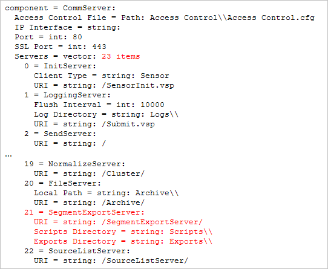

# Segmentexport{#segment-export}

U kunt een definitie van de Uitvoer van het Segment van de visualisatie van de Lijst van het Detail in de Cliënt van de Data Workbench gemakkelijk tot stand brengen.

Daarnaast worden de resultaten van [!DNL Segment Exports] automatisch gecombineerd tot één server, in plaats van dat deze gedeeltelijke resultaten opleveren voor elke DPU die u moet combineren met behulp van een extern proces. U kunt een segment tot stand brengen uitvoerdossier, het bewaren aan [!DNL Profile Manager], en het outputdossier uploaden aan een server van uw keus.

**Om de server van de segmentuitvoer te vormen**

Met de functie [!DNL Segment Export] wordt één uitvoerbestand op de exportserver van het segment gemaakt in plaats van afzonderlijke uitvoerbestanden die op elke DPU worden gemaakt. De segment de uitvoerserver wordt gewoonlijk gevormd om op FSU in werking te stellen.

Open in de directory Gegevensset\ in [!DNL Profile Manager] de [!DNL Segment Export.cfg] in Workstation en geef het adres van uw server op. (Uw adres kan een IP-adres zijn of een volledig gekwalificeerde domeinnaam.)


Dit is IP van de server die van de Data Workbench de resultaten van de segmentuitvoer ontvangt. Dit is een eenmalige installatie. Als [!DNL Segment Export.cfg] niet aanwezig is, loopt de uitvoer niet.

**Exportmappen configureren**

Voor veiligheidsdoeleinden, moeten de uitvoerbare of partijdossiers die na een segmentuitvoer lopen in de configureerbare folder van Scripts \ van de de segmentuitvoer server verblijven.

[!DNL .part] en definitieve output moet in de configureerbare folder van Uitvoer verblijven. De opdracht die moet worden uitgevoerd, bestaat in opdrachtargumenten en opdrachtargumenten. Instanties van %file% in de opdrachtargumenten worden vervangen door het pad van het uitvoerbestand.

>[!NOTE]
>
>Nieuwe Data Workbench 5.4. De map \Exports wordt automatisch gemaakt. Voor vorige exportdirectory&#39;s die waren ingesteld vóór versie 5.4 was een voorvoegsel voor Exporteren vereist vóór de bestandsnaam voor elk segment dat werd geëxporteerd. Het toevoegen van dit voorvoegsel is nu overbodig.

1. Voeg in [!DNL Communications.cfg] op de doelserver voor [!DNL Segment Exports] een SegmentExportServer toe aan de lijst met servers. (Voorbeeld weergegeven in rood).

   

   Exportmap: Geeft aan waar [!DNL .part] en uitvoerbestanden moeten worden geplaatst. Dit kan een gedeelde map zijn.

   Scriptmap: Hiermee geeft u de map op waaruit alle uitvoerbare bestanden of batchbestanden worden uitgevoerd.

1. [!DNL Access Control.cfg], op de zelfde server, voeg lees-schrijf toegang tot URI /SegmentExportServer/ aan de Cluster Servers AccessGroup toe:

   

1. Wijzig uw [!DNL .export]-bestanden:

   

1. Voor elk profiel bevindt de [!DNL Segment Export.cfg] zich in de map Dataset, met de volgende inhoud:

   ```
   Segment Export = SegmentExport:
   Segment Export Server = serverInfo:
   Port = int: 80
   Address = string: 192.168.5.128 (for example) Use SSL = bool: false
   ```

1. Zorg ervoor dat de folders die in de Folder van de Uitvoer en Folder van Manuscripten worden bedoeld bestaan.

   Alleen uitvoerbare bestanden en batchbestanden in de map Scripts kunnen worden uitgevoerd als opdracht voor het exporteren van segmenten.

**Een segmentexportbestand maken**

1. Maak in een werkruimte een detailtabel met subsets van gegevens (Visualisatie > Detailtabel) en voeg kenmerken toe.
1. Maak desgewenst selecties in de werkruimte. (Alle selecties of filters worden toegepast op het exporteren.)

   

1. Klik met de rechtermuisknop in de koptekst van de tabel Details en selecteer **[!UICONTROL Create Segment Export File]**.
1. Typ in [!DNL Save as] een naam voor het [!DNL .export]-bestand.
1. Configureer in het [!DNL .export]-bestand de parameters naar wens.

   Alle selecties of filters in de werkruimte worden opgenomen in het exportbestand.

1. Sla het [!DNL .export]-bestand op.

   Het opgeslagen bestand wordt weergegeven in de [!DNL Profile Manager] zodat u het op de server kunt opslaan. Wanneer u het bestand op de server opslaat, wordt het exporteren gestart.
