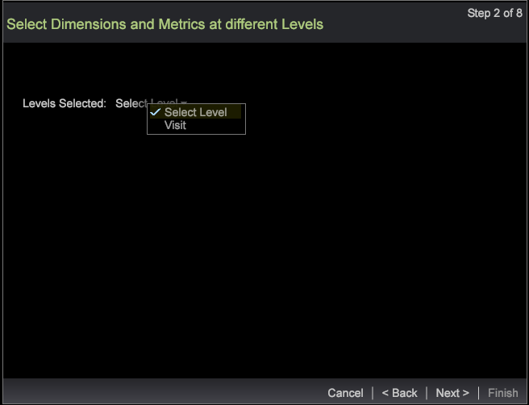

# wizard Segment exporteren{#segment-export-wizard}

Segmenten exporteren met de wizard Segment exporteren

De tovenaar van de segmentuitvoer verstrekt een geleidelijke proces om segmenten te vormen en uit te voeren eerder dan [het uitvoeren van segmenten van een detaillijst](https://experienceleague.adobe.com/docs/data-workbench/using/client/export-data/c-sgmt-expt.html).

## Segmenten exporteren met de wizard {#section-b30f2699dbc7490bad18512b91cb0cb3}

Als u de wizard wilt openen, klikt u met de rechtermuisknop in een werkruimte en selecteert u **Admin** > **Wizards** > **Wizard Segment exporteren**.

>[!NOTE]
>
>Alleen de segmenten die zijn toegepast voordat de wizard wordt geopend, worden vastgelegd. Ook, kan de segmentuitvoer die van de tovenaar wordt gecreeerd geen externe bevelen kweken.

1. Selecteer de verschillende bovenliggende niveaus van de dimensies en metriek die aan de exportbewerking moeten worden toegevoegd.

   Welke niveaus worden weergegeven, is afhankelijk van het geselecteerde profiel. U kunt meerdere dimensieniveaus selecteren op basis van het profiel.

   

1. Klik **Volgende**.
1. Selecteer de Dimension en Metriek voor de geselecteerde niveaus.

   Nadat u bijvoorbeeld Paginaweergave hebt geselecteerd als hoofdniveau, kunt u de onderliggende afmetingen en maatstaven selecteren die beschikbaar zijn om te worden geëxporteerd.

1. Klik **Volgende**.

   

   

1. Selecteer de exportindeling en voer een naam voor het exportbestand in.

   

   CSV, TSV, de Uitvoer van het Segment, en de Uitvoer van het Segment met de types van Kopbal hebben geen extra configuratie nodig. Nochtans, moeten de Profielen en de Uitvoer van het Publiek, de Dienst van het Verslag van de Douane en de Uitvoer van Adobe Target in Stap 3 worden gevormd. Zie bijvoorbeeld de configuratievelden voor de exportopties Profielen en Publiek. Configureer deze exporttypen en klik op **Next**.

   

   

   

1. Configureer het geselecteerde exporttype.

   Koptekst—Als Koptekst waar is, geeft u het veld **Uitvoerbestand** een naam.

   Escape veld—Ingesteld als **True** of **False**.

   Volgorde van velden—Selecteer een veld en ga omhoog of omlaag om de volgorde in te stellen in het exportbestand.

   

   Klik **Volgende**.

1. Geef het niveau en de toegepaste filters weer in dit dialoogvenster. Klik **Volgende**. 

1. Als **CSV**, **TSV**, **Segment Export** of **Segment exporteren met koptekst** is geselecteerd, zijn er drie opties:

   Algemeen exporteren - Het uitvoerbestand wordt door de server gegenereerd in de map Server/Export.

   

   FTP-export - Het uitvoerbestand wordt overgebracht naar de geselecteerde server. (De serverlijst wordt gekozen uit het bestand FTPServerInfo.cfg.)

   

   SFTP-export - Het uitvoerbestand wordt veilig overgebracht naar de geselecteerde server.

1. Klik **Volgende**

   **Opmerking:** Als het geselecteerde exporttype  **Profielen en Audience Export**,  **Custom Record Service** en  **Adobe Target Export** is, is de tekst statisch op basis van de geselecteerde exportbewerking.

1. Configureer de planningsparameters.

   **Één** Shotcan wordt geplaatst aan Waar of Vals.

   **Geavanceerde** planning kan worden aangezet of weg door de Geavanceerde Plannende knoop van de Configuratie te klikken.

   

   Als het uitvoeren van de Lijst van het Detail, zal Één Opname weggaan als het Geavanceerde Plaatsen is. Klik **Volgende**.

1. Geef een voorvertoning van het exportbestand weer en klik op **Exporteren uitvoeren**.

   

   

De volgende exporttypen zijn beschikbaar met de wizard:

**Exporttypen voor segmenten**

* Algemeen
* FTP
* SFTP

**Segment exporteren met koptekst**

* Algemeen
* FTP
* SFTP

**CSV-export**

* Algemeen
* FTP
* SFTP

**TSV-export**

* Algemeen
* FTP
* SFTP
