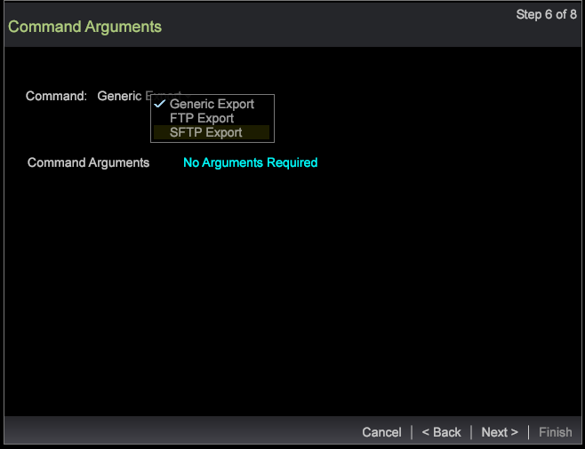

# wizard Segmentexport{#segment-export-wizard}

De segmenten van de uitvoer die de tovenaar van de segmentuitvoer gebruiken

De tovenaar van de segmentuitvoer verstrekt een geleidelijke proces om segmenten te vormen en uit te voeren eerder dan [het uitvoeren van segmenten van een detaillijst](https://docs.adobe.com/content/help/en/data-workbench/using/client/export-data/c-sgmt-expt.html).

## De segmenten van de uitvoer die de tovenaar gebruiken {#section-b30f2699dbc7490bad18512b91cb0cb3}

Om de tovenaar te openen, klik in een werkruimte met de rechtermuisknop aan en selecteer **Admin** > **Tovenaars** > de Tovenaar **van de Uitvoer van het** Segment.

>[!NOTE]
>
>Slechts zullen de segmenten die vóór het openen van de tovenaar worden toegepast worden gevangen. Ook, kan de segmentuitvoer die van de tovenaar wordt gecreeerd geen externe bevelen paaien.

1. Selecteer de diverse ouderniveaus van de afmetingen en de metriek die aan uw uitvoer moeten worden toegevoegd.

   De getoonde niveaus hangen van het geselecteerde profiel af. U kunt veelvoudige afmetingsniveaus selecteren die op het profiel worden gebaseerd.

   

1. Klik op **Volgende**.
1. Selecteer de Dimensie en de Metriek voor de geselecteerde niveaus.

   Bijvoorbeeld, na het selecteren van de Mening van de Pagina als ouderniveau, kunt u de kindafmetingen en de metriek selecteren beschikbaar om worden uitgevoerd.

1. Klik op **Volgende**.

   

   

1. Selecteer het de uitvoerformaat en ga een naam voor het de uitvoerdossier in.

   

   CSV, TSV, de Uitvoer van het Segment, en de Uitvoer van het Segment met de types van Kopbal vergen geen extra configuratie. Nochtans, moeten de Profielen en de Uitvoer van het Publiek, de Dienst van het Verslag van de Douane en de Uitvoer van het Doel van Adobe in Stap 3 worden gevormd. Bijvoorbeeld, zie de configuratiegebieden voor de de Profielen en Uitvoer van het Publiek. Vorm deze de uitvoertypes en klik **daarna**.

   

   

   

1. Vorm het geselecteerde uitvoertype.

   Kopbal-als de Kopbal Waar is, dan noem het gebied van het Dossier **van de** Output.

   Vlucht gebied-plaats als **Waar** of **Vals**.

   Orde van gebied-selecteer een gebied en beweeg naar boven of naar onder om de orde in het de uitvoerdossier te plaatsen.

   

   Klik op **Volgende**.

1. Bekijk het Niveau en de toegepaste filters in deze dialoog. Klik op **Volgende**. 

1. Als **CSV**, **TSV**, de Uitvoer **van het** Segment of de Uitvoer van het **Segment met Kopbal** wordt geselecteerd dan zijn er drie opties:

   Generieke Uitvoer - het outputdossier zal door server in de omslag van de Server/van de Uitvoer worden geproduceerd.

   

   FTP-export - Het uitvoerbestand wordt overgebracht naar de geselecteerde server. (De lijst van de server wordt gekozen uit het FTPServerInfo.cfg-bestand.)

   

   De Uitvoer van SFTP - het outputdossier zal veilig naar de geselecteerde server worden overgebracht.

1. Klik op **Volgende**

   **Opmerking:** Als het geselecteerde uitvoertype **Profielen en de Uitvoer** van het Publiek, de Dienst **van het Verslag van de** Douane, en de Uitvoer **van het Doel van** Adobe is, dan zal de tekst statisch zijn gebaseerd op de geselecteerde uitvoer.

1. Vorm het plannen van parameters.

   **Één Ontsproten** kan aan Waar of Vals worden geplaatst.

   **De geavanceerde planning** kan worden aangezet of weg door de Geavanceerde Plannende knoop van de Configuratie te klikken.

   

   Als het uitvoeren van de Lijst van het Detail, zal Één Ontsproten verdwijnen als het Geavanceerde Plaatsen is. Klik op **Volgende**.

1. Voorproef het de uitvoerdossier en klik dan de Uitvoer van de **Looppas**.

   

   

De volgende uitvoertypes zijn beschikbaar gebruikend de tovenaar:

**Soorten Segmentuitvoer**

* Algemeen
* FTP
* SFTP

**De Uitvoer van het segment met Kopbal**

* Algemeen
* FTP
* SFTP

**CSV-export**

* Algemeen
* FTP
* SFTP

**TSV-export**

* Algemeen
* FTP
* SFTP

