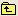

# Een callout{#configure-a-callout} configureren

Bijroepen brengen aandacht aan een bepaald afmeting element door een nieuwe visualisatie met een virtuele selectie van een bepaald afmeting element in een visualisatie te creëren.

U kunt callouts toevoegen of uitgeven door de callout dossiers te vormen die in een Profiles \*profielnaam*\Context\Callout folder of the [!DNL Server] installatiemap worden opgeslagen. Bijschriften die aandacht aan bepaalde metrisch in een aantekenvelvisualisatie brengen worden genoemd metrische callouts. Metrische bijschriftbestanden worden opgeslagen in de profielnaam\*\Context\Metric Callout folder.

Voor instructies om een callout of metrische callout aan een visualisatie toe te voegen, zie [Bijschrijvingen aan een Werkruimte](../../../home/c-get-started/c-vis/c-call-wkspc.md#concept-212b09e763044d938987b4a9c658adc0) toevoegen.

**Een nieuw type bijschrift maken**

1. In om het even welke werkruimte, creeer een visualisatie die de gegevens bevat die u in het nieuwe bijschrifttype wilt verschijnen. Als u bijvoorbeeld wilt dat de callout een tabel is, maakt u een tabelvisualisatie met de gewenste metrische en afmeting.
1. Klik met de rechtermuisknop op de bovenrand van het bijschriftvenster en klik op **[!UICONTROL Save]**.
1. Klik in het venster [!DNL Save] op , dubbelklik **[!UICONTROL Context]** en dubbelklik vervolgens op **[!UICONTROL Callout]**. Typ in het veld [!DNL File Name] een naam voor het bestand en klik op **[!UICONTROL Save]**. Het callout dossier wordt bewaard aan de Gebruiker \*het werkende profielnaam*\Context\Callout folder.

   >[!NOTE]
   >
   >Wanneer het noemen van uw callout, kies een beschrijvende naam die op het visualisatietype en metrisch en afmeting wijst die het toont. Bijvoorbeeld, als u een callout van een lijstvisualisatie wilt tot stand brengen die metrische zittingen over de dimensie van de Dag toont, kon u de callout &quot;Zittingen door Lijst van de Dag noemen.&quot;

1. (Optioneel) Deze wijziging beschikbaar stellen voor alle gebruikers van het werkprofiel:

   1. Klik in [!DNL Profile Manager] op **[!UICONTROL Context]** en vervolgens op **[!UICONTROL Callout]**. Deze map bevat alle visualisatiebestanden ( [!DNL .vw]) die de bestaande bijschrifttypen definiëren.

   1. Klik met de rechtermuisknop op het vinkje naast de bestandsnaam van de nieuwe callout in de kolom [!DNL User] en klik **[!UICONTROL Save to]** > *&lt;**[!UICONTROL working profile name]***.

**Een callout wijzigen in een metrische callout**

1. Klik in [!DNL Profile Manager] op **[!UICONTROL Context]** en vervolgens op **[!UICONTROL Callout]**. Deze map bevat alle visualisatiebestanden ( [!DNL .vw]) die de bestaande bijschrifttypen definiëren.

1. Klik met de rechtermuisknop op het vinkje naast de bestandsnaam van het type bijschrift dat u wilt wijzigen en klik op **[!UICONTROL Make Local]**. Nadat het bestand naar de lokale computer is gedownload, wordt een vinkje weergegeven in de kolom [!DNL User].

1. Klik met de rechtermuisknop op het vinkje naast de bestandsnaam in de kolom [!DNL User] en klik op **[!UICONTROL Open]** > **[!UICONTROL In Notepad]**.

1. Zoek het [!DNL metric_y = ref:]-item in het bijschriftbestand en vervang de bestaande waarde door het woord Metrisch. De gemarkeerde tekst in het volgende bestandsfragment laat zien waar u dit woord invoegt.

   ```
   window = simpleBorderWindow: 
     client = graph: 
       bars = bool: true
       dim_x = ref: wdata/model/dim/dimension name
       lines = bool: false
       metrics = vector: 1 items
         0 = gr_metric: 
           metric_y = ref: Metric
           yaxis = axisLegend: 
             max_value = double: maximum y-value
             min_value = double: minimum y-value
             zoom_max = double: maximum y-zoom
             zoom_min = double: minimum y-zoom
   . . . 
   ```

1. Klik op **[!UICONTROL File]** > **[!UICONTROL Save As]**. Klik in het venster **[!UICONTROL Save As]** eenmaal en dubbelklik vervolgens **[!UICONTROL Metric Callout]**. Typ in het veld [!DNL File Name] een naam voor het bestand en klik op **[!UICONTROL Save]**. Het metrische callout dossier wordt bewaard aan de Gebruiker \*het werkende profielnaam*\Context\Metric Callout folder.

1. (Optioneel) Als u deze metrische callout beschikbaar wilt maken voor alle gebruikers van het werkprofiel, klikt u in [!DNL Profile Manager] met de rechtermuisknop op het vinkje naast de bestandsnaam in de kolom [!DNL User] en klikt u op **[!UICONTROL Save to]** > *&lt;**[!UICONTROL working profile name]**>*.
