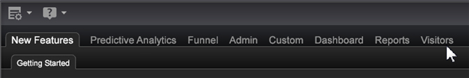

# Voeg een lusje aan de werktop toe{#add-a-tab-to-the-worktop}

Voeg een lusje aan het Desktop toe om tot een werkruimte snel toegang te hebben.

U kunt een werkruimte als lusje op de Desktop toevoegen. Bijvoorbeeld, kunt u een lusje van **Bezoekers** voor snelle toegang tot een overzicht van uw verkeer toevoegen.

**Een map toevoegen in Profielbeheer**

1. Open de werkruimte u met het nieuwe lusje wilt associëren, dan **Admin** met de rechtermuisknop aanklikken > de Manager **van het** Profiel.
1. In [!DNL Profile Manager], klik **[!UICONTROL Workspaces]** om zijn inhoud te bekijken.
1. Klik met de rechtermuisknop in de [!DNL User] kolom voor [!DNL Workspaces] en selecteer **[!UICONTROL Create]** > **[!UICONTROL Folder]**.

   

   Dit leidt tot een nieuwe subfolder om de dossiers te bevatten die u door uw nieuw lusje beschikbaar wilt zijn. Een nieuwe omslag verschijnt genoemd Nieuwe Omslag.
1. Om anders te noemen, klik in de [!DNL User] kolom voor de Nieuwe Omslag met de rechtermuisknop aan en typ een naam in de parameter Dir.

   

   De omslagnaam zal in de werktop als tabel verschijnen.

   

1. (Facultatief) om de veranderingen beschikbaar te maken voor alle gebruikers van het het werkprofiel, klik het witte vinkje voor het [!DNL .vw] dossier in de [!DNL User] kolom met de rechtermuisknop aan en klik **[!UICONTROL Save to]** > *&lt;**[!UICONTROL working profile name]**>*.

   Om slechts de volledig-gerangschikte versie van de beschrijvingswerkruimte en niet de duimnagel van deze werkruimte te tonen, moet u de werkruimte aan het het werk profiel bewaren. Om dit te doen, in [!DNL Profile Manager], klik het witte vinkje voor het [!DNL description.vw] dossier in de [!DNL User] kolom met de rechtermuisknop aan, dan klik **[!UICONTROL Save to]** > *&lt;**[!UICONTROL working profile name]**>*.
