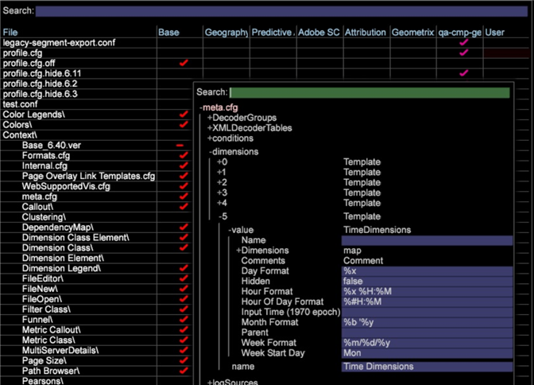

# Afmetingen lokalisatietijd{#localizing-time-dimensions}

Vorm de tijddimensies aan vertoning correct voor de scène.

U kunt het getoonde formaat van tijdafmetingen vormen die op scène in het **[!DNL Standard Time Dimensions.cfg]** dossier worden gebaseerd (die door gebrek bij **[!DNL Server/Profiles/`<my profile>`/Dataset/Transformation/Tijd/StandaardAfmetingen van de Tijd/Standaard]** wordt gevestigd).

Bijvoorbeeld, in Noord-Amerika kunt u de datum van 3 Mei, 2015 als 5/3/15 uitdrukken, of **`%m/%d/%y`**. In andere delen van de wereld zou dit echter kunnen worden geïnterpreteerd als `%d/%m/%y`, of 5 maart 2015, vanwege een dubbelzinnigheid in de waarden. Om deze situatie te vermijden, zou een beheerder het getoonde formaat kunnen willen veranderen om de verwachtingen van de gebruikers in een scène aan te passen.

## 1. Standaardafmetingen van de Tijd van de opheffing in StandaardAfmetingen van de Tijd.cfg {#section-7d0b24657bef4b15abb3cbea66cb617f}

Om deze eigenschap toe te laten, moet de beheerder de gebreken met voeten treden door of de bestaande tijddimensies uit te geven of door nieuwe tijddimensies met extra parameters te creëren.

Een voorbeeld van een gewijzigde tijddimensie volgt.

De waarden van het **Formaat** voor Week, Uur, Dag, Maand, en Uur van Dag worden geplaatst aan de gebreken in het voorbeeld.

>[!NOTE]
>
>Als deze lijnen worden weggelaten, zal het gedrag van de Werkbank van Gegevens niet veranderen en de afmeting zal worden gecompileerd gebruikend de gebreken.

```
Transformation Include = TransformationInclude:  
  Extended Dimensions = vector: 1 items 
    0 = TimeDimensions:  
      Comments = Comment: 0 items 
      Dimensions = map:  
        Day = string: Day 
        Day of Week = string: Day of Week 
        Hour = string: Hour 
        Hour of Day = string: Hour of Day 
        Month = string: Month 
        Week = string: Week 
      Hidden = bool: false 
      Input Time (1970 epoch) = string: x-unixtime 
      Week Format = string:  
  %m/%d/%y
      Hour Format = string:  
  %x %H:%M 
      Day Format = string:  
  %x
      Month Format = string:  
  %b '%y
      Hour Of Day Format = string:  
  %#H:%M
      Name = string: Visit Time 
      Parent = string: Visit 
      Week Start Day = string: Mon 
  Transformations = vector: 0 items
```


## 2. Vorm het meta.cfg- dossier {#section-5e077d3298dd48fda7f7bb16af9ea00c}

Bovendien, is het noodzakelijk voor de pakketbeheerder om deze parameters en hun gebreken aan het **[!DNL meta.cfg]** dossier van het profiel toe te voegen. Dit staat het uitgeven van het werkstation toe.

Hier is een uittreksel van een gevormd **[!DNL meta.cfg]** dossier.

```
dimensions = vector: 6 items 
  0 = Template: 
    ...
  ...
  5 = Template: 
    name = string: Time Dimensions 
    value = TimeDimensions: 
      Name = string:  
      Comments = Comment: 0 items 
      Hidden = bool: false 
       
  Week Format = string: %d/%m/%y 
       Hour Format = string: %x %H:%M 
       Day Format = string: %x 
       Month Format = string: %b '%y 
       Hour Of Day Format = string: %#H:%M</b> 
      Input Time (1970 epoch) = string:  
      Parent = string:  
      Week Start Day = string: Mon 
      Dimensions = map: 
        Hour of Day = string: Hour of Day 
        Day of Week = string: Day of Week 
        Hour = string: Hour 
        Day = string: Day 
        Week = string: Week 
        Month = string: Month
```

Hier is een voorbeeld van een **[!DNL meta.cfg]** dossier in het werkstation:



De beheerder kan dan in de **Bestandsbeheerder** gaan, de bestanden openen waar de tijddimensies zijn geconfigureerd (bijv. **[!DNL Standard Time Dimensions.cfg]**) en ze bewerken met behulp van het werkstation.
