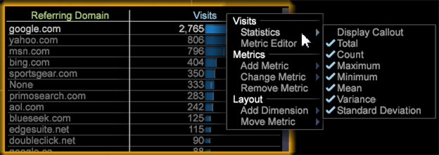

# Statistische bijschriften{#statistical-callouts}

{{eol}}

Statistische callouts meten betekenisvolle relaties om verborgen kansen en variabelen van belang te identificeren voor meer geavanceerde mogelijkheden voor datamining in publiekscategorieën en scoring van bezoekersreacties.

Met statistische callouts worden de algoritmen uitgebreid, zodat meer gegevenstypen kunnen worden gecorreleerd, zoals binomiale variabelen (ja/neen, 0/1, of koper/niet-koper) die gecorreleerd zijn met aftelbare meetgegevens (bezoeken, orders of downloads).

Om statistische callouts toe te voegen:

1. In een lijst, klik de metrische kopbal met de rechtermuisknop aan.
1. Selecteren **[!UICONTROL Statistics]** en selecteert of wist dan de controletekens voor elke vereiste het plaatsen. Alles in de callout Weergave wordt geselecteerd als de standaardinstelling.

   

De callout kan statistische waarden terugkeren die in de datasetkolommen worden gefactureerd.

<table id="table_B2A4F9D5938D4756A81ACF6F4D77E63D">
 <thead>
  <tr>
   <th colname="col1" class="entry"> Berekening </th>
   <th colname="col2" class="entry"> Beschrijving </th>
  </tr>
 </thead>
 <tbody>
  <tr>
   <td colname="col1"> Aantal </td>
   <td colname="col2">
Retourneert het aantal rijen in een gegevensset. 
</td>
  </tr>
  <tr>
   <td colname="col1"> Maximum </td>
   <td colname="col2">
 Hiermee wordt de maximale metrische waarde voor alle elementen van de dimensie aangegeven. 
</td>
  </tr>
  <tr>
   <td colname="col1"> Minimaal </td>
   <td colname="col2">
 Hiermee wordt de minimale metrische waarde voor alle elementen van de dimensie aangegeven. 
</td>
  </tr>
  <tr>
   <td colname="col1"> Gemiddeld </td>
   <td colname="col2">
 Het gemiddelde is het rekenkundig gemiddelde van de metrische waarden van de elementen in de Dimension, berekend door de totale som gedeeld door de telling (som/telling). 
</td>
  </tr>
  <tr>
   <td colname="col1"> Standaardafwijking </td>
   <td colname="col2"> De standaardafwijking geeft aan hoeveel variatie er ten opzichte van het verwachte gemiddelde bestaat. Bij een lagere standaardafwijking worden de gegevenspunten dicht bij het gemiddelde weergegeven. Een hogere standaardafwijking laat zien dat de gegevenspunten worden verspreid over een groot waardebereik. </td>
  </tr>
  <tr>
   <td colname="col1"> Totaal </td>
   <td colname="col2">
 Retourneert de totale som van de metrische waarden. 
</td>
  </tr>
  <tr>
   <td colname="col1"> Variantie </td>
   <td colname="col2">
 Een maat voor de variantie van de meetwaarden ten opzichte van het metrische gemiddelde voor die dimensie. Het is gelijk aan het vierkant van de standaardafwijking. 
</td>
  </tr>
 </tbody>
</table>
