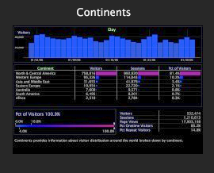
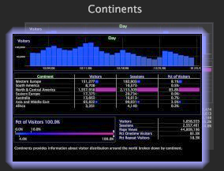

# Bestandsversioning{#file-versioning}

Met de desktop kunt u eenvoudig bepalen waar elke werkruimte is opgeslagen, of deze nu op de server van de Data Workbench is, op uw lokale machine of op beide.

## Bestandsversies identificeren {#section-d555c96b016344f19b356c12213dd2a9}

**Server**

Een serverwerkruimte wordt opgeslagen op de verbonden server van de Werkbank van Gegevens en is beschikbaar aan alle gebruikers die toegang tot dit profiel en tabel hebben. Een serverwerkruimte wordt weergegeven als één miniatuur.

De werkruimten van de server worden opgeslagen door gebrek in de aangewezen subomslag binnen de omslag van Werkruimten op de verbonden server van de Werkbank van Gegevens.

**Lokaal**

Een lokale werkruimte is de lokale versie van een serverwerkruimte. Een lokale werkruimtevertoningen als twee overlappende duimnagels. De duimnagel op de bovenkant wordt aanvankelijk omringd door een gloed, die erop wijst dat de recente veranderingen plaatselijk aan de serverwerkruimte werden aangebracht. Deze gloed verdwijnt in de loop der tijd.

De lokale werkruimten worden opgeslagen door gebrek in de [!DNL User\working profile name\Workspaces\tab] naamomslag binnen de de installatiefolder van de Werkbank van Gegevens (of van het Inzicht).

>[!NOTE]
>
>Wanneer u een lokale versie van een serverwerkruimte hebt, moet u aan de serverversie terugkeren alvorens u een bijgewerkte versie van de serverwerkruimte kunt downloaden. Om terug naar de serverversie zonder lokale veranderingen terug te keren, klik de duimnagel van de lokale werkruimte met de rechtermuisknop aan en klik **[!UICONTROL Revert to server version]**.

**Gebruiker**

Een gebruikerswerkruimte is een werkruimte die werd gecreeerd op en slechts op de lokale machine bestaat. Een gebruikerswerkruimte toont als één enkele duimnagel met een gestippeld overzicht van een lege werkruimte achter het, erop wijzend dat er geen bronwerkruimte op de verbonden server van de Werkbank van Gegevens is.

De werkruimten van de gebruiker worden opgeslagen door gebrek in de Gebruiker \*werk profielnaam*\Workspaces\*lusjenaam* omslag binnen de de installatiefolder van het Inzicht.
