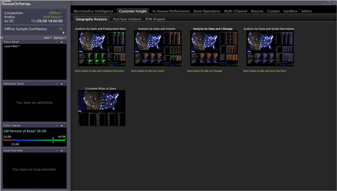

# Werkbalken{#worktops}

{{eol}}

In het bureaublad kunt u al uw werkruimten en rapporten ordenen en openen.

In de meeste gevallen wordt [!DNL Worktop] wordt onmiddellijk weergegeven nadat u de Data Workbench hebt geopend. De kenmerken van de [!DNL Worktop] bevat de zijbalk en de interface met tabbladen. Bovendien kunt u met de zijbalk visualisaties toevoegen en regelmatig gebruikte functies gebruiken.

**WorDesktop**

De [!DNL Worktop] kunt u ook nieuwe en bijgewerkte werkruimten en rapporten maken en opslaan, en werkruimten en rapporten publiceren naar de server van de Data Workbench zodat anderen er toegang toe hebben.

De [!DNL Worktop] de onderstaande elemententabel beschrijft elk element van het [!DNL Worktop].

<table id="table_CB1DBB7DE8E2450A8C57601531BBD689">
 <tbody>
  <tr>
   <td colname="col1"> Zijbalk </td>
   <td colname="col2"> 
De zijbalk biedt context en controle voor werkruimten, evenals inzicht in de huidige status van een werkruimte en toegang tot regelmatig gebruikte functies. De volgende functies zijn beschikbaar in de zijbalk: 
 
 <b>Verbinding:</b> Een statusindicator die de online status weergeeft. Klik op de verbindingsstatus om deze in of uit te schakelen  Online werken. Zie <a href="../../home/c-get-started/c-off-on.md#concept-cef8758ede044b18b3558376c5eb9f54"> Offline werken en online werken</a>. 
 
 <b>Profiel:</b> Een indicator van het huidige profiel in gebruik. 
 
 <b>Vanaf: </b>Een statusindicator die aangeeft hoe up-to-date de gegevens zijn in de gegevensset van het profiel. Dit gegeven wordt gedownload en verwerkt van de server DPU, die slechts kan voorkomen wanneer u online werkt. 
 
 <b>Vertrouwen query/sample:</b> Een indicator van de vraagvoltooiing. Wanneer de statusvragen aan 100 percenten, zijn alle gegevens gevraagd. 
 
 <b>Toevoegen:</b> Hiermee kunt u visualisaties zoals deelvensters, legenda en tabellen toevoegen aan het zijpaneel. Zie <a href="../../home/c-get-started/c-config-sidebar.md#section-666f70a405db4f8d8eaffa567ffcac06"> Visualisaties toevoegen aan de zijbalk</a>. 
 
 <b>Opties:</b> Hiermee kunt u terugkeren naar een vorige zijbalk en de zijbalk automatisch verbergen. 
 
Zijbalkinstellingen worden opgeslagen in het dialoogvenster  sidebar.vw bestand wanneer u Data Workbench sluit. 
 </td>
  </tr>
  <tr>
   <td colname="col1"> 
Tabblad en subtab of vervolgkeuzemenu's (niet weergegeven) 
 </td>
   <td colname="col2"> 
Elk tabblad dat wordt weergegeven op het tabblad  WorDesktop komt overeen met de tabs <i>naam van werkprofiel</i>\Workspaces\<i>tabnaam</i> binnen de installatiemap van de Data Workbench en staat voor een bepaald type informatie, zoals dashboards, Activiteit, Overname, Bezoekers, enzovoort. De submappen in de map met tabnamen worden standaard als subtabbladen weergegeven, maar ze kunnen ook als submappen worden weergegeven. Zie <a href="../../home/c-get-started/c-intf-anlys-ftrs/c-cstm-wktp-tabs/c-cstm-wktp-tabs.md#concept-0f1e6061b03949199326dc6df71a52bc"> Tabs voor bureaublad aanpassen</a>. 
 
 
Opmerking: Elk profiel van de Data Workbench wordt geleverd met een standaardreeks lusjes. Omdat uw implementatie volledig kan worden aangepast, kunnen de werkruimten (en daarom ook de tabbladen) die worden weergegeven afwijken van wat in deze handleiding wordt beschreven. 
 
 </td>
  </tr>
  <tr>
   <td colname="col1"> Profielstatus </td>
   <td colname="col2"> Verstrekt de verbindingsstatus aan de server van de Data Workbench en de naam van het momenteel geladen profiel. De datum en tijd vanaf de datum en tijd waarop de gegevens in de gegevensset van het profiel worden weergegeven onder de online-indicator. </td>
  </tr>
  <tr>
   <td colname="col1"> Minimaliseren, Maximaliseren, Sluiten </td>
   <td colname="col2"> Standaardfuncties van Windows. </td>
  </tr>
  <tr>
   <td colname="col1"> Miniaturen </td>
   <td colname="col2"> 
Een miniatuur is een opname van een werkruimte die wordt weergegeven op het tabblad  WorDesktop. Elke keer dat u de werkruimte opslaat, wordt een nieuwe opname gemaakt. Met miniaturen kunt u snel een bepaalde werkruimte in het dialoogvenster  WorDesktop. 
 
Klik op de miniatuur om een werkruimte te openen. 
 
 
Opmerking: Elk profiel van de Data Workbench wordt geleverd met een standaardreeks werkruimten. Omdat uw implementatie volledig kan worden aangepast, kunnen de werkruimten (en dus ook de miniaturen) die worden weergegeven afwijken van wat in deze handleiding wordt beschreven. 
 
 
Voor meer informatie over werkruimten raadpleegt u <a href="../../home/c-get-started/c-config-sidebar.md#concept-41db771b302e43018e5a9daa40b397e6"> De zijbalk configureren</a>. 
 </td>
  </tr>
  <tr>
   <td colname="col1"> Foutberichten </td>
   <td colname="col2"> 
Foutberichten worden in het rood onder de status weergegeven. Voor beschrijvingen van statuscode raadpleegt u <a href="https://www.w3.org/Protocols/rfc2616/rfc2616-sec10.html" format="http" scope="external"> https://www.w3.org/Protocols/rfc2616/rfc2616-sec10.html</a>. 
 
Bijvoorbeeld: 403_Verboden. 
 </td>
  </tr>
 </tbody>
</table>
