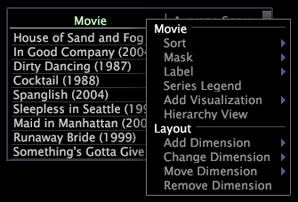

# menu&#39;s met metrische en dimensie{#metric-and-dimension-menus}

De menu&#39;s die door het metrische of afmetingsgebied binnen een visualisatie worden betreden met de rechtermuisknop aan te klikken verlenen toegang tot acties met betrekking tot metrisch of afmeting in die visualisatie.

Voor meer informatie over het gebruiken van deze menuopties met een bepaald type van visualisatie, zie de aangewezen visualiseringssectie binnen de Visualisaties van de [Analyse](../../../home/c-get-started/c-analysis-vis/c-analysis-vis.md).

## Het menu Metrisch {#section-115db63a26f04b57ac954a69972c6291}

U hebt toegang tot het metrische menu door om het even welk metrisch-verwant gebied binnen een visualisatie met de rechtermuisknop aan te klikken.

Dit menu voorziet u van verschillende opties afhankelijk van het type van visualisatie waarin u werkt. Het volgende voorbeeld toont enkele beschikbare menuopties, terwijl de volgende lijst van alle beschikbare menuopties een lijst maakt.

<table id="table_81EFAC2D754843DD98C2DDF81A35A2B4"> 
 <thead> 
  <tr> 
   <th colname="col1" class="entry"> Menu Option </th> 
   <th colname="col2" class="entry"> Beschrijving </th> 
  </tr> 
 </thead>
 <tbody> 
  <tr> 
   <td colname="col1"> <i>metrische naam</i> </td> 
   <td colname="col2"> 
Rubriek voor de volgende metrisch-verwante menuopties. 
 </td> 
  </tr> 
  <tr> 
   <td colname="col1"> 
Zoomen naar alles 
 </td> 
   <td colname="col2"> 
Keert op een vertoning van alle gegevens binnen de grafiek terug. Zie <a href="../../../home/c-get-started/c-vis/c-zoom-vis.md#concept-7e33670bb5344f78a316f1a84cc20530"> Zoomen in Visualisaties</a>. 
 </td> 
  </tr> 
  <tr> 
   <td colname="col1"> 
Zoomen naar selectie 
 </td> 
   <td colname="col2"> 
Zoemt binnen op een geselecteerde ondergroep van gegevens in een lijngrafiek. Zie <a href="../../../home/c-get-started/c-vis/c-zoom-vis.md#concept-7e33670bb5344f78a316f1a84cc20530"> Zoomen in Visualisaties</a>. Voor meer informatie over selecties, zie het <a href="../../../home/c-get-started/c-vis/c-sel-vis/c-sel-vis.md#concept-012870ec22c7476e9afbf3b8b2515746"> Maken Selecties in Visualisaties</a>. 
 </td> 
  </tr> 
  <tr> 
   <td colname="col1"> 
Metrische editor 
 </td> 
   <td colname="col2"> 
Laat u toe om de definitie van metrisch uit te geven die door het metrische naamgebied wordt geïdentificeerd. Zie Bestaande afgeleide <a href="../../../home/c-get-started/c-admin-intrf/c-prof-mgr/c-drvd-mtrcs.md#section-db6d924cf4e14bcc8d57cfe1059fc797"> waarden</a>bewerken. 
 </td> 
  </tr> 
  <tr> 
   <td colname="col1"> 
Metriek 
 </td> 
   <td colname="col2"> 
Rubriek voor de volgende metrisch-verwante menuopties. 
 </td> 
  </tr> 
  <tr> 
   <td colname="col1"> 
Metrisch toevoegen 
 </td> 
   <td colname="col2"> 
Voegt nieuwe metrisch aan de visualisatie links van geselecteerde metrisch toe. 
 </td> 
  </tr> 
  <tr> 
   <td colname="col1"> 
Metrisch wijzigen 
 </td> 
   <td colname="col2"> 
Verandert geselecteerde metrisch in de visualisatie. 
 </td> 
  </tr> 
  <tr> 
   <td colname="col1"> 
Metrisch verwijderen 
 </td> 
   <td colname="col2"> 
Verwijdert geselecteerde metrisch uit de visualisatie. 
 </td> 
  </tr> 
  <tr> 
   <td colname="col1"> 
Indeling 
 </td> 
   <td colname="col2"> 
Rubriek voor de volgende lay-out-related menuopties. 
 </td> 
  </tr> 
  <tr> 
   <td colname="col1"> 
Dimension toevoegen 
 </td> 
   <td colname="col2"> 
Voegt een andere dimensie aan de visualisatie toe. 
 </td> 
  </tr> 
  <tr> 
   <td colname="col1"> 
Metrische gegevens verplaatsen 
 </td> 
   <td colname="col2"> 
Verplaatst geselecteerde metrisch naar een andere as in de visualisatie. 
 </td> 
  </tr> 
 </tbody> 
</table>

## Gebruik het afmetingsmenu {#section-e09de0aa6b74459a957b627ff7d07979}

U hebt toegang tot het afmetingsmenu door om het even welk afmetingsgerelateerd gebied binnen een visualisatie met de rechtermuisknop aan te klikken.

Dit menu voorziet u van verschillende opties afhankelijk van het type van visualisatie waarin u werkt. Het volgende voorbeeld toont enkele beschikbare menuopties, terwijl de volgende lijst van alle beschikbare menuopties een lijst maakt.

<table id="table_D8BB675B710B48A783B1C9EB206033E9"> 
 <thead> 
  <tr> 
   <th colname="col1" class="entry"> Menu Option </th> 
   <th colname="col2" class="entry"> Beschrijving </th> 
  </tr> 
 </thead>
 <tbody> 
  <tr> 
   <td colname="col1"> 
Oproepen toevoegen 
 </td> 
   <td colname="col2"> 
Voegt een callout voor het geselecteerde element toe, dat aandacht aan dat element vestigt. Zie het <a href="../../../home/c-get-started/c-vis/c-call-wkspc.md#concept-212b09e763044d938987b4a9c658adc0"> Toevoegen van Callouts aan een Werkruimte</a>. 
 </td> 
  </tr> 
  <tr> 
   <td colname="col1"> 
Element hernoemen 
 </td> 
   <td colname="col2"> 
Noem het element anders. Klik op  Terugkeren om terug te keren naar de oorspronkelijke naam. 
 </td> 
  </tr> 
  <tr> 
   <td colname="col1"> 
<i>afmetingsnaam</i> 
 </td> 
   <td colname="col2"> 
Rubriek voor de volgende dimensie-verwante menuopties. 
 </td> 
  </tr> 
  <tr> 
   <td colname="col1"> 
Sorteren 
 </td> 
   <td colname="col2"> 
Sorteert de elementen van de geselecteerde afmeting zoals gewenst. 
 </td> 
  </tr> 
  <tr> 
   <td colname="col1"> 
Masker 
 </td> 
   <td colname="col2"> 
Selecteert een ondergroep van de elementen in de geselecteerde afmeting. 
 </td> 
  </tr> 
  <tr> 
   <td colname="col1"> 
Etiket 
 </td> 
   <td colname="col2"> 
Laat u toe om het etiket voor de geselecteerde afmeting uit te geven. 
 </td> 
  </tr> 
  <tr> 
   <td colname="col1"> 
Geselecteerd markeren 
 </td> 
   <td colname="col2"> 
Benadrukt het geselecteerde element van de afmeting. 
 </td> 
  </tr> 
  <tr> 
   <td colname="col1"> 
Duidelijk gemarkeerd 
 </td> 
   <td colname="col2"> 
Ontruimt het benadrukken van om het even welk element in de visualisatie. 
 </td> 
  </tr> 
  <tr> 
   <td colname="col1"> 
Reeks Legend 
 </td> 
   <td colname="col2"> 
Kleur-codes de elementen binnen de geselecteerde afmeting als reeks. Zie <a href="../../../home/c-get-started/c-analysis-vis/c-tables/c-srs-leg.md#concept-c48042a705524bc4b63cd6f24874cc12"> Reeks gebruiken Legends</a>. 
 </td> 
  </tr> 
  <tr> 
   <td colname="col1"> 
Visualisatie toevoegen 
 </td> 
   <td colname="col2"> 
Voegt een visualisatie toe die de geselecteerde afmeting gebruikt. 
 </td> 
  </tr> 
  <tr> 
   <td colname="col1"> 
Dimension opslaan 
 </td> 
   <td colname="col2"> 
Bewaart de geselecteerde afmeting van de visualisatie. 
 </td> 
  </tr> 
  <tr> 
   <td colname="col1"> 
Hiërarchieweergave 
 </td> 
   <td colname="col2"> 
Verandert de huidige paginavisualisatie in een visualisatie van de paginahiërarchie, die de pagina's in een plaats toont die hiërarchisch door dossier wordt georganiseerd - noem en alfabetisch gesorteerd. Zie <a href="../../../home/c-get-started/c-analysis-vis/c-tables/c-hier-vews.md#concept-b461183424a841eb94f8143a0eaf9bff"> Toepassende Hiërarchische meningen</a>. 
 </td> 
  </tr> 
  <tr> 
   <td colname="col1"> 
Indeling 
 </td> 
   <td colname="col2"> 
Rubriek voor de volgende lay-out-related menuopties. 
 </td> 
  </tr> 
  <tr> 
   <td colname="col1"> 
Dimension toevoegen 
 </td> 
   <td colname="col2"> 
Voegt een andere dimensie aan de visualisatie toe. 
 </td> 
  </tr> 
  <tr> 
   <td colname="col1"> 
Afmetingen wijzigen 
 </td> 
   <td colname="col2"> 
Verandert de afmeting in de visualisatie. 
 </td> 
  </tr> 
  <tr> 
   <td colname="col1"> 
Dimension verplaatsen 
 </td> 
   <td colname="col2"> 
Verplaatst de geselecteerde afmeting naar een andere as in de visualisatie. 
 </td> 
  </tr> 
  <tr> 
   <td colname="col1"> 
Afmetingen verwijderen 
 </td> 
   <td colname="col2"> 
Verwijdert de geselecteerde afmeting uit de visualisatie. 
 </td> 
  </tr> 
 </tbody> 
</table>

