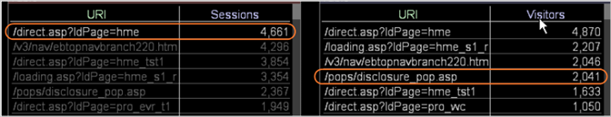

# Begrijpen hoe een selectie andere visualisaties beïnvloedt{#understanding-how-a-selection-affects-other-visualizations}

{{eol}}

Binnen een werkruimte vertegenwoordigt een visualisatie een set queryresultaten.

Wanneer u een selectie maakt, filtert de Data Workbench de resultaten van de vragen die het gebruikt om de visualisaties in de werkruimte te veroorzaken. Het specifieke filter varieert door visualisatie.

In het volgende voorbeeld ziet u hoe Data Workbench een selectie toepast op drie verschillende visualisatietypen. Als u deze voorbeelden bekijkt, begrijpt u welke filtereffecten selecties hebben op visualisaties. Ze helpen u ook te begrijpen hoe u de resultaten kunt interpreteren die u in een gefilterde visualisatie ziet.

* [Een visualisatie filteren met een metrische sessie](../../../../home/c-get-started/c-vis/c-sel-vis/c-sel-aff-vis.md#section-7cc06493ecb34cd4a696dbf0f0a7aaef)
* [Een visualisatie filteren met een metrische bezoeker](../../../../home/c-get-started/c-vis/c-sel-vis/c-sel-aff-vis.md#section-97d38c7f03e8457189a9c72d69514ed2)
* [Filteren van een Visualisatie met een Bezoeker-voor-Zitting Metrisch](../../../../home/c-get-started/c-vis/c-sel-vis/c-sel-aff-vis.md#section-f746182311d648dcb98716b0fe846e25)

## Een visualisatie filteren met een metrische sessie {#section-7cc06493ecb34cd4a696dbf0f0a7aaef}

In dit voorbeeld wordt [!DNL /direct.asp/?ldPage=hme] URI in visualisatie op de linkerzijde filtert metrisch voor Zittingen die in visualisatie op het recht worden getoond.


* **Effect van Selectie op de Vraag:** Data Workbench filtert de sessies voor de geselecteerde URI. In dit voorbeeld wordt de query die de waarde voor de [!DNL /pops/disclosure_pop.asp] element wordt als volgt gefilterd:

   ```
   Sessions[ URI="/pops/disclosure_pop.asp" AND URI="/direct.asp
   /?ldPage=hme"] by Page View by Session
   ```

* **De visualisatie interpreteren:** De gefilterde visualisatie vertegenwoordigt het aantal sessies die URI&#39;s bevatten die in de visualisatie en [!DNL /direct.asp/?ldPage=hme]. Dit voorbeeld laat zien dat er 1.113 sessies waren waarin bezoekers beide bekeken [!DNL /pops/disclosure_pop.asp] pagina en [!DNL /direct.asp/?ldPage=hme] in dezelfde sessie.

## Een visualisatie filteren met een metrische bezoeker {#section-97d38c7f03e8457189a9c72d69514ed2}

In dit voorbeeld wordt [!DNL /direct.asp/?ldPage=home] URI in visualisatie op de linkerzijde filtreert metrisch voor Bezoekers in visualisatie op het recht.



* **Effect van Selectie op de Vraag:** Data Workbench filtert de Bezoekers voor de geselecteerde URI. In dit voorbeeld wordt de query die de waarde voor de [!DNL /pops/disclosure_pop.asp] URI wordt als volgt gefilterd:

   ```
   Visitors[ URI="/pops/disclosure_pop.asp" by Page View by Visitor 
     AND URI="/direct.asp/?ldPage=hme" by Page View by Visitor ]
   ```

* **De visualisatie interpreteren:** De gefilterde visualisatie toont de Bezoekers die de URI&#39;s hebben weergegeven die in de visualisatie en [!DNL /direct.asp/?ldPage=hme] (hoewel niet noodzakelijkerwijs tijdens dezelfde sessie). Uit het bovenstaande voorbeeld blijkt dat 2.041 bezoekers beide hebben bekeken [!DNL /pops/disclosure_pop.asp] en [!DNL /direct.asp/?ldPage=hme].

## Filteren van een Visualisatie met een Bezoeker-voor-Zitting Metrisch {#section-f746182311d648dcb98716b0fe846e25}

In dit voorbeeld wordt [!DNL /direct.asp/?ldPage=hme] URI in visualisatie op de linkerzijde filtreert metrisch voor bezoeker-door-zitting in visualisatie op het recht.


* **Effect van Selectie op de Vraag:** Data Workbench filtert de Bezoekers op sessie voor de geselecteerde URI. De query die bijvoorbeeld de waarde voor de [!DNL /pops/disclosure_pop.asp] URI wordt als volgt gefilterd:

   ```
   Visitors[ ( URI="/pops/disclosure_pop.asp" by Page View 
     AND URI="/direct.asp/?ldPage=hme" by Page View ) by Session ]
   ```

* **De visualisatie interpreteren:** De gefilterde visualisatie toont de Bezoekers die beide URI&#39;s hebben weergegeven die in de visualisatie en [!DNL /direct.asp/?ldPage=hme] tijdens dezelfde sessie. Dit voorbeeld laat zien dat 1.069 bezoekers beide zagen [!DNL /pops/disclosure_pop.asp] en [!DNL /direct.asp/?ldPage=hme] tijdens één sessie.
