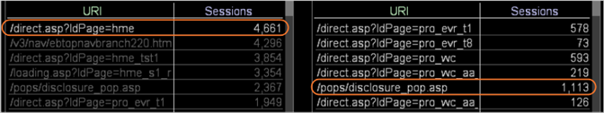

# Begrijpen hoe een selectie andere visualisaties beïnvloedt{#understanding-how-a-selection-affects-other-visualizations}

Binnen een werkruimte vertegenwoordigt een visualisatie een set queryresultaten.

Wanneer u een selectie maakt, filtert de Data Workbench de resultaten van de vragen die het gebruikt om de visualisaties in de werkruimte te veroorzaken. Het specifieke filter varieert door visualisatie.

In het volgende voorbeeld ziet u hoe Data Workbench een selectie toepast op drie verschillende visualisatietypen. Als u deze voorbeelden bekijkt, begrijpt u welke filtereffecten selecties hebben op visualisaties. Ze helpen u ook te begrijpen hoe u de resultaten kunt interpreteren die u in een gefilterde visualisatie ziet.

* [Een visualisatie filteren met een metrische sessie](../../../../home/c-get-started/c-vis/c-sel-vis/c-sel-aff-vis.md#section-7cc06493ecb34cd4a696dbf0f0a7aaef)
* [Een visualisatie filteren met een metrische bezoeker](../../../../home/c-get-started/c-vis/c-sel-vis/c-sel-aff-vis.md#section-97d38c7f03e8457189a9c72d69514ed2)
* [Filteren van een Visualisatie met een Bezoeker-voor-Zitting Metrisch](../../../../home/c-get-started/c-vis/c-sel-vis/c-sel-aff-vis.md#section-f746182311d648dcb98716b0fe846e25)

## Een visualisatie filteren met een sessiemetrisch {#section-7cc06493ecb34cd4a696dbf0f0a7aaef}

In dit voorbeeld filtert [!DNL /direct.asp/?ldPage=hme] URI in visualisatie op de linkerzijde metrisch voor Zittingen die in visualisatie op het recht worden getoond.



* **Het effect van Selectie op Vraag:** Data Workbench filtert de zittingen voor geselecteerde URI. In dit voorbeeld wordt de query die de waarde voor het element [!DNL /pops/disclosure_pop.asp] genereert, als volgt gefilterd:

   ```
   Sessions[ URI="/pops/disclosure_pop.asp" AND URI="/direct.asp
   /?ldPage=hme"] by Page View by Session
   ```

* **Bezig met interpreteren van visualisatie:** De gefilterde visualisatie vertegenwoordigt het aantal sessies dat de URI&#39;s bevat die in de visualisatie en  [!DNL /direct.asp/?ldPage=hme]. In dit voorbeeld wordt getoond dat er 1.113 sessies waren waarin bezoekers zowel [!DNL /pops/disclosure_pop.asp] pagina als [!DNL /direct.asp/?ldPage=hme] in dezelfde sessie bekeken.

## Een visualisatie filteren met een metrisch {#section-97d38c7f03e8457189a9c72d69514ed2}

In dit voorbeeld filtert de URI [!DNL /direct.asp/?ldPage=home] in de visualisatie links de metrische waarde voor Bezoekers in de visualisatie aan de rechterkant.


* **Effect van Selectie op Vraag:** Data Workbench filtert de Bezoekers voor geselecteerde URI. In dit voorbeeld wordt de query die de waarde voor de URI [!DNL /pops/disclosure_pop.asp] genereert, als volgt gefilterd:

   ```
   Visitors[ URI="/pops/disclosure_pop.asp" by Page View by Visitor 
     AND URI="/direct.asp/?ldPage=hme" by Page View by Visitor ]
   ```

* **Bezig met interpreteren van visualisatie:** De gefilterde visualisatie toont de bezoekers die de URI&#39;s hebben bekeken die in de visualisatie en  [!DNL /direct.asp/?ldPage=hme] (hoewel niet noodzakelijkerwijs tijdens dezelfde sessie) worden vermeld. Het bovenstaande voorbeeld toont dat 2.041 bezoekers zowel [!DNL /pops/disclosure_pop.asp] als [!DNL /direct.asp/?ldPage=hme] hebben bekeken.

## Filtrerend een Visualisatie met Bezoekers-door-Zitting Metrisch {#section-f746182311d648dcb98716b0fe846e25}

In dit voorbeeld filtert de URI [!DNL /direct.asp/?ldPage=hme] in de visualisatie aan de linkerkant de metrische waarde voor bezoeker-voor-sessie in de visualisatie aan de rechterkant.


* **Effect van Selectie op Vraag:** Data Workbench filtert de Bezoekers door Zitting voor geselecteerde URI. Bijvoorbeeld, wordt de vraag die de waarde voor [!DNL /pops/disclosure_pop.asp] URI produceert gefiltreerd als volgt:

   ```
   Visitors[ ( URI="/pops/disclosure_pop.asp" by Page View 
     AND URI="/direct.asp/?ldPage=hme" by Page View ) by Session ]
   ```

* **Bezig met interpreteren van visualisatie:** De gefilterde visualisatie toont de bezoekers die beide URI&#39;s hebben weergegeven die in de visualisatie en  [!DNL /direct.asp/?ldPage=hme] tijdens dezelfde sessie zijn vermeld. In dit voorbeeld wordt getoond dat 1069 bezoekers zowel [!DNL /pops/disclosure_pop.asp] als [!DNL /direct.asp/?ldPage=hme] hebben gezien tijdens één sessie.
