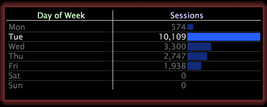

# Selecteer een niveau{#select-a-level}

Wanneer u een subset maakt, moet u een niveau opgeven.

Een niveau is om het even welke telbare dimensie. Als u bijvoorbeeld met websitegegevens werkt en de elementkleurtoon van de dimensie Dag van week selecteert en een subset maakt, moet u het niveau selecteren dat u wilt weergeven: Paginaweergave, Sessie of Bezoeker.

* **Dag van Week=&quot;Kleurtoon&quot;door de Mening van** de Pagina:Het niveau van de paginamening toont u slechts die paginameningen die op een Dinsdag voorkwamen.

   

* **Dag van Week=&quot;Tue&quot;door Zitting:** Het zittingsniveau toont u slechts die zittingen die op een Dinsdag voorkwamen.

   

* **Dag van Week=&quot;Kleurtoon&quot; door bezoeker:** Op bezoekersniveau ziet u alle bezoekers die dinsdag naar de site kwamen, maar het toont ook andere dagen dat dezelfde bezoekers naar de site kwamen.

   
