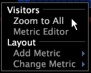

# In- of uitzoomen op een visualisatie{#zoom-in-or-out-in-a-visualization}

U kunt in- of uitzoomen op gegevens in grafieken, globes, procesafbeeldingen en verstrooiingspunten.

## Zoomen op objecten in procesafbeeldingen en globes {#section-be293f50337f49ee8f0f1ee3e613e4a1}

**Inzoomen op een gebied**

* Wijs het gewenste gebied aan, houd beide muisknop ingedrukt en verplaats de muis naar voren (weg van u).

**Uitzoomen op een gebied**

* Wijs het gewenste gebied aan, houd beide muisknop ingedrukt en verplaats de muis naar achteren (naar u toe).

## Zoomen op assen in grafieken en verstrooiingspunten {#section-1438a5d637e84d68b69e269062dd3d7a}

Zowel grafieken als verstrooiingspunten hebben assen waarop u afzonderlijk kunt in- of uitzoomen (u kunt dus inzoomen op de ene as en vervolgens uitzoomen op de andere).

>[!NOTE]
>
>Voor de y-as in een lijngrafiek en de x- of y-as in een spreidingsperceel wordt de zoomfactor telkens opnieuw ingesteld wanneer de onderliggende gegevens veranderen. Omdat dit vaak gebeurt wanneer u online werkt, raadt Adobe u aan offline te werken wanneer u op deze assen moet inzoomen. Zie [Offline werken en Online](../../../home/c-get-started/c-off-on.md#concept-cef8758ede044b18b3558376c5eb9f54).

**Als u wilt inzoomen op de x- of y-as van een** grafiekWanneer u verticaal (langs de y-as) inzoomt, blijft de x-as vast en worden de gegevens naar boven verplaatst.

1. Plaats de muisaanwijzer op het metrische gebied of het labelgebied van de afmetingen op de x- of y-as van de grafiek.
1. Druk op beide muisknoppen en beweeg de muis naar voren (weg van u). De pijlen verschijnen op de as erop wijzend dat meer gegevens voorbij het gedeelte van de visualisatie momenteel beschikbaar zijn.

**Uitzoomen op de x- of y-as van een grafiek**

1. Plaats de muisaanwijzer op het metrische gebied of het labelgebied van de afmetingen op de x- of y-as van de grafiek.
1. Druk op beide muisknop en verplaats de muis naar achteren (naar u toe).

**Als u wilt inzoomen op alle gegevens op de x- of y-as van een** grafiek, gaat de  [!DNL Zoom to All] menuopdracht terug naar een weergave van alle gegevens op de geselecteerde as.

* Klik met de rechtermuisknop op de grensgebieden langs de x- of y-as (bij de gegevenslabels) en klik op **[!UICONTROL Zoom to All]**.

   

**Inzoomen op gegevens die zijn geselecteerd in grafieken**

1. Klik en sleep de muisaanwijzer over het gegevensbereik dat u wilt selecteren.
1. Klik met de rechtermuisknop in het gebied met de dimensielabel en klik op **[!UICONTROL Zoom to Selection]**.

De pijlen verschijnen op de as erop wijzend dat meer gegevens voorbij het gedeelte van de visualisatie momenteel beschikbaar zijn.
