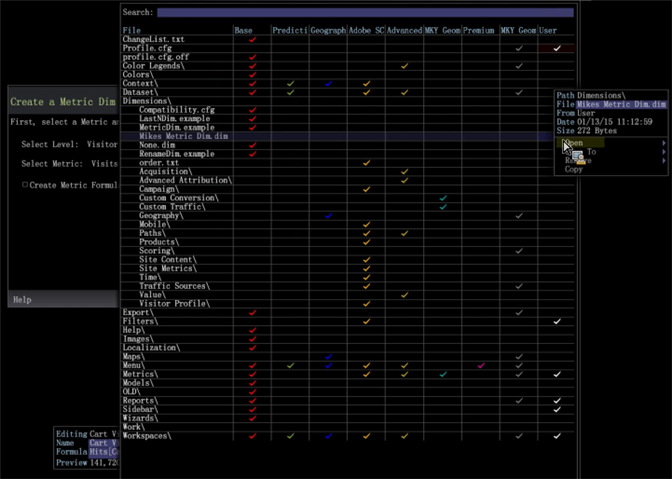

# De metrische grijstint bewerken{#editing-the-metric-dim}

{{eol}}

Bewerk een meter metrisch in Profielbeheer.

Een bestaande metrische gedim bewerken:

1. Klik in een werkruimte met de rechtermuisknop **Beheer** > **Profielbeheer**. Openen **Dimension** en selecteert u de metrische gedim. 

1. Klik met de rechtermuisknop op het vinkje in de gebruikerskolom en selecteer **Openen** en selecteert u vervolgens de metrische gedim. 

1. Breng de gewenste wijzigingen aan in het vak Metrische grijswaarden bewerken. 
