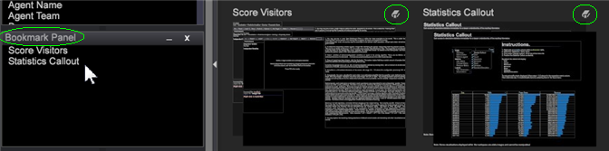

# Het menu met miniaturen van bureaublad gebruiken{#using-the-worktop-thumbnail-menu}

Hoe te, exemplaar, en referentie van de Desktop uitvoeren.

Klik met de rechtermuisknop op een werkruimte om bladwijzerfuncties van het bureaublad te exporteren, kopiëren en te kopiëren.

## Interfacebeschrijvingen {#section-fd027dd94b7d4cb6b933d70c08ccd3e2}

De volgende elementen zijn beschikbaar in het [!DNL Worktop] miniatuurmenu:

**Serverwerkruimte:** *naam*

Wordt alleen weergegeven voor onbewerkte serverwerkruimten. Identificeert de benoemde werkruimte als hetzelfde als de werkruimte die op de server is opgeslagen.

**Datum:** *dag en tijd*

De datum en tijd waarop de werkruimte voor het laatst is geopend.

**Lokale versie van:** *name*

Wordt alleen weergegeven voor lokale versies van serverwerkruimten. Identificeert de benoemde werkruimte als een bewerkte, lokale versie van een werkruimte die is opgeslagen op de server.

**Gebruikerswerkruimte:** *naam*

Wordt alleen weergegeven voor gebruikerswerkruimten. Hiermee wordt de benoemde werkruimte geïdentificeerd als een werkruimte die alleen op de lokale computer bestaat.

**Berekenen op achtergrond**

Wordt alleen weergegeven wanneer u online werkt. Hiermee blijven de query&#39;s in de geselecteerde werkruimte op de achtergrond actief terwijl u doorgaat met werken. Als deze optie is geselecteerd, wordt in de miniatuur de volgende informatie weergegeven die de voortgang van de query&#39;s aangeeft:

* Werken: *n%* - wijst erop dat de vraag en het percentage van de verwerking die volledig is verwerkt.
* *De Lading van de Vraag* nMB - totale grootte van het vraagresultaat. De Lading van de vraag is evenredig aan de totale geheugenlading van uw server van de Data Workbench, maar correleert niet direct. Als richtlijn, kan een 10 MB of hogere vraaglading uw systeem belasten. De vermelde vraaglading neemt geen groepering in aanmerking.

   >[!NOTE]
   >
   >Als Berekenen op achtergrond blijft geselecteerd, worden de query&#39;s in de geselecteerde werkruimte staande query&#39;s, worden deze bijgewerkt en wordt geheugenbelasting gebruikt. Schakel Berekenen op achtergrond uit als u klaar bent met werken in de werkruimte.

**Exporteren naar Excel**

De werkruimtegegevens van de uitvoer naar lijst in Microsoft Excel (.xls en .xslx- dossiers). Wanneer het uitvoeren van een werkruimte naar Excel, voert de Data Workbench gegevens van bepaalde visualisaties, afmeting en waardelegenda, en tekstannotaties naar een nieuw werkboek van Excel met één visualisatie per aantekenvel uit.

**Exporteren naar Excel-sjabloon**

Exporteren naar een Excel-sjabloon (.xltx).

**Kopiëren**

Kopieert de werkruimte. Zie [Bestaande werkruimten kopiëren en plakken](../../home/c-get-started/c-work-worksp/c-create-worksp.md#section-f91ae89b845640c9a4a52820a6110e65) voor meer informatie over het plakken van een gekopieerde werkruimte.

**Terugkeren naar serverversie**

Wordt alleen weergegeven voor lokale versies van serverwerkruimten. Hiermee verwijdert u de lokale kopie van deze werkruimte. Het origineel blijft op de server staan.

**Verwijderen**

Wordt alleen weergegeven voor gebruikerswerkruimten. Hiermee verwijdert u de gebruikerswerkruimte, die alleen op de lokale computer bestaat. Zie [Bestanden verwijderen uit uw werkprofiel](../../home/c-get-started/c-admin-intrf/c-prof-mgr/t-del-files-wkg-prof.md#task-1e29c25e6c824cc9b51cb651e835856b) voor informatie over het verwijderen van werkruimten van de verbonden Data Workbench-server.

**Opslaan op server**

Wordt alleen weergegeven voor lokale versies van serverwerkruimten en gebruikerswerkruimten en werkt alleen voor gebruikers met de juiste machtigingen. Hiermee slaat u de lokale kopie van de werkruimte op de server op. Werkruimten worden standaard opgeslagen in de juiste werkmap `<profile name>\Workspaces\<tab name>`.

**Bladwijzer**

Bladwijzer maken van een werkruimte om deze later snel op te halen.

Een bladwijzerpictogram  zal boven de werkruimte op de werkbovenkant verschijnen en de naam van de werkruimte zal in het paneel van de Bladwijzer verschijnen. 
