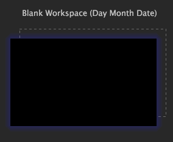

# Een werkruimte maken{#create-a-workspace}

U kunt bestaande werkruimten aanpassen door bestaande visualisaties toe te voegen of te wijzigen of nieuwe werkruimten te maken.

U kunt deze werkruimten vervolgens opslaan voor later gebruik. Zie [Werkruimten maken](../../../home/c-get-started/c-work-worksp/c-create-worksp.md#concept-d8bc99d7739e4eaeab2a02b022394a31).

U kunt nieuwe werkruimten maken door een lege werkruimte te maken, een bestaande werkruimte te kopiëren en te plakken, een werkruimte op een andere locatie op te slaan of een andere naam te gebruiken.

In deze sectie worden de volgende taken beschreven:

* [Nieuwe werkruimten toevoegen](../../../home/c-get-started/c-work-worksp/c-create-worksp.md#section-4236ae30e2884ea08f0885bf329f0778)
* [Bestaande werkruimten kopiëren en plakken](../../../home/c-get-started/c-work-worksp/c-create-worksp.md#section-f91ae89b845640c9a4a52820a6110e65)
* [De naam van een werkruimte wijzigen](../../../home/c-get-started/c-work-worksp/c-create-worksp.md#section-ca7edb913e4e4630a856f45a2536ffad)

## Nieuwe werkruimten toevoegen {#section-4236ae30e2884ea08f0885bf329f0778}

Klik op de gewenste [!DNL Worktop] tab met de rechtermuisknop op een leeg gebied op de tab en klik op een van de volgende opties:

* **[!UICONTROL New]** > **[!UICONTROL Blank Workspace]**. Met deze optie geeft u een standaardgrootte en een lege werkruimte weer.

* **[!UICONTROL New]** >  **[!UICONTROL Report Template]**. Met deze optie geeft u een standaardformaatsjabloon weer waarmee u rapporten kunt maken.

De miniatuur voor het nieuwe type werkruimte wordt weergegeven op het tabblad.

>[!NOTE]
>
>Nadat u een nieuwe werkruimte hebt geopend, moet u mogelijk **Toevoegen** > **Tijdelijk ontgrendelen** klikken.

## Bestaande werkruimten kopiëren en plakken {#section-f91ae89b845640c9a4a52820a6110e65}

U kunt een bestaande werkruimte naar een andere werkruimte kopiëren en plakken. Als u de werkruimte plakt op een tabblad dat een serverversie bevat van een werkruimte met dezelfde naam, wordt de werkruimte geplakt als een lokale versie van die werkruimte. Als u de werkruimte plakt op een tabblad met server- en lokale versies van een werkruimte met dezelfde naam, wordt de werkruimte geplakt als een gebruikersversie van die werkruimte met dezelfde naam gevolgd door (Kopiëren). Als u de werkruimte plakt op een tabblad dat geen werkruimte met dezelfde naam bevat, wordt de werkruimte geplakt als een nieuwe gebruikerswerkruimte.

**Een bestaande werkruimte kopiëren en plakken**

1. Klik op de gewenste [!DNL Worktop]-tab met de rechtermuisknop op de werkruimte die u wilt kopiëren en klik op **[!UICONTROL Copy]**.

   

1. Ga naar het lusje waarin u de werkruimte wilt kleven, klik een leeg gebied binnen het lusje met de rechtermuisknop aan, dan klik **[!UICONTROL Paste]**.

   In het volgende voorbeeld ziet u een werkruimte die op een tabblad van een werkruimte wordt geplakt en een serverversie bevat:

   

In het volgende voorbeeld ziet u een werkruimte die op een tabblad van een werkruimte wordt geplakt en die al een server en een lokale versie bevat. De werkruimte wordt geplakt als een gebruikersversie van die werkruimte met dezelfde naam gevolgd door (Kopiëren):

## De naam van een werkruimte wijzigen {#section-ca7edb913e4e4630a856f45a2536ffad}

**De naam van een werkruimte wijzigen**

1. Klik op de gewenste [!DNL Worktop]-tab op de miniatuur van de werkruimte die u wilt weergeven.
1. Klik in de werkruimte op de titeltekst in de titelbalk en typ de nieuwe titel, zoals in het volgende voorbeeld wordt getoond:

   

## Een werkruimte {#section-fb04cc195e1a4a5491ff634f5f3ca972} verwijderen

**De naam van een werkruimte wijzigen**
