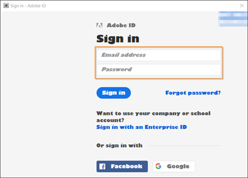

# Data Workbench openen{#opening-data-workbench}

{{eol}}

Nadat Data Workbench is geïnstalleerd en met de server is verbonden, kunt u het gebruiken om uw verwerkte gegevens te analyseren.

1. Navigeer naar de installatiemap van de Data Workbench.
1. Dubbelklikken [!DNL insight.exe] om de toepassing te starten.
1. Klik op **[!UICONTROL Login]**.

   

1. Voer uw referenties in.

   

   De eerste keer dat u start, geeft het systeem de [!DNL Start] pagina en begint met het downloaden van profielgegevens en de gegevenscache.

1. Klik op **[!UICONTROL Start]**.

   Het systeem geeft de [!DNL Worktop].

   

   De volgende keer dat u de Data Workbench start, slaat het systeem de [!DNL Start] en geeft de [!DNL Worktop], tenzij een nieuw profiel aan de server is toegevoegd.

   Updates van het profiel en de bijbehorende gegevens worden alleen gedownload als u online werkt en een netwerkverbinding met de Data Workbench-server hebt. Ga voor meer informatie over online werken naar [Offline werken en online werken](../../home/c-get-started/c-off-on.md#concept-cef8758ede044b18b3558376c5eb9f54).

   >[!NOTE]
   >
   >Het wordt niet aanbevolen dat meerdere gebruikers één computer delen om het werkstation te gebruiken.
