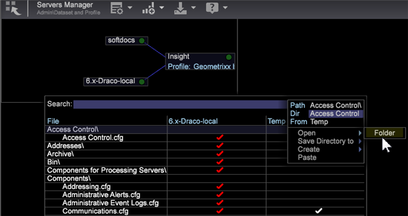

# Gebruikersbeheer van toegang groepslid{#user-administration-of-group-member-access}

De beheerders kunnen werkstationgebruikers de gedeeltelijke capaciteit geven om toegangsbeheer voor douanegroepen te beheren.

**Zelf-beleid van groepslid** geeft toegang tot niet-beheerders rechten om leden in een douanegroep toe te voegen en te schrappen. De beheerder leidt tot een **dossier van de Lijst van de Gebruiker** en plaatst - omhoog groepstoegang in [Access Control.cfg](https://experienceleague.adobe.com/docs/data-workbench/using/server-admin-install/admin-dwb-server/access-control/c-config-acs-ctrl.html) dossier voor de nieuwe groepsleden.

**Toegang tot de Servers Manager**

Het instellen van het **[!DNL User List]**-bestand en het synchroniseren met het **[!DNL Communications.cfg]**-bestand wordt uitgevoerd in de werkruimte **Servers Manager**.

1. Klik op het tabblad **Beheer** > **Gegevensset en profiel** op de werkbalk.

1. Open de werkruimte **Servers Manager**.
1. Klik met de rechtermuisknop >*uw servernaam*> in het diagram en selecteer **Bestanden**.

   De serverbestanden worden geopend in een tabel met de kolommen *File*, *`<server name>`* en *Temp*.

1. **Maak** Lokaal door in de serverkolom van een serverdossier met de rechtermuisknop aan te klikken (voor deze eigenschap  **[!DNL Access Control]** en  **[!DNL Components/Communications.cfg)]**.

   Een wit vinkje zal in **Temperatuur** kolom verschijnen. U kunt deze bewerken in de map Temperatuur. Klik vervolgens met de rechtermuisknop op het vinkje en **Opslaan naar** op de server. (Wordt rood wanneer deze wordt gesynchroniseerd met de server).

## Een bestand met de naam User List.cfg maken {#section-c25bcaf34f4546e6b8b65f5e7f69ac09}

De beheerder moet een **[!DNL User List.cfg]** dossier in **[!DNL Access Control]** omslag tot stand brengen.

1. Klik met de rechtermuisknop op de rij Toegangsbeheer*** in de kolom **Temp** en selecteer **Openen** > **Map**. 

   In de map Access Control in de map **Temp** wordt één **[!DNL Access Control.cfg]**-bestand geopend.

1. Voeg nog een tekstbestand toe aan deze map en noem het **[!DNL User List.cfg]** (naast **[!DNL Access Control.cfg]**).

1. Voeg de volgende parameters aan het **[!DNL User List.cfg]** dossier toe.

Het dossier van de Lijst van de Gebruiker zou een vector van **AccessGroup** voorwerpen moeten bevatten, en elk **AccessGroup** voorwerp zou een naam en een vector van koorden moeten hebben genoemd **members**.

```
Access Control Groups = vector: 1 items 
  0 = AccessGroup:  
    Name = string: Group 1 
    Members = vector: 1 items 
      0 = string: CN:Joe User
```

U kunt gebruikers dit dan uitgeven en toevoegen in de mening van het Werkstation van het **[!DNL User List.cfg]**dossier.


Hier zijn de eenvoudigste parameters om aan het **[!DNL User List.cfg]** dossier toe te voegen. De leden kunnen dan in de mening van het Werkstation worden toegevoegd.

```
Access Control Groups = vector: 1 items 
  0 = AccessGroup:  
    Name = string:  
    Members = vector: 0 items
```

>[!IMPORTANT]
>
>Net als bij elk **[!DNL .cfg]**-bestand dat u handmatig bewerkt, dient u spaties te gebruiken in plaats van tabs en nauwlettend te letten op de witruimte en syntaxis. Een fout in dit bestand leidt ertoe dat *Adobe Insight Server* het bestand Gebruikerslijst negeert.

In het **Name**-veld in elk **Access Group** wordt verwezen naar het [!DNL Access Control.cfg]-bestand.

>[!NOTE]
>
>Alleen geldige leden met voorvoegsels van directoryservices, zoals **CN:** of **OU:**, worden geaccepteerd en deze mogen geen jokerteken (*) bevatten.

## Het bestand Communications.cfg instellen {#section-9d6f05ba81c14f15be63e361533459e8}

Een beheerder schakelt deze functie eerst in door het bestand **[!DNL Components]>[!DNL Communications.cfg]** te openen en een nieuwe sleutel met de naam **[!DNL Access Control User List File]** toe te voegen. De tekenreekswaarde van deze sleutel is het pad waar dit nieuwe bestand zich bevindt.

1. Klik in de serverbestanden op **Componenten** en klik met de rechtermuisknop op het vinkje in de serverkolom. Klik **Lokaal maken**.

   Een wit vinkje zal in **Temperatuur** kolom verschijnen.

1. Klik met de rechtermuisknop op het vinkje in de kolom **Temperatuur** en selecteer **Openen** > **in Workstation**.

1. Klik in het bestand **Communication.cfg** met de rechtermuisknop op **component** en selecteer **Aangepaste sleutel toevoegen.** 

1. Typ de **Naam** als *Gebruikerslijstbestand van toegangsbeheer* en stel **Van type** in als *String*.

   >[!NOTE]
   U kunt het nieuwe lijstbestand niet maken als een pad. Om dit te verhelpen, moet u het dossier opslaan, het openen in een redacteur (Blocnote), en &quot;Koord&quot;veranderen in &quot;Weg&quot;:

   Voor:

   ```
   component = CommServer:  
     Access Control File = Path: Access Control\\Access Control.cfg 
     Access Control User List File =  
    <string>: Access Control\\User List.cfg
   ```

   Na:

   ```
   component = CommServer:  
     Access Control File = Path: Access Control\\Access Control.cfg 
     Access Control User List File =  
    <Path>: Access Control\\User List.cfg
   ```

1. Sla het **[!DNL Communications.cfg]**-bestand op en sla het bestand (indien nodig) op de server op. Hierdoor worden componenten in de server opnieuw gestart om ervoor te zorgen dat u geen fouten hebt gemaakt die kunnen voorkomen dat het **[!DNL Communications.cfg]**-bestand wordt geparseerd.
1. Als uw systeem verwerkingsservers bevat, wijzigt u het configuratiebestand in het **[!DNL Components for Processing Servers.cfg]**-bestand.
1. Klik met de rechtermuisknop op **[!DNL Communications.cfg]** en sla het bestand op de server op.

De beheerder van de Data Workbench kan nu bevestigen dat de beoogde gebruiker(s) toegang heeft tot het bestand met de gebruikerslijst en de gebruikers in staat stelt de groep te beheren. De gebruiker(s) kunnen het bestand Gebruikerslijst openen, bewerken en zo nodig GN- of OU-leden toevoegen en verwijderen.

## Het bestand Access Control.cfg synchroniseren {#section-ca6da453dfb4432bb40b86ef15ede872}

De beheerder kan **[!DNL Access Control.cfg]** dan uitgeven en verwijzingen opnemen naar de groep(en) die door het *dossier van de Lijst van de Gebruiker* worden bepaald.

De verwijzingen naar de groep(en) moeten net als elk ander lid worden ingevoegd, maar met de volgende syntaxis:

```
$(Group Name)
```

Waar &quot;Groepsnaam&quot; overeenkomt met wat is gedefinieerd in het gebruikerslijstbestand, inclusief spaties. 

Op dit punt kan de beheerder van de Data Workbench bevestigen dat de uitgezochte groepsgebruikers toegang tot het dossier van de gebruikerslijst hebben. De uitgezochte gebruikers kunnen dan **[!DNL User List.cfg]** dossier openen, het uitgeven, en GN of OU leden toevoegen en verwijderen zoals nodig.
