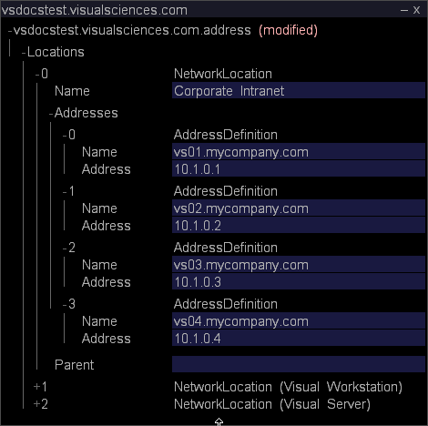

# De Master Insight Server configureren voor clustering{#configuring-the-master-insight-server-for-clustering}

Informatie over het vormen van de cluster op de Master Server van het Inzicht, het bijwerken van het dossier van de toegangscontrole voor een cluster, en meer.

Om de cluster te vormen, voer de volgende stappen op master [!DNL Insight Server] uit:

* Voeg de verwerking [!DNL Insight Servers’] gemeenschappelijke namen en adressen aan het adresdossier toe.
* Voeg alle [!DNL Insight Servers] aan de groep van de Servers van de Cluster in het [!DNL Access Control.cfg] dossier toe.

* Werk het [!DNL Synchronize.cfg] dossier in de Componenten voor de folder van Servers van de Verwerking bij om aan master [!DNL Insight Server] te richten.

* Wijzig zo nodig het [!DNL Disk Files.cfg]-bestand in de map Components for Processing Servers om de locatie van het [!DNL temp.db]-bestand op de verwerking [!DNL Insight Servers] op te geven.

Om deze stappen te voltooien, moet u de gemeenschappelijke namen (zoals gespecificeerd op de digitale certificaten voor het individu [!DNL Insight Server]) en de IP adressen van elk [!DNL Insight Server] in de cluster kennen. Als u deze gegevens nog niet hebt, vraagt u deze op voordat u verdergaat.

>[!NOTE]
>
>Voor de in deze sectie beschreven procedures is [!DNL Insight] vereist. Als u [!DNL Insight] niet hebt geïnstalleerd, volg de instructies in **[!DNL Insight]Gids van de Gebruiker** alvorens te werk te gaan.

## De servers van het Inzicht van de Verwerking aan het Dossier van het Adres {#section-2fe5298180164e8dbaa59ea6b6ff682d} toevoegen

Gebruik de volgende procedure om de verwerking [!DNL Insight Servers’] gemeenschappelijke namen en IP adressen aan het adresdossier op master [!DNL Insight Server] toe te voegen. (Hoewel het adresdossier op master [!DNL Insight Server] wordt gehandhaafd en wordt beheerd, wordt het gebruikt door al [!DNL Insight Servers] in de cluster.)

>[!NOTE]
>
>Het volgende veronderstelt dat het adresdossier reeds voor master [!DNL Insight Server] is gevormd. Als u nog niet het master [!DNL Insight Server’s] IP-adres(sen) aan het adresbestand hebt toegevoegd, voltooit u de procedure die wordt beschreven in [De netwerklocatie van de server definiëren](../../../../../../home/c-inst-svr/c-install-ins-svr/t-install-proc-inst-svr-dpu/c-svrs-ntwk-loc/c-svrs-ntwk-loc.md#concept-87dd2aa3448c415ca1285bc445a8c649) voordat u begint.

**De verwerking toevoegen  [!DNL Insight Servers] aan het adresbestand**

1. Start [!DNL Insight] en laad het configuratieprofiel (als dit nog niet is geopend) door met de rechtermuisknop op de titelbalk te klikken en op **[!UICONTROL Switch Profile]** > **[!UICONTROL Configuration]** te klikken.

1. Klik in [!DNL Insight] op het tabblad [!DNL Admin] > [!DNL Dataset and Profile] op de miniatuur **[!UICONTROL Servers Manager]** om de werkruimte Servers Manager te openen.

1. Klik met de rechtermuisknop op het pictogram van het master **[!UICONTROL Insight Server]** en klik op **[!UICONTROL Server Files]**.

1. Open in [!DNL Server Files Manager] de map Adressen en open het volgende om het adresbestand [!DNL Insight Server’s] te openen:

   1. Klik met de rechtermuisknop op het vinkje in de kolom *servernaam* en klik op **[!UICONTROL Make Local]**.

   1. Klik met de rechtermuisknop op het vinkje in de kolom [!DNL Temp] en klik op **[!UICONTROL Open]** > **[!UICONTROL in Insight]**.

1. Breid de inhoud van de [!DNL Locations] structuur uit, dan uitbreiden NetworkLocation 0, Adressen, en AddressDefinition.
1. Doe het volgende een AddressDefinition aan NetworkLocation 0 voor elke verwerking [!DNL Insight Server] in de cluster toevoegen:

   1. Klik met de rechtermuisknop **[!UICONTROL AddressDefinition]** en klik **[!UICONTROL Add New]** > **[!UICONTROL Address Definition]**.

   1. Geef in de parameter Name de algemene naam voor de verwerking [!DNL Insight Server’s] op.
   1. In de parameter van het Adres, specificeer de verwerking [!DNL Insight Server’s] IP adres.

      U kunt een asterisk als vervanging op het gebied van het Adres, zoals 10.10.116 gebruiken.*, om clustering te vereenvoudigen. Zie [Toegangsniveaus begrijpen](../../../../../../home/c-inst-svr/c-admin-inst-svr/c-config-acs-ctrl/c-undst-acc-lvls.md#concept-6b292edf79214750a8d0525097b8795a).

      In het volgende voorbeeld wordt een cluster gedefinieerd die twee [!DNL Insight Servers] bevat:

      

1. Als de servers met veelvoudige netwerken worden verbonden, herhaal Stap 6 om de verwerking [!DNL Insight Servers] aan NetworkLocations voor die netwerken toe te voegen.

   Het volgende voorbeeld toont een cluster van vier [!DNL Insight Servers] verbonden aan twee netwerken (&quot;Collectief Intranet&quot;en &quot;Internet&quot;).

   

1. Sla de wijzigingen op de server op door het volgende te doen:

   1. Klik met de rechtermuisknop **[!UICONTROL (modified)]** boven in het venster en klik **[!UICONTROL Save]**.

   1. Klik in [!DNL Server Files Manager] met de rechtermuisknop op het vinkje voor het bestand in de kolom [!DNL Temp] en selecteer **[!UICONTROL Save to]** > *&lt;**[!UICONTROL server name]**>*.

## Het toegangsbeheerbestand voor een cluster bijwerken {#section-fce1367d92a445168c35e9ca506e7d6b}

Om [!DNL Insight Servers] in een cluster te gebruiken, moet elke [!DNL Insight Server] in de cluster (met inbegrip van master [!DNL Insight Server]) tot de de toegangsbeheergroep van de Servers van de Cluster behoren. De groep van de Servers van de Cluster identificeert de servers (door IP adres) die aan de cluster mogen deelnemen. Hoewel dit bestand wordt onderhouden en beheerd op de master [!DNL Insight Server], wordt het gebruikt door alle [!DNL Insight Servers] in de cluster.

**Het toegangsbeheerbestand bewerken**

1. Klik in [!DNL Insight] op het tabblad [!DNL Admin] > [!DNL Dataset and Profile] op de miniatuur **[!UICONTROL Servers Manager]** om de werkruimte Servers Manager te openen.

1. Klik met de rechtermuisknop op het pictogram van het master [!DNL Insight Server] en klik op **[!UICONTROL Server Files]**.

1. Open in [!DNL Server Files Manager] de directory Toegangsbeheer.
1. Ga als volgt te werk om het [!DNL Access Control.cfg]-bestand te openen:

   1. Klik met de rechtermuisknop op het vinkje in de kolom *servernaam* en klik op **[!UICONTROL Make Local]**.

   1. Klik met de rechtermuisknop op het vinkje in de kolom [!DNL Temp] en klik op **[!UICONTROL Open]** > **[!UICONTROL in Insight]**.

1. Breid de structuur van de Groepen van het Toegangsbeheer uit, dan breid AccessGroup (de Servers van de Cluster) uit.
1. Voer voor elke [!DNL Insight Server] in de cluster (inclusief de master [!DNL Insight Server]) de volgende handelingen uit:

   1. Klik met de rechtermuisknop **[!UICONTROL Members]** en klik **[!UICONTROL Add New]** > **[!UICONTROL New Member]**.

   1. Specificeer [!DNL Insight Server’s] IP adres (zijn numeriek IP adres, niet zijn naam). Als [!DNL Insight Servers] met veelvoudige netwerken worden verbonden, zou deze AccessGroup slechts de interne adressen moeten bevatten die [!DNL Insight Servers] voor inter-servermededeling binnen de cluster gebruiken.

      Het volgende toont AccessGroup (de Servers van de Cluster) voor een cluster van vier [!DNL Insight Servers].

      

1. Sla de wijzigingen op de server op door het volgende te doen:

   1. Klik met de rechtermuisknop **[!UICONTROL (modified)]** boven in het venster en klik **[!UICONTROL Save]**.

   1. Klik in [!DNL Server Files Manager] met de rechtermuisknop op het vinkje voor het bestand in de kolom [!DNL Temp] en klik **[!UICONTROL Save to]** > *&lt;**[!UICONTROL server name]**>*.

## Het vormen van het Dossier van de Synchronisatie {#section-d23e751771c84da6bab6a34a8db867bc}

U kunt de volgende procedure gebruiken om het centrale exemplaar van het [!DNL Synchronize.cfg] dossier te vormen. Het centrale exemplaar van dit dossier wordt gehandhaafd op master [!DNL Insight Server]. De verwerking [!DNL Insight Servers] in de cluster initieert communicatie met de master [!DNL Insight Server] om een bijgewerkte kopie van dit bestand op te halen.

In het [!DNL Synchronize.cfg]-bestand wordt de locatie van de master [!DNL Insight Server] opgegeven. Het identificeert ook de reeks administratieve dossiers die elk van de verwerking [!DNL Insight Servers] in de cluster van master [!DNL Insight Server] terugwint. De verwerking [!DNL Insight Servers] downloadt deze dossiers automatisch van master [!DNL Insight Server] wanneer zij beginnen. Zij winnen ook dynamisch bijgewerkte exemplaren van deze dossiers van master [!DNL Insight Server] terug wanneer de dossiers veranderen.

>[!NOTE]
>
>Hoewel u het [!DNL Synchronize.cfg] dossier op master [!DNL Insight Server] vormt, master [!DNL Insight Server] zelf gebruikt dit dossier niet. U werkt dit bestand op de master [!DNL Insight Server] bij, zodat het op de juiste wijze wordt geconfigureerd wanneer de verwerking [!DNL Insight Servers] het bestand ophaalt.

**Het bestand Synchronize.cfg in het master bestand bijwerken[!DNL Insight Server]**

1. Klik in [!DNL Insight] op het tabblad [!DNL Admin] > [!DNL Dataset and Profile] op de miniatuur **[!UICONTROL Servers Manager]** om de werkruimte Servers Manager te openen.

1. Klik met de rechtermuisknop op het pictogram van het master [!DNL Insight Server] en klik op **[!UICONTROL Server Files]**.

1. Open in [!DNL Server Files Manager] de map **[!UICONTROL Components]** voor het verwerken van servers.

1. Ga als volgt te werk om [!DNL Synchronize.cfg] te openen:

   1. Klik met de rechtermuisknop op het vinkje in de kolom *servernaam* en klik op **[!UICONTROL Make Local]**.

   1. Klik met de rechtermuisknop op het vinkje [!DNL Temp] en klik **[!UICONTROL Open]** > **[!UICONTROL in Insight]**.

1. Breid de componentenstructuur uit.
1. In de parameter van het Adres van de Server van de Cluster Primaire, specificeer het IP adres van master (primair) **[!UICONTROL Insight Server]**.

   

   Om een logboek te creëren dat registreert telkens als de synchronisatie tussen master [!DNL Insight Server] en de verwerking [!DNL Insight Servers] voorkomt, zorg ervoor dat de Enable parameter van het Logboek van de Synchronisatie aan &quot;waar wordt geplaatst.&quot;

1. Sla de wijzigingen op de server op door het volgende te doen:

   1. Klik met de rechtermuisknop **[!UICONTROL (modified)]** boven in het venster en klik **[!UICONTROL Save]**.

   1. Klik in [!DNL Server Files Manager] met de rechtermuisknop op het vinkje voor het bestand in de kolom [!DNL Temp] en klik **[!UICONTROL Save to]** > *&lt;**[!UICONTROL server name]**>*.

## De locatie van de gegevensset configureren (temp.db) {#section-5ec257a4b4c64fb58baec1f12119a822}

Voer de volgende procedure uit als u wilt dat de verwerking [!DNL Insight Servers] (de dataset) in een folder of aandrijving verschillend dan de standaardplaats handhaaft of als u [!DNL temp.db] over veelvoudige aandrijving wilt verdelen.[!DNL temp.db]

>[!NOTE]
>
>Omdat de verwerking [!DNL Insight Servers] allemaal dezelfde [!DNL Disk Files.cfg] heeft, moeten alle gebruikers de bestandslocatie(s) ondersteunen die u in dit bestand opgeeft. Als u bijvoorbeeld [!DNL temp.db] toewijst aan de E: -station, moet elke verwerking [!DNL Insight Server] in de cluster een E hebben: rijden.

**De locatie van temp.db configureren**

1. Klik in [!DNL Insight] op het tabblad [!DNL Admin] > [!DNL Dataset and Profile] op de miniatuur **[!UICONTROL Servers Manager]** om de werkruimte Servers Manager te openen.

1. Klik met de rechtermuisknop op het pictogram van het master [!DNL Insight Server] en klik op **[!UICONTROL Server Files]**.

1. Open in [!DNL Server Files Manager] de map **[!UICONTROL Components for Processing Servers]**.

1. Ga als volgt te werk om [!DNL Disk Files.cfg] te openen:

   1. Klik met de rechtermuisknop op het vinkje in de kolom *servernaam* en klik op **[!UICONTROL Make Local]**.

   1. Klik met de rechtermuisknop op het vinkje in de kolom [!DNL Temp]en klik op **[!UICONTROL Open]** > **[!UICONTROL in Insight]**.

1. Vouw de structuur DiskSpaceManagerComponent uit en vouw vervolgens de lijst Schijfbestanden uit.
1. Bewerk item 0 om de locatie van het [!DNL temp.db]-bestand te wijzigen.
1. Als u [!DNL temp.db] over veelvoudige aandrijving wilt verdelen, gebruik de hieronder stappen om een extra ingang voor elke extra aandrijving tot stand te brengen.

   1. Klik met de rechtermuisknop **[!UICONTROL Disk Files]** en klik **[!UICONTROL Add New]** > **[!UICONTROL Disk File]**.

   1. Geef in het nieuwe item de locatie op waar u [!DNL temp.db] wilt schrijven.
   In het volgende voorbeeld ziet u [!DNL temp.db] geschreven over vier stations.

   

1. Sla de wijzigingen op de server op door het volgende te doen:

   1. Klik met de rechtermuisknop **[!UICONTROL (modified)]** boven in het venster en klik **[!UICONTROL Save]**.

   1. Klik in [!DNL Server Files Manager] met de rechtermuisknop op het vinkje voor het bestand in de kolom [!DNL Temp] en klik **[!UICONTROL Save to]** > *&lt;**[!UICONTROL server name]**>*.
