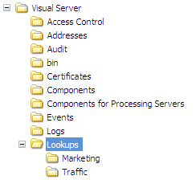

# Profielen installeren en bestanden opzoeken{#installing-profiles-and-lookup-files}

De profielen en raadplegingsdossiers die Adobe voor uw bepaalde toepassing heeft ontwikkeld zijn interne profielen die de metriek, de afmetingen, en de werkruimten verstrekken die de analyse van uw dataset toelaten.

Net als bij alle andere interne profielen die door Adobe worden geleverd, mogen deze profielen niet worden gewijzigd. Alle aanpassing moet in uw dataset of rol-specifieke profielen of andere profielen voorkomen die u creeert.

Adobe verspreidt het profiel en de raadplegingsdossiers voor uw toepassing als [!DNL .zip] dossier. Elk ZIP-bestand krijgt een naam voor de toepassing waarvan het profiel en de opzoekbestanden in het bestand staan. ([!DNL Site52.zip] bevat bijvoorbeeld de profielbestanden voor Site v5.2.) Het [!DNL .zip]-bestand bevat twee mappen ( [!DNL Lookups] en [!DNL Profiles]).

>[!NOTE]
>
>Als u nog geen installatiebestand hebt dat de profielen en opzoekbestanden voor uw toepassing bevat, downloadt u deze van de FTP-site Adobe voordat u begint.

U moet het profiel en zijn raadplegingsdossiers op de [!DNL Insight Server] machine installeren waarop u uw gegevenssetprofiel verwerkt en in werking stelt. Als u een [!DNL Insight Server] cluster in werking stelt, moet u de dossiers op de master server installeren. Voor informatie over datasetprofielen, zie *de Gids van de Configuratie van de Dataset*.

**Profielen voor uw Adobe-toepassing installeren**

1. Open de map [!DNL Profiles] vanuit het bestand [!DNL .zip] dat u van Adobe hebt ontvangen.

1. Kopieer alle mappen in de map [!DNL Profiles] in het bestand [!DNL .zip] naar de map [!DNL Profiles] in de installatiemap [!DNL Insight Server]. U wilt omhoog met  [!DNL ...\Profiles\]*&lt; [!DNL internal profile name]* omslagen op uw [!DNL Insight Server] zoals aangetoond in het volgende voorbeeld beëindigen. De werkelijke profielnamen kunnen afwijken.

   

1. Navigeer naar de map  [!DNL Profiles\]*&lt; [!DNL dataset profile name]* in de map waarin u [!DNL Insight Server] hebt geïnstalleerd en zoek het bestand [!DNL profile.cfg] in deze map.

   >[!NOTE]
   >
   >Als u profielen voor de eerste keer installeert, kunt u het verstrekte profiel van de Steekproef als uw datasetprofiel gebruiken. U kunt het [!DNL profile.cfg] dossier (het zou kunnen worden genoemd iets zoals [!DNL profile.cfg.offline]) voor het profiel van de Steekproef binnen [!DNL Profiles\Sample] omslag in uw [!DNL Insight Server] installatiemap vinden.

1. Open het [!DNL profile.cfg] dossier gebruikend een tekstredacteur zoals Blocnote en doe het volgende:

   1. Voeg items toe voor de interne profielen in de vector Directory&#39;s. De profielnamen komen overeen met de namen van de directory&#39;s die u naar de map [!DNL Profiles] op de computer [!DNL Insight Server] hebt gekopieerd.

   1. Werk het aantal mappen naar wens bij.
   1. Voeg de gemeenschappelijke naam van de server aan de Gemeenschappelijke lijn van de Naam in dit dossier toe, zoals hieronder benadrukt:

      ```
      Profile = profileInfo: 
      Directories = vector: n+1 items
        0 = string: Base\\
        1 = string: internal profile name 1\\
        2 = string: internal profile name 2\\
      . . .
        n = string: internal profile name n\\
      Processing Servers = vector: 1 items
        0 = ProfileServerInfo: 
          Common Name = string: serverCommonName
          Server = string: 
      ```

      >[!NOTE]
      >
      >De *serverCommonName* die u in het [!DNL profile.cfg]-bestand opgeeft voor de gemeenschappelijke naam, komt overeen met de gemeenschappelijke naam van de server voor de [!DNL Insight Server]-computer waarop u het gegevenssetprofiel verwerkt en uitvoert. Voor instructies om [!DNL profile.cfg] bij te werken zodat het datasetprofiel op een [!DNL Insight Server] cluster loopt, zie [De Clusters van de Server van het Inzicht](../../../../home/c-inst-svr/c-install-ins-svr/c-ins-svr-clstrs/c-abt-ins-svr-clsters.md).

1. Sla het bestand op. Sla het bestand op als [!DNL profile.cfg] als een andere naam is opgegeven.

**De opzoekbestanden voor uw Adobe-toepassing installeren**

1. Open de map [!DNL Lookups] vanuit het bestand [!DNL .zip] dat u van Adobe hebt ontvangen.

1. Kopieer alle mappen in de map [!DNL Lookups] in het bestand [!DNL .zip] naar de map [!DNL Lookups] in de installatiemap [!DNL Insight Server]. U wilt omhoog met  [!DNL ...\Lookups\]*&lt; [!DNL internal profile name]* omslagen op uw [!DNL Insight Server] zoals aangetoond in het volgende voorbeeld beëindigen. De werkelijke profielnamen kunnen afwijken.

   
