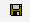

# Het digitale certificaat downloaden en installeren{#downloading-and-installing-the-digital-certificate}

Nadat u de Insight-programmabestanden hebt geïnstalleerd, moet u het digitale certificaat downloaden en installeren dat u van Adobe hebt ontvangen.

## Het digitale certificaat downloaden en installeren {#topic-fed3b44e472c4e4ca6dd5852af14cdb9}

Nadat u de Insight-programmabestanden hebt geïnstalleerd, moet u het digitale certificaat downloaden en installeren dat u van Adobe hebt ontvangen.

## Digitale certificaten {#concept-9eed01c8d95440cda6ce29d68e65098c}

Adobe gebruikt X.509 digitale certificaten om de cliënt en servercomponenten te identificeren en voor authentiek te verklaren die omhoog een implementatie maken.

<!--
c_undst_dgtl_crtf.xml
-->

Wanneer u Insight installeert, moet u het digitale certificaat installeren dat een benoemde persoon (bijvoorbeeld Jane Smith) toestaat de geïnstalleerde clienttoepassing te gebruiken.

>[!NOTE]
>
>Als u Inzicht naar een andere computer of een andere genoemde gebruiker moet migreren, moet u een nieuw certificaat van Adobe verkrijgen. Neem hiervoor contact op met de klantenservice van Adobe.

Insight geeft dit digitale certificaat weer om toegang te krijgen tot een servercomponent. Een beheerder van een servercomponent kan toegang tot servermiddelen beperken die op de gemeenschappelijke naam of organisatorische eenheidwaarden worden gebaseerd die in het certificaat van de gebruiker verschijnen.

De X.509 digitale certificaten die met Adobe toepassingen worden geïnstalleerd laten ook zijn cliënt en servercomponenten toe om informatie over de Veilige Laag van Contactdozen (SSL) uit te wisselen. SSL beveiligt transmissies over HTTP gebruikend een publiek-en-privé zeer belangrijk encryptiesysteem. Adobe&#39;s implementatie van SSL ondersteunt 1024-bits RSA-sleutels en gebruikt een 128-bits RC4-versleutelingsalgoritme.

Naast beveiliging werkt het digitale certificaat dat u installeert ook als licentiecode waarmee u Insight kunt uitvoeren. Een digitaal certificaat kan alleen correct functioneren als het is vergrendeld en actueel is, of als de toepassing wordt gestart.

## Door knooppunten vergrendelde certificaten {#section-984aa8f2f5a1448cadc4afea978aedc9}

Een door knooppunten vergrendeld certificaat is een digitaal certificaat dat is geregistreerd op de computer waarop het is geïnstalleerd. Knooppuntvergrendeling koppelt een certificaat permanent aan een specifieke knooppunt-id (een waarde die een bepaalde computer uniek identificeert). Als u het certificaat wilt vergrendelen op een knooppunt, moet uw computer toegang hebben tot internet van de Adobe-licentieserver of een proxyserver die toegang heeft tot de licentieserver.

Als u een computer installeert die geen toegang heeft tot internet, moet u een speciaal vooraf vergrendeld certificaat verkrijgen en installeren, zoals beschreven in [Digitale certificaten gebruiken op computers zonder internettoegang](../../../home/c-install-insight/install-setup/c-dgtl-crtf.md#section-d3c060131d7f45cda27f68848b704fa1).

Als u op een computer installeert die tot Internet kan toegang hebben, zal uw digitaal certificaat knoop-gesloten automatisch zijn de eerste keer dat u Insight begint. Nadat het knooppunt-vergrendeld is, kan het certificaat niet op een andere computer worden gebruikt. Als u Inzicht naar een andere computer moet migreren, moet u een nieuw, niet-vergrendeld certificaat verkrijgen van Adobe.

## Huidige certificaten {#section-0816b031df3e415ab3f0205b720c723e}

Uw digitale certificaat moet niet alleen zijn vergrendeld door knooppunten, maar ook actueel zijn. Uw certificaat moet regelmatig opnieuw worden gevalideerd (gewoonlijk om de 30 dagen, maar kan afhankelijk van uw toestemming met Adobe variëren) om actueel te blijven. Als uw computer toegang tot internet heeft, is het proces voor opnieuw valideren volledig transparant. Het inzicht verbindt automatisch met de Server van de Vergunning en bevestigt het certificaat wanneer noodzakelijk. Als uw computer geen internettoegang heeft, moet u handmatig een bijgewerkt certificaat installeren, zoals beschreven in de volgende sectie.

## Digitale certificaten gebruiken op computers zonder internettoegang {#section-d3c060131d7f45cda27f68848b704fa1}

Als u op een computer installeert die tot Internet niet kan toegang hebben, moet u een vooraf gesloten certificaat voor uw installatie van Insight vragen. Een vooraf vergrendeld certificaat is een digitaal certificaat dat Adobe handmatig vergrendelt op de knooppuntidentificatie voor de computer.

Als u een vooraf vergrendeld certificaat wilt aanvragen, moet u de knooppuntidentificatie en uw certificaatnummer naar de klantenservice van Adobe sturen. Om de knoop herkenningsteken voor uw computer te verkrijgen, contacteer de Zorg van de Klant van Adobe om het Adobe [!DNL Node Identifier] nut te verzoeken. U kunt de knoopherkenningsteken van het alarm ook verkrijgen dat de kwesties van het Inzicht wanneer het probeert om met de Server van de Vergunning te verbinden en niet kan. Wanneer u het vooraf vergrendelde certificaat ontvangt, installeert u dit zoals beschreven in de laatste twee stappen van [Digitale certificaten installeren](../../../home/c-install-insight/install-setup/c-dgtl-crtf.md#task-1dad1e1d86d04100a7bcf87f26303c38).

Wanneer het certificaat opnieuw moet worden gevalideerd, moet u een nieuw, gevalideerd certificaat downloaden van de licentieserver en dit opnieuw op uw computer installeren (tenzij u akkoord gaat met Adobe, anders).

## Digitale certificaten installeren {#task-1dad1e1d86d04100a7bcf87f26303c38}

<!--
t_install_dgtl_crtf.xml
-->

**Het digitale certificaat downloaden en installeren**

1. Open uw webbrowser naar [!DNL https:\\license.visualsciences.com].

   >[!NOTE]
   >
   >Mogelijk wordt u in uw browser gevraagd om nu een digitaal certificaat voor te leggen. Als dit het geval is, klikt u op **[!UICONTROL Cancel]** om het dialoogvenster te sluiten.

1. Voer in het aanmeldingsscherm de [!DNL Account Name] en [!DNL Password] in die u van Adobe hebt ontvangen en klik vervolgens op **[!UICONTROL login]**.
1. Zoek het certificaat dat is uitgegeven voor uw Insight-exemplaar ( *Uw naam*.pem) en klik op het -pictogram dat is gekoppeld aan dat certificaat.
1. Wanneer ertoe aangezet om het certificaat te bewaren, klik **[!UICONTROL Save]**.
1. Download het bestand naar de map [!DNL Certificates] in de map waarin u Insight hebt geïnstalleerd.

   Deze map bevat een certificaatbestand met de naam [!DNL trust_ca_cert.pem]. Beide certificaatbestanden moeten altijd aanwezig zijn om Insight te kunnen gebruiken.

## Windows-certificaatarchief {#concept-4acb13b7de9340ea8cde8ad84b93358d}

Met het Windows-certificaatarchief kunt u het certificaat en de persoonlijke sleutel van de client opslaan in het Windows-certificaatarchief voor SSL-communicatie met servers.

<!--
crypto-api.xml
-->

Het Windows-certificaatarchief voor de client is een nieuwe functie waarmee u het SSL-communicatiecertificaat en de persoonlijke sleutel kunt opslaan in het Windows-certificaatarchief in plaats van in het `Insight/Certificates/<CertName>.pem`-bestand. Het gebruik van het Windows-certificaatarchief heeft de voorkeur als u het certificaatarchief voor andere toepassingen gebruikt en het certificaatbeheer op één plaats wilt uitvoeren, of als u wilt genieten van het aanvullende Windows-auditlogboek dat door het Windows-certificaatarchief wordt geleverd.

>[!NOTE]
>
>Het verlenen van licenties met de licentieserver wordt nog steeds onderhouden met behulp van het bestaande `<Common Name>.pem`-bestand en dat het certificaat dat is verkregen uit het certificaatarchief alleen wordt gebruikt voor communicatie met de servers die u opgeeft.

## Vereisten {#section-69b18600052145ff8e5299b7123e69c5}

1. U moet toegang tot het [!DNL certmgr.msc] dossier met de capaciteit hebben om een certificaat en een sleutel in **Persoonlijke** opslag in te voeren. (Dit zou voor de meeste gebruikers van Vensters moeten waar zijn.)

1. De gebruiker die de configuratie doet moet een exemplaar van **OpenSSL** bevel-lijn hulpmiddel hebben.
1. De server en de client moeten al zijn geconfigureerd voor het gebruik van een aangepast SSL-certificaat. Hierin worden instructies gegeven voor het opslaan van het clientcertificaat in het Windows-certificaatarchief in plaats van het op te slaan in de map **Certificates**.

## Het Windows-certificaatarchief configureren {#section-3629802122e947d4b4f63e8b732cfe27}

Het Windows-certificaatarchief voor clients wordt als volgt ingeschakeld:

**Stap 1: Importeer het SSL-certificaat en de persoonlijke sleutel van de gebruiker naar het Windows-certificaatarchief.**

In [Aangepaste certificaten gebruiken in Data Workbench](../../../home/c-install-insight/install-setup/c-dgtl-crtf.md#concept-ee6a9b5015f84a0ba64a11428b0a72dd) wordt u aangeraden het SSL-certificaat en de sleutel in de volgende map te plaatsen:

```
<
<filepath>
  DWB Install folder
</filepath>>\Certificates\
```

De naam van het certificaat is `<Common Name>.pem`, zoals Analytics Server 1.pem (niet het bestand trust_ca_cert.pem).

Voordat het certificaat en de persoonlijke sleutel kunnen worden geïmporteerd, moeten ze zijn omgezet van . [!DNL pem] aan een  [!DNL .pfx] formaat, zoals  [!DNL pkcs12.pfx] ).

1. Open een opdrachtprompt of terminal en navigeer naar de map:

   ```
   <CommonName>.pem c: cd \<filepath>DWB Install folder</filepath>>\Certificates
   ```

1. [!DNL openssl] uitvoeren met de volgende argumenten (met de daadwerkelijke [!DNL .pem] bestandsnaam):

   ```
   openssl pkcs12 -in "<Common Name>.pem" -export -out "<Common Name>.pfx"
   ```

   Druk, indien daarom wordt gevraagd, op **Enter** om het invoeren van een exportwachtwoord over te slaan.

1. [!DNL certmgr.msc] van de looppasherinnering, beginmenu, of bevellijn in werking stellen.
1. Open het certificaatarchief **Personal** voor de huidige gebruiker.

   

1. Klik met de rechtermuisknop **Certificates** en klik **All Tasks** > **Import**.

   Zorg ervoor dat de optie **Huidige gebruiker** is geselecteerd en klik vervolgens op **Volgende**.

   

1. Klik **Bladeren** en selecteer het `<CommonName>.pfx` dossier u eerder creeerde. U zult het drop-down vakje van de dossieruitbreiding van een X.509 Certificaat in of **Personal Information Exchange** of in **Alle Dossiers** moeten veranderen om het te zien.

   Selecteer het bestand en klik op **Open** en **Volgende**.

1. Voer geen wachtwoord in en zorg ervoor dat alleen de opties **Deze sleutel markeren als exporteerbaar** en **Alle uitgebreide eigenschappen opnemen** zijn geselecteerd.

   

   Klik **Volgende**.

1. Zorg ervoor dat **Alle certificaten in de volgende opslag plaatsen** wordt geselecteerd, en dat de vermelde certificaatopslag **Persoonlijk** is. (Als u een gevorderde gebruiker bent, kunt u een andere opslag op dit punt selecteren, maar u zult de configuratie later moeten veranderen.)

1. Klik **Volgende** en klik dan **Voltooien**. Er wordt een dialoogvenster weergegeven waarin u wordt aangegeven dat het importeren is gelukt. Uw certificaat wordt weergegeven in de map Certificates in de winkel.

   >[!NOTE]
   >
   >Let vooral op de velden **Uitgegeven aan** en **Uitgegeven door**. U zult deze in de volgende stap nodig hebben.

**Stap 2: Bewerk het bestand Insight.cfg.**

Het [!DNL Insight.cfg] dossier moet worden uitgegeven om Data Workbench te leiden om de eigenschap van het Opslag van het Certificaat van Vensters te gebruiken. Voor elk serveritem in dit bestand moeten aanvullende parameters worden opgegeven. Als de parameters worden weggelaten, zal het werkstation aan het gebruiken van de bestaande certificaatconfiguratie in gebreke blijven. Als de parameters worden gespecificeerd maar onjuiste waarden hebben, zal het werkstation een foutenstaat ingaan en u zult naar het logboekdossier voor fouteninformatie moeten verwijzen.

1. Open het bestand **Insight.cfg** (in de installatiemap **Insight**).

1. De rol neer aan de serveringang die u wenst te vormen. Als u het Windows-certificaatarchief voor elke server wilt gebruiken, moet u deze wijzigingen aanbrengen in elke vermelding in de vector van [!DNL serverInfo]-objecten.
1. Voeg deze parameters aan hun [!DNL Insight.cfg] dossier toe. U kunt dit vanuit het werkstation doen of handmatig door de volgende parameters toe te voegen aan het object [!DNL serverInfo]. (Gebruik spaties in plaats van tabtekens en maak geen andere typografische of syntaxisfouten in dit bestand. )

   ```
   SSL Use CryptoAPI = bool: true
   SSL CryptoAPI Cert Name = string: <Common Name>
   SSL CryptoAPI Cert Issuer Name = string: Visual Sciences,LLC
   SSL CryptoAPI Cert Store Name = string: My
   ```

   De Booleaanse waarde schakelt de functie in of uit. De certificaatnaam komt overeen met **Uitgever met** in het certificaatbeheer. De naam van de certificaatuitgever komt overeen met **Uitgegeven door**, en **Naam van winkel** moet overeenkomen met de naam van het certificaatarchief.

   >[!NOTE]
   >
   >De naam &quot;Persoonlijk&quot;in de Manager van het Certificaat (certmgr.msc) verwijst eigenlijk naar de certificaatopslag genoemd **Mijn.** Als u uw SSL-communicatiecertificaat en -sleutel (.PFX) naar het  **** persoonlijke certificaatarchief importeert zoals aanbevolen, moet u daarom de  **SSL CryptoAPI Cert Store-** tekenreeks instellen op Mijn. Het instellen van deze parameter op &#39;Persoonlijk&#39; werkt niet. Dit is een eigenaardigheid van het Windows-certificaatarchief.

   Een volledige lijst van de vooraf bepaalde systeemopslag kan hier worden verkregen: [https://msdn.microsoft.com/en-us/library/windows/desktop/aa388136(v=vs.85).aspx](https://msdn.microsoft.com/en-us/library/windows/desktop/aa388136%28v=vs.85%29.aspx). Mogelijk bevat uw systeem extra certificaatopslagruimten. Als u een opslag buiten &quot;Persoonlijk&quot;wenst te gebruiken (zoals **Mijn**), moet u de canonieke naam van de certificaatopslag verkrijgen en het verstrekken in [!DNL Insight.cfg] dossier. (De naam van de systeemopslag &quot;Mijn&quot;wordt inconsistent bedoeld als &quot;Mijn&quot;en &quot;MIJN&quot;door de documentatie van Vensters. De parameter lijkt niet hoofdlettergevoelig te zijn.)

1. Nadat u deze parameters hebt toegevoegd en gecontroleerd dat de waarden de lijst in de Manager van het Certificaat van Vensters aanpassen, sparen [!DNL Insight.cfg] dossier.

U kunt het werkstation nu starten (of de verbinding met de server verbreken of opnieuw tot stand brengen). Data Workbench moet uw certificaat en sleutel laden uit het certificaatarchief en normaal verbinding maken.

## Logboekuitvoer {#section-a7ef8c9e90ef4bbabaa3cd51a2aca3ab}

Wanneer een certificaat niet wordt gevonden of ongeldig is, wordt dit foutbericht gegenereerd naar het [!DNL HTTP.log]-bestand.

```
ERROR Fatal error: the cert could not be found!
```

>[!NOTE]
>
>U kunt het L4-logboekframework inschakelen door het [!DNL L4.cfg]-bestand in te stellen (raadpleeg uw accountmanager om dit in te stellen).

## Aangepaste certificaten gebruiken in Data Workbench {#concept-ee6a9b5015f84a0ba64a11428b0a72dd}

Instructies voor het gebruik van aangepaste certificaten.

<!--
using-custom-certificates-DWB.xml
-->

Een certificaat dat door de client of server van de Data Workbench wordt gebruikt, moet door een vertrouwde certificeringsinstantie (Certificate Authority) worden ondertekend. Klanten van Data Workbench ontvangen certificaten die door de Visual Sciences CA zijn ondertekend. Deze certificaten worden vertrouwd door de software van de Data Workbench, aangezien [!DNL trust_ca_cert.pem] (die samen met de software van het Inzicht wordt verstrekt en in **Certificates** folder van zowel servers als cliënten wordt opgeslagen) een *Certificaat van de Wortel CA* voor Visual Sciences CA bevat. Deze certificaten worden gebruikt voor zowel licenties voor de software als verificatie wanneer clients en servers met elkaar communiceren via SSL. Alleen door de Visual Sciences CA uitgegeven certificaten kunnen worden gebruikt voor licenties, maar andere certificaten kunnen worden gebruikt voor communicatie en verificatie. Door andere CA&#39;s dan Visual Sciences uitgegeven certificaten worden hieronder aangeduid als *aangepaste certificaten.*

**Belangrijke opmerking:** Voor servers en clients gebruikt de software van de Data Workbench de certificaatbestanden die zijn geïnstalleerd in de  **** certificaatmap of certificaten van de client of server die expliciet in de configuratie zijn vermeld. U kunt echter ook het Windows-certificaatarchief voor clients gebruiken.

De volgende instructies beschrijven de procedures die moeten worden gevolgd om douanecertificaten voor communicatie tussen de cliënten en de servers van de Data Workbench te gebruiken. Niet elk detail is een harde eis en er kunnen verschillende variaties in het proces worden toegepast. Onderstaande procedures zijn echter getest om te werken.

## Aangepaste clientcertificaten instellen {#section-2083fd41973e451fa404e7a4ae4da591}

1. Voeg het certificaat van de uitgevende CA aan [!DNL trust_cert_ca.pem] toe, dat in **Certificates** folder van de cliënt en dat van elke server in elke cluster wordt geïnstalleerd die met dit douanecertificaat moet worden betreden.

1. Vraag een aangepast certificaat aan voor elke server in de cluster met de volgende voorwaarden:

   1. Certificaat is opgemaakt als een [!DNL .pem]-certificaat.
   1. Het certificaat bevat de sleutel en is niet versleuteld (het heeft dus geen wachtwoord/woordgroep).

      Een certificaat bevat de sleutel met een van de volgende regels:

      ```
      BEGIN PRIVATE KEY
      BEGIN RSA PRIVATE KEY
      ```

      Een manier om de wachtwoorduitdrukking te verwijderen uit een [!DNL .pem]-certificaat:

      ```
      openssl rsa  -in password-protected-cert.pem -out no-password-cert.pem
      openssl x509 -in password-protected-cert.pem >> no-password.pem
      ```

   1. Het certificaat heeft de CN, O, OU, enz. zoals vereist voor deze client in het [!DNL Access Control.cfg]-bestand van de server.
   1. Certificaat is uitgegeven met een *doel **** van *client* (of zowel *server* **als** *client*).

      Om te verifiëren dat een certificaat een doelcode van server en/of cliënt heeft, kunnen de volgende bevelen worden gebruikt:

      ```
      openssl verify -CAfile trust_ca_cert.pem -purpose sslserver -x509_strict custom_communications_cert.pem
      openssl verify -CAfile trust_ca_cert.pem -purpose sslclient -x509_strict custom_communications_cert.pem
      ```

      Voor servercertificaten moeten beide opdrachten het volgende opleveren:

      ```
      custom_communications_cert.pem: OK
      ```

      Voor een clientcertificaat is alleen de tweede opdracht vereist om [!DNL OK] op te leveren.

1. Plaats het certificaat in de map **Certificates** van de client.
1. Controleer in [!DNL Insight.cfg] onder *serverInfo* voor elke cluster die u dit certificaat wilt gebruiken of het *aangepaste clientcertificaat* een naam heeft, zoals:

   ```
   Servers = vector: 1 items
     0 = serverInfo:
       SSL Client Certificate = string:
     <my_custom_client_cert.pem>
   ```

## Aangepaste servercertificaten instellen {#setting-up-custom-server-certificates}

In deze sectie wordt ervan uitgegaan dat u een cluster hebt dat in gebruik is, waarbij door Visual Sciences uitgegeven certificaten worden gebruikt. De configuratie volgt gangbare praktijken (zoals de map *Components for Processing Servers* op de master map wordt gesynchroniseerd met de directory *Components* van alle DPU&#39;s).

1. Voeg het certificaat van de uitgevende CA toe aan [!DNL trust_cert_ca.pem] dat op elke server in de cluster en elke cliënt wordt geïnstalleerd die met deze cluster moet communiceren.
1. Vraag een aangepast certificaat aan voor elke server in de cluster met de volgende vereisten:

   1. Aangepast certificaat is opgemaakt als een [!DNL .pem]-certificaat.
   1. Het certificaat bevat de sleutel en is niet versleuteld (het heeft dus geen wachtwoord/woordgroep).

      Een certificaat bevat zijn sleutel als het een lijn zoals heeft:

      ```
      BEGIN PRIVATE KEY
      BEGIN RSA PRIVATE KEY
      ```

      Een manier om de wachtwoorduitdrukking te verwijderen uit een [!DNL .pem]-certificaat:

      ```
      openssl rsa  -in password-protected-cert.pem -out no-password-cert.pem
      openssl x509 -in password-protected-cert.pem >> no-password.pem
      ```

   1. Het certificaat heeft dezelfde CN als de [!DNL server_cert.pem] die momenteel op de server is geïnstalleerd.
   1. Certificaat is uitgegeven met als doel *server* en *client*.

      Om te verifiëren dat een certificaat een doelcode van server en/of cliënt heeft, kunnen de volgende bevelen worden gebruikt:

      ```
      openssl verify -CAfile trust_ca_cert.pem -purpose sslserver -x509_strict custom_communications_cert.pem
      openssl verify -CAfile trust_ca_cert.pem -purpose sslclient -x509_strict custom_communications_cert.pem
      ```

      Voor servercertificaten moeten beide opdrachten het volgende opleveren:

      ```
      custom_communications_cert.pem: OK
      ```

      Voor een clientcertificaat is alleen de tweede opdracht vereist om [!DNL OK] op te leveren.

1. Installeer het aangepaste certificaat van elke server in de map **Certificates** van de server als [!DNL custom_communications_cert.pem].

1. Voeg met behulp van een teksteditor de volgende regel toe aan het bestand **Communications.cfg** in zowel de map *Components* als de map *Components for Processing Servers*, direct onder de eerste regel ( [!DNL component = CommServer]):

   ```
   Certificate = string: Certificates\\custom_communications_cert.pem
   ```

1. Start alle servers opnieuw.

**Waarschuwing bij certificaatfout**

Wanneer de Insight-server of -client naar een **license**-certificaat in de map **Certificates** zoekt, probeert de server alle certificaten (behalve [!DNL trust_ca_cert.pem]) te valideren aan de hand van een gedrukte gecodeerde kopie van het Insight CA-certificaat, die mislukt op elk aangepast certificaat dat zich in de map bevindt. De server geeft deze waarschuwing af:

```
Certificate failed to verify. Error 20 at 0 depth. Desc: unable to get local issuer certificate. Cert details:
```

Deze waarschuwing kan veilig worden genegeerd.

## String Encryption {#concept-35da0b53650a4d7e82b240ad27f6d45a}

Codeer wachtwoorden en andere koorden wanneer het communiceren tussen de cliënt en de server.

<!--
string_encryption.xml
-->

Wanneer het communiceren tussen de cliënt van de Data Workbench (werkstation) en de server, kunt u een parameter van de Waarde (zoals een wachtwoord) met het Type van *EncryptedString* bewaren. Dit verbergt de parameter en bewaart het koord aan *Windows Credential Store* op de server met de overeenkomstige teruggekeerde sleutel. Dit slaat hoofdzakelijk geloofsbrieven op die in uitvoer worden gebruikt maar kan worden gebruikt om het even welke parameter te coderen.

* Er is een nieuwe map toegevoegd op Server\**EncryptStrings**.

   Hier stelt u het configuratiebestand zo in dat tekenreeksen worden gecodeerd.

* Een nieuw configuratiedossier werd toegevoegd in Server\Component\**EncryptedStrings.cfg**.

   ```
   component = EncryptionComponent:
     Path = Path: EncryptStrings\\*.cfg
   ```

   Dit bestand opinieert de map *Server*\*EncryptStrings* voor coderingsconfiguratiebestanden.

**Een tekenreeks** coderen:

1. Maak een **EncryptedStrings.cfg**-configuratiebestand voor een tekenreeks met deze velden ingesteld:

   ```
   Names = vector: 1 items
    0 = NameEncryptValuePair:
     EncryptValue = EncryptedString: // left empty as input then output will be filled by server
     Name = string: // Name for identifier
     Value = string: // Value to be encrypted
   ```

   * *Waarde*  - Dit veld bevat de tekenreeks zonder opmaak die moet worden versleuteld.

      Dit is alleen servercodering. De instelling *Value* wordt alleen op de servercomputer gecodeerd.

   * *Naam*  - Dit veld bevat een waarde die de gecodeerde tekenreeks identificeert.
   * *EncryptValue*  - Dit veld blijft leeg in het invoerconfiguratiebestand. De gecodeerde waarde wordt in dit veld geretourneerd.

   U kunt meerdere **NameEncryptValuePair**-waarden toevoegen voor verschillende velden voor codering.

   >[!NOTE]
   >
   >Alle lege waardevelden worden verwijderd.

1. Sla het bestand **EncryptedStrings.cfg** op in de map Server\**EncryptStrings**.

**Uitvoerbestand**

Er wordt een uitvoerbestand gegenereerd met dezelfde naam als het invoerbestand met een &lt;*bestandsnaam*>.** encryptedextensie. Als het invoerbestand bijvoorbeeld de naam *sample.cfg* heeft, krijgt het uitvoerbestand de naam *sample.cfg.encrypted*.
