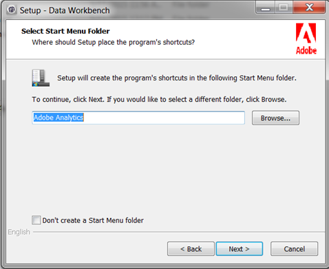

# Wizard Werkstation instellen{#workstation-setup-wizard}

Data Workbench biedt een installatiewizard om de workstationtoepassing (client) te installeren.

## Het werkstation installeren met de wizard Setup {#section-58da9bb6196c46eab3b54146913fdcb8}

Start het uitvoerbare bestand van de installatiewizard en doorloop elke stap om het clientprogramma van het werkstation te installeren. Nadat u het werkstation hebt geïnstalleerd, kunt u verbinding maken met servers en profielen.

1. Dubbelklik op het uitvoerbare bestand van het installatieprogramma van het werkstation.
1. Klik op **Ja** om het programma in Windows te laten installeren.
1. Selecteer een **Taal** voor de opstellingstovenaar.

   De wizard wordt geopend:

   

1. Klik op **Volgende** in het dialoogvenster **Welkom bij Wizard** Data Workbench Setup.

1. Selecteer deze optie om een **nieuwe installatie** te installeren of om een bestaande installatie te **upgraden of te herstellen** .

   **Met Nieuwe installatie** worden eerder geïnstalleerde bestanden overschreven.

   **Met de upgrade** wordt uw werkstation bijgewerkt naar de nieuwste versie of kunt u een bestaande installatie repareren. De Werkbank van gegevens zal geïnstalleerde **Insight.exe** dossiers vergelijken en zal de Tovenaar van de Opstelling van het Werkstation in werking stellen als een nieuwere versie van de cliënt beschikbaar is.

1. Selecteer installatielocatie:

   **De standaardmap en -locatie worden standaard** geïnstalleerd.

   * Programmabestanden worden standaard opgeslagen in:

      ```
      C:\Program Files\Adobe\Adobe Analytics\Data Workbench
      ```

   * Gegevensbestanden (profielen, certificaten, traceringslogbestanden en gebruikersbestanden) worden standaard opgeslagen in:

      ```
      C:\Users\<username>\AppData\Local\Adobe\Adobe Analytics\Data Workbench\
      ```

      >[!IMPORTANT]
      >
      >Een algemeen ***Insight.cfg*** - dossier zonder serverdetails zal aanvankelijk worden geïnstalleerd. U wordt aangeraden het zojuist geïnstalleerde bestand ***Insight.cfg*** te gebruiken en het aan te passen in plaats van een bestand van een vorige installatie te verplaatsen. Omdat het pad voor de installatie van het werkstation is gewijzigd, wordt aanbevolen lettertypen toe te voegen, de *gebruikersmap* te verwijderen en de *TraceFileComponent * te verwijderen.

1. (Optioneel) Selecteer **Aangepast** om het taalpakket en de locatie van het programma en gegevensbestanden te kiezen.
1. Selecteer locatie voor **sneltoetsen in het menu** Start.

   

   Klik **creeer geen omslag** van het Menu van het Begin om geen kortere weg op het Menu van het Begin van Vensters te installeren.

1. Klik op **Volgende.** Er wordt een overzicht weergegeven van de paden en talen van de geselecteerde bestandslocatie. Klik op **Installeren.**

1. Zoek het **Data Workbench-certificaat**.

   Als de installatiewizard het Data Workbench-certificaat niet kan vinden tijdens de installatie, wordt een dialoogvenster geopend waarin u naar de locatie van het certificaat kunt bladeren (een bestand **.pem** dat standaard in de map met clientcertificaten **staat), of u klikt op** Overslaan **** om het certificaat na de installatie te zoeken.

   Klik op **Installeren** nadat u het certificaat hebt gevonden.

1. Nadat de installatiewizard is voltooid en Data Workbench is geïnstalleerd, klikt u op **Voltooien** om de installatie te voltooien.

   >[!NOTE]
   >
   >De standaardlogboekplaats voor de Tovenaar van de Opstelling van het Werkstation in **[!DNL C:\Users\`<userName>&quot;\AppData\Local\Temp.]**

   Schakel het selectievakje Toepassing **** starten in om de werkbank na installatie te openen.

1. **Verbindingen** met servers in **[!DNL Insight.cfg]** bestand configureren.

   Na installatie van het werkstation, zal de Verbeterde werkruimte van de Ervaring van de Configuratie van het Werkstation met extra informatie over het [ingaan van de informatie](/help/home/c-get-started/c-insght-config-param.md) van de serververbinding in het *Insight.cfg* - dossier en een optie openen om een profiel van drop-down te selecteren. U kunt de verbindingsstatus ook weergeven op uw servers.

   

## Installatiemappen {#section-b5ea5a3b3ecb4622aef713972f3f8ebd}

De mapstructuur van Data Workbench heeft twee installatielocaties:

* **De Dossiers** van het programma **Insight.exe** en het steunen cliëntdossiers (**Insight.ini**) worden nu gevestigd door gebrek bij

   ```
   C:\Program Files\Adobe\Analytics\DataWorkbench
   ```

* De map **Appdata** .

   **Insight.cfg**, de profielen, de certificaten, de spoorlogboeken, en de gebruikersdossiers worden nu door gebrek gevestigd

   ```
   C:\Users\<Winuser>\AppData\Adobe\Analytics\DataWorkbench\ 
   ```

   U kunt het pad instellen voor de map **Appdata** in het `Insight.ini` bestand:

   ```
   [InitialSettings] 
   AppDataFolder=C:\Users\mhiatt\AppData\Local\Adobe\Adobe Analytics\Data Workbench\ 
   Locale=en-us
   ```

## Het werkstation verwijderen {#section-5ce2e233fe4348469ef1b3c451dd5b70}

Data Workbench bevat nu een uitvoerbaar bestand voor het verwijderen van het werkstation (dat zich standaard op **`Program Files\Adobe\Adobe Analytics\Data Workbench\ unins000.exe`**) bevindt.

Start en voer de stappen uit om de bestanden voor het werkstation Data Workbench van de vaste schijf te verwijderen.

>[!NOTE]
>
>U kunt het uitvoerbare bestand **unins00.exe** vanuit de map starten met de snelkoppeling Gegevens Workbench **verwijderen in het menu Start of vanuit** > **[!UICONTROL Control Panel]** **[!UICONTROL Program and Features]**.
