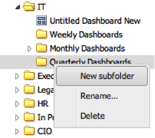

# Mappen toevoegen{#adding-folders}

1. Klik een bestaande omslag met de rechtermuisknop aan, en selecteer **[!UICONTROL New subfolder]**.

   

1. Een nieuwe subfolder zal worden gecreeerd.

   

   Als de verrichting succesvol was, zult u ook een herinnering zien erop wijzend dat de omslag is gecreeerd.
