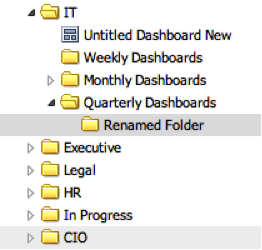

# Naam van mappen wijzigen{#renaming-folders}

1. Klik met de rechtermuisknop op de map waarvan u de naam wilt wijzigen en selecteer **[!UICONTROL Rename…]**.

   

1. Voer de nieuwe naam voor de map in en druk op **[!UICONTROL Enter]**.

   

   Als de bewerking succesvol was, wordt er een melding weergegeven dat de naam van de map is gewijzigd.
