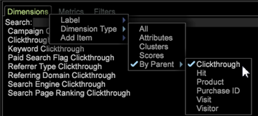

# Data Workbench 6.21 Bijwerken{#data-workbench-update}

Data Workbench 6.2.1 verstrekt nieuwe eigenschappen en insectenmoeilijke situaties.

## Nieuwe functies {#section-1aacfe9a6a964c91b1d24fc1b181db34}

Data Workbench 6.2.1 bevat de volgende nieuwe functies:

<table id="table_E28A6D31E7D941F7A0C2048F0F0F7838"> 
 <thead> 
  <tr> 
   <th colname="col1" class="entry"> Functies </th> 
   <th colname="col2" class="entry"> Beschrijving </th> 
  </tr> 
 </thead>
 <tbody> 
  <tr> 
   <td colname="col1"> Verticale schuifbalken in tekst en tekstomloop. </td> 
   <td colname="col2"> Tekstvakken hebben nu verticale schuifbalken en tekstomloop. 
  
 </td> 
  </tr> 
  <tr> 
   <td colname="col1"> Miniaturen op de werkbalk sorteren </td> 
   <td colname="col2"> Namen die op de werkbalk worden gesorteerd, zijn nu niet meer gevoelig voor het hoofdlettergebruik van het teken, omdat AaBbCcDd alfabetisch wordt gesorteerd in plaats van ABCDabcd. 
  
 </td> 
  </tr> 
  <tr> 
   <td colname="col1"> De afmetingen zoeken op basis van de bovenliggende dimensie. </td> 
   <td colname="col2"> 
In het deelvenster Finders kunt u nu met de rechtermuisknop op het tabblad Dimension klikken en vervolgens Dimension Type &gt; Op bovenliggende element selecteren. Een lijst van top-level telbare afmetingen zal tonen. Wanneer u een van deze bovenliggende afmetingen selecteert, wordt een lijst met de ondergeschikte afmetingen weergegeven in de zoekresultaten. 
  </td> 
  </tr> 
  <tr> 
   <td colname="col1"> Dialoogvenster waarin u wordt gevraagd een externe toepassing te openen. </td> 
   <td colname="col2"> 
De eerste keer dat u een externe toepassing probeert te openen in Data Workbench, wordt er een dialoogvenster weergegeven. 
 
Als u bijvoorbeeld een tekstbestand opent in Kladblok, krijgt u het volgende bericht. 
  
Hierdoor wordt ook een lokaal bestand met de naam  InsightSES.dat  in de installatiemap van de client wordt geplaatst. 
 </td> 
  </tr> 
  <tr> 
   <td colname="col1"> Werkbalken wijzigen in knoppen </td> 
   <td colname="col2"> U kunt ervoor kiezen de nieuwe werkbalkpictogrammen in Data Workbench 6.2 niet meer te gebruiken. door het argument  Toolbar Icons  in het  insight.cfg  dossier in  vals  te veranderen. <code> Toolbar&amp;nbsp;Icons&amp;nbsp;=&amp;nbsp;bool:&amp;nbsp;false&amp;nbsp;&amp;nbsp;&amp;nbsp;&amp;nbsp;&amp;nbsp;&amp;nbsp; </code> 
De wijziging wordt pas van kracht nadat u de client opnieuw hebt gestart. 
 </td> 
  </tr> 
  <tr> 
   <td colname="col1"> Opties voor opnieuw instellen in het scores van de dichtheid en het bijwerken van Beslissingsbomen </td> 
   <td colname="col2"> In de <a href="https://experienceleague.adobe.com/docs/data-workbench/using/client/analysis-visualizations/visitor-propensity/c-visitor-propensity.html" format="http" scope="external"> Propensiteitscores </a> (  Opties &gt; Predictive Analytics &gt; Propensity Score ) en de <a href="https://experienceleague.adobe.com/docs/data-workbench/using/client/analysis-visualizations/decision-trees/c-decision-trees.html" format="http" scope="external"> Beslissingsstructuur </a> (  Visualisaties &gt; Predictive Analytics &gt; Classifications &gt; Decision Tree Builder )-visualisaties hebt u nu twee herstelopties: 
<b>Modellen</b> opnieuw instellen: hiermee wordt het model gewist, maar blijven de instellingen en invoer behouden. Maakt de <b>Go</b> knoop selecteerbaar. 
 
<b>Alles</b> opnieuw instellen - Hiermee worden alle instellingen opnieuw ingesteld (zoals in het vorige ontwerp). 
 </td> 
  </tr> 
 </tbody> 
</table>

## Opgeloste problemen {#section-8704a9ac358246cd81233dd0982d534f}

* De **[!UICONTROL Browsers]** en **[!UICONTROL Operating Systems]** raadplegingsdossiers zullen niet binnen het erfenis **[!UICONTROL Traffic]** profiel (bijvoorbeeld, [!DNL Lookups\Traffic\Browsers.txt)] worden bijgewerkt. In plaats daarvan gebruikt de configuratie van het **[!UICONTROL Traffic]** profiel de bundel DeviceAtlas ( [!DNL Lookups\DeviceAtlas\DeviceAtlas.bundle]) om deze configuratieinformatie te verstrekken.
* Data Workbench 6.2.1 zal de laatste versie zijn om een download van de cliënttoepassing met 32 bits te verstrekken. Alle toekomstige downloads van clienttoepassingen zijn 64-bits en blijven Windows 7 of hoger nodig. Geheugenbeperkingen van de 32-bits toepassing worden verholpen met de introductie van de 64-bits toepassing die begint met de 6.1-release.

   >[!NOTE]
   >
   >De versie met 32 bits van de de cliënttoepassing van de Data Workbench kan potentiële kwesties met betrekking tot geheugenbeperkingen ervaren wanneer het runnen van vooruitlopende modellen gebruikend de het groeperen en het scoren eigenschappen.
