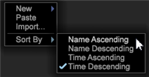

# Data Workbench 6.21 Update{#data-workbench-update}

De Werkbank 6.2.1 van gegevens verstrekt nieuwe eigenschappen en insectenmoeilijke situaties.

## Nieuwe functies {#section-1aacfe9a6a964c91b1d24fc1b181db34}

De Werkbank 6.2.1 van gegevens omvat deze nieuwe eigenschappen:

<table id="table_E28A6D31E7D941F7A0C2048F0F0F7838"> 
 <thead> 
  <tr> 
   <th colname="col1" class="entry"> Kenmerken </th> 
   <th colname="col2" class="entry"> Beschrijving </th> 
  </tr> 
 </thead>
 <tbody> 
  <tr> 
   <td colname="col1"> De verticale Bars van de Rol in de eigenschappen van de Tekst en het Verpakken van de Tekst. </td> 
   <td colname="col2"> De dozen van de tekst hebben nu verticale rolbars en het verpakken tekst. 
  
 </td> 
  </tr> 
  <tr> 
   <td colname="col1"> Miniaturen op de werktop sorteren </td> 
   <td colname="col2"> De namen die op de werktop worden gesorteerd zijn nu ongevoelig voor het geval van het karakter, dat alfabetisch AaBbCcDd in plaats van ABCDabcd sorteert. 
  
 </td> 
  </tr> 
  <tr> 
   <td colname="col1"> Het zoeken afmetingen die op de ouderdimensie worden gebaseerd. </td> 
   <td colname="col2"> 
In het paneel van Vinders, kunt u nu op het lusje van Afmetingen met de rechtermuisknop klikken en het uitgezochte Type van Dimensie klikken &gt; door Ouder. Een lijst van top-level telbare afmetingen zal tonen. Wanneer u één van deze ouderafmetingen selecteert, zal een lijst van zijn ondergeschikte afmetingen in de onderzoeksresultaten verschijnen. 
  </td> 
  </tr> 
  <tr> 
   <td colname="col1"> Dialoog die om een externe toepassing vraagt te openen. </td> 
   <td colname="col2"> 
U zult nu met een dialoogdoos de eerste keer worden voorgesteld u probeert om een externe toepassing in de Werkbank van Gegevens te openen. 
 
Bijvoorbeeld, als u een tekstdossier in Blocnote opent, zult u het volgende bericht krijgen. 
  
Dit zal ook tot een lokaal dossier genoemd   InsightSES.dat leiden dat in de cliënt wordt geplaatst installeert omslag. 
 </td> 
  </tr> 
  <tr> 
   <td colname="col1"> Werkbalken wijzigen in knoppen </td> 
   <td colname="col2"> U kunt opteren uit het gebruiken van de nieuwe toolbarpictogrammen die in Werkbank 6.2 van Gegevens worden verstrekt. door het  argument van de Pictogrammen van de Toolbar in het  insight.cfg-  dossier in  vals te veranderen  . <code> Toolbar&amp;nbsp;Icons&amp;nbsp;=&amp;nbsp;bool:&amp;nbsp;false&amp;nbsp;&amp;nbsp;&amp;nbsp;&amp;nbsp;&amp;nbsp;&amp;nbsp; </code> 
U zult de cliënt voor de verandering moeten opnieuw beginnen om van kracht te worden. 
 </td> 
  </tr> 
  <tr> 
   <td colname="col1"> De opties van het terugstellen in het Scoren van de Volheid en bijgewerkte de Bomen van het Besluit </td> 
   <td colname="col2"> In de <a href="https://docs.adobe.com/content/help/en/data-workbench/using/client/analysis-visualizations/visitor-propensity/c-visitor-propensity.html" format="http" scope="external"> Propensity Scoring </a> (  Tools &gt; Predictive Analytics &gt; Propensity Score ) en de <a href="https://docs.adobe.com/content/help/en/data-workbench/using/client/analysis-visualizations/decision-trees/c-decision-trees.html" format="http" scope="external"> Decision Tree </a> (  Visualisaties &gt; Predictive Analytics &gt; Classifications &gt; Decision Tree Builder ) hebben u nu twee resetopties: 
<b>De modellen</b>-ontruimt het terugstellen uit het model maar handhaaft de montages en de input. Maakt de <b>Go</b> knoop verkiesbaar. 
 
<b>Het terugstellen allen</b>-stelt alle montages (zoals in vorig ontwerp) terug. 
 </td> 
  </tr> 
 </tbody> 
</table>

## Bug Fixes {#section-8704a9ac358246cd81233dd0982d534f}

* De **[!UICONTROL Browsers]** en **[!UICONTROL Operating Systems]** raadplegingsdossiers zullen niet binnen het erfenisprofiel (bijvoorbeeld, **[!UICONTROL Traffic]** [!DNL Lookups\Traffic\Browsers.txt)]worden bijgewerkt. In plaats daarvan, zal de configuratie van het **[!UICONTROL Traffic]** profiel de bundel DeviceAtlas ( [!DNL Lookups\DeviceAtlas\DeviceAtlas.bundle]) gebruiken om deze configuratieinformatie te verstrekken.
* De Werkbank 6.2.1 van gegevens zal de laatste versie zijn om een download van de cliënttoepassing met 32 bits te verstrekken. Alle toekomstige downloads van de cliënttoepassing zullen met 64 bits zijn en blijven Vensters 7 of nieuwer vereisen. De beperkingen van het geheugen van de toepassing met 32 bits worden behandeld met de introductie van de toepassing met 64 bits die met de versie met 6.1 begint.

   >[!NOTE]
   >
   >De 32 beetjeversie van de de cliënttoepassing van de Werkbank van Gegevens kan potentiële kwesties met betrekking tot geheugenbeperkingen ervaren wanneer het runnen van vooruitlopende modellen die de het groeperen en het noteren eigenschappen gebruiken.

