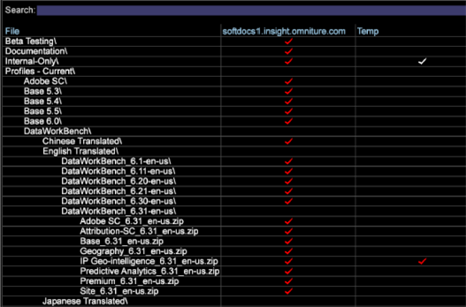

# Data Workbench 6.3 Opmerkingen bij de release{#data-workbench-release-notes}

De Data Workbench 6.3- versienota&#39;s omvat nieuwe eigenschappen, verbeteringsvereisten, vaste insecten, en bekende kwesties.

## New Features {#section-1225066ea8f44cf68e42e019d0bca816}

Data Workbench 6.3 bevat de volgende nieuwe functies:

<table id="table_E28A6D31E7D941F7A0C2048F0F0F7838"> 
 <thead> 
  <tr> 
   <th colname="col1" class="entry"> Functies </th> 
   <th colname="col2" class="entry"> Beschrijving </th> 
  </tr> 
 </thead>
 <tbody> 
  <tr> 
   <td colname="col1"> <a href="../../../home/c-get-started/c-attribution-profiles/c-attrib-algorithmic/c-attrib-algorithmic.md"> Kenmerk best passend </a> </td> 
   <td colname="col2"> Best Fit Attribution biedt een machine-learningmethode om de variërende invloedsniveaus te bepalen die de interactie van de klant tot een geslaagde conversiegebeurtenis bijdraagt, en wijst vervolgens het juiste toewijzingsniveau toe aan elke gebeurtenis. Met kenmerk Aanpassen aan beste wensen kunt u aanrakingen gedurende een tijdsvenster evalueren voordat de conversiegebeurtenis is opgetreden. Vervolgens gebruikt u het algoritme Data Workbench om een toewijzingsmodel te maken op basis van uw gegevens met resultaten die specifiek zijn voor uw marketingcampagnes en interne workflow. </td> 
  </tr> 
  <tr> 
   <td colname="col1"> <a href="../../../home/c-get-started/c-exp-data-seg-exp/c-mmp-integration.md"> Integratie met Master marketingprofiel </a> </td> 
   <td colname="col2"> Deel rijke klantensegmenten die in Data Workbench aan Adobe Experience Cloud worden gecreeerd. Dankzij de integratie met profielen en soorten publiek kunnen de <a href="https://www.adobe.com/solutions/digital-marketing.html?promoid=KLXLZ" format="https" scope="external"> Adobe Experience Cloud </a> en andere Adobe-analysemogelijkheden rijke publiekssegmenten die in de Data Workbench zijn gemaakt, benutten. Dit vereist dat u de Experience Cloud gevormd en lopend hebt. <p>Dankzij de integratie met de Master Experience Cloud kunt u voorspellende functies uitvoeren, zoals clustering of het scoren van eigenschappen, en segmenten vervolgens uitduwen naar de grotere Adobe Experience Cloud of andere producten, zoals Adobe Target en Adobe Experience Manager. </p> </td> 
  </tr> 
  <tr> 
   <td colname="col1"> <a href="../../../home/c-get-started/c-exp-data-seg-exp/c-segment-export.md#concept-ac18fdb34edc4b9592130ab98fabd05e"> Exportopties voor segment </a> </td> 
   <td colname="col2"> Toegevoegde industrie-standaard formaatopties voor segmenten voor directe integratie met andere mogelijkheden, zoals <b>R</b>, zonder extra dossiermanipulatie. Dit biedt een naadloze workflow en snellere analyse. </td> 
  </tr> 
  <tr> 
   <td colname="col1"> <a href="../../../home/c-get-started/c-analysis-vis/c-visitor-cluster/c-clustering-2.md"> Clustering 2.0 </a> </td> 
   <td colname="col2"> Omvat een nieuw <span class="filepath"> KMeans++ </span> algoritme ( <span class="filepath"> KMeans </span> wordt momenteel gesteund) dat een snellere benadering gebruikt om centra voor een versnelde cluster-generatie proces te vinden. </td> 
  </tr> 
  <tr> 
   <td colname="col1"> <a href="../../../home/c-get-started/c-analysis-vis/c-graphs/c-trend-lines.md#concept-2898b2ef97dc4762bda7df292713e9a2"> Trend Lines </a> </td> 
   <td colname="col2"> Geef een zeer visuele en gemakkelijk te interpreteren weergave van de gegevens weer. </td> 
  </tr> 
  <tr> 
   <td colname="col1"> <a href="../../../home/c-get-started/c-analysis-vis/c-graphs/c-regression-analysis.md#concept-58ec981ab50549488585a88295fa14b7"> Grafiek Regressieanalyse </a> </td> 
   <td colname="col2"> Biedt de mogelijkheid om het effect van de ene factor rechtstreeks binnen de workflow van de analist te vergelijken met de andere. </td> 
  </tr> 
  <tr> 
   <td colname="col1"> <a href="../../../home/c-get-started/c-analysis-vis/c-chord-visualization.md#concept-ca600beb11674f3bb2696edf41f1dda9"> Visualisatie kord </a> </td> 
   <td colname="col2"> De Woordvisualisatie biedt een andere weergave van de <a href="https://docs.adobe.com/content/help/en/data-workbench/using/client/analysis-visualizations/correlation-analysis/c-correlation-analysis.html" format="http" scope="external"> Correlatiematrix </a>. </td> 
  </tr> 
  <tr> 
   <td colname="col1"> <a href="../../../home/c-get-started/c-admin-intrf/c-query-que/c-query-string-grouping.md"> Groepering queryreeks </a> </td> 
   <td colname="col2"> Als u vele gebieden met douanevars, steunen, en variabelen hebt, tijdens logboekverwerking kunt u een paar van de naamwaarde bouwen om gebieden in een rapport te combineren. </td> 
  </tr> 
  <tr> 
   <td colname="col1"> <a href="../../../home/c-get-started/c-analysis-vis/c-latency.md#concept-a18c23d45af0460ba531f94da0cdfe6a"> Latentieanalyse </a> </td> 
   <td colname="col2"> Met de latentie-visualisatie kunt u het gedrag van latente klanten binnen een bepaald aantal dagen vóór of na een gebeurtenis na een campagne of ander gebeurtenistype analyseren. </td> 
  </tr> 
  <tr> 
   <td colname="col1"> <b>Tijddimensie</b> </td> 
   <td colname="col2"> In het deelvenster Finders kunt u nu met de rechtermuisknop op het <span class="uicontrol"> tabblad </span> Dimension klikken en <span class="uicontrol"> Dimension Type &gt; Tijd selecteren </span>. In de zoekresultaten wordt een lijst met tijdafmetingen weergegeven. <p>  </p> </td> 
  </tr> 
  <tr> 
   <td colname="col1"> <b>Functie Vergrendelen</b> </td> 
   <td colname="col2"> Met de nieuwe functie <b>Vergrendelen</b> wordt een pictogram op de werkbalk weergegeven wanneer een werkruimte is vergrendeld. U kunt de werkruimte ontgrendelen door te klikken op het menu <b>Toevoegen</b> en vervolgens te klikken op <b>Tijdelijk ontgrendelen</b>. </td> 
  </tr> 
  <tr> 
   <td colname="col1"> Logische operatoren en nieuwe metrische functies in het deelvenster <b>Filter </b> </td> 
   <td colname="col2"> EN/OF logische operatoren zijn toegevoegd aan het deelvenster <b></b>Filter, zodat u gegevens kunt samenvoegen of toevoegen bij het filteren van gegevens. Als u de maateenheden wijzigt, wordt het Filterpercentage dienovereenkomstig aangepast en weergegeven. </td> 
  </tr> 
  <tr> 
   <td colname="col1"> Sneltoetsen </td> 
   <td colname="col2"> Met de nieuwe sneltoetsen in Data Workbench kunt u met de pijltoetsen door de hoofdwerkbalk en de afzonderlijke werkruimten navigeren. Bovendien wordt de werkbalk in de werkruimte nu weergegeven in het werkbovenvenster. </td> 
  </tr> 
  <tr> 
   <td colname="col1"> Ondersteuning voor Windows 8.1 </td> 
   <td colname="col2"> Microsoft Windows 8.1 64-bits wordt <a href="https://docs.adobe.com/content/help/en/data-workbench/using/install/c-data-workbench-client-install.html" format="https" scope="external"> nu ondersteund </a> voor clientinstallatie. </td> 
  </tr> 
 </tbody> 
</table>

## Upgradevereisten en Recommendations {#section-8704a9ac358246cd81233dd0982d534f}

Nieuwe profielen voor Data Workbench bevinden zich in het profiel **Software en Docs** op

```
Profiles - Current\DataWorkBench\ 
  English Translated\DataWorkBench_6.31-en-us\
```



**Upgrademeserver:**

>[!NOTE]
>
>Als u aangepaste profielen hebt die voorrang hebben op de standaardbestanden in het [!DNL Base] pakket, moet u deze aangepaste bestanden bijwerken:

* **Werk het Meta.cfg- dossier** bij ( [!DNL E:\..\Profiles\<your custom profile>\Context\meta.cfg)]om bijgewerkte wachtwoordencryptie voor de Eenheid van het Systeem van het Dossier (server FSU) te plaatsen, en ingangen voor de Transformaties van het Paar van de Waarde van de Naam toe te voegen om uit de Groepering [van het Koord van de](../../../home/c-get-started/c-admin-intrf/c-query-que/c-query-string-grouping.md)Vraag voordeel te halen.

   1. Open het [!DNL meta.cfg] bestand op de FSU.
   1. Wijzig het gegevenstype voor **[!UICONTROL Proxy Password]** van &quot; [!DNL string"] in &quot; [!DNL EncryptedString]&quot; in de sectie *Werkstationconfiguratie* .

      ```
      Proxy User Name = string: 
      Proxy Password = EncryptedString:   (from Proxy Password = String) 
      Use Address File = bool: true
      ```

   1. Voeg nieuwe ingangen toe om de nieuwe transformaties van het Paar van de Waarde van de Naam toe te laten: *BuildNameValuePair* en *ExtractNameValueParen*.

      Open een werkruimte en klik met de rechtermuisknop op **Beheer** > **Profielbeheer**.

      Klik onder **Context** op het **bestand meta.cfg** in de kolom **Basis** en klik vervolgens op Lokaal **** maken. Klik in de tabelkolom Gebruiker met de rechtermuisknop en selecteer **Openen** > **in werkstation**.

      

      * Klik in het nieuwe venster op **metagegevens** en voeg acceptabele onderliggende sjablonen toe.

      

      * Open **transformatie** en voeg nieuwe sjablonen toe.

      


* **Update voor snelle verbeteringen** in de samenvoeging. Voeg parameters toe of verander waarden aan de volgende configuratiedossiers om uit snelheidsverbeteringen in Data Workbench tijdens een transformatie voordeel te halen.

   * **Communications.cfg** ([!DNL E:\Server\Components\Communications.cfg])

      ```
      18 = SourceListServer:  
          URI = string: /SourceListServer/ 
          Listing Interval = int: 10 (new)
      ```

   * **Disk Files.cfg** (at [!DNL E:\Server\Components] en [!DNL E:\Server\Components for Processing Servers])

      ```
      Disk Cache Size (MB) = double: 1024 (from double: 256) 
      Disk Cache Read Limit (MB) = double: 768 (new)
      ```

   * **Modus voor logboekverwerking.cfg** ( [!DNL E:\Server\Profiles\<your profile>\Dataset\Log Processing Mode.cfg])

      ```
      <i>(changed)</i> 
      Batch Bytes = int: 268435456 
      Cloud Bytes = int: 268435456 
      Real Time FIFO Bytes = int: 268435456
      ```

      ```
      (new) 
      Cache Bytes = int: 32000000 
      Fast Input Decision Ratio = double: 200 
      Fast Input FIFO Bytes = int: 268435456 
      FIFO Hash Mask = int: 16383 
      Fast Merge Buffer Bytes = int: 536870912 
      Slow Merge Buffer Bytes = int: 268435456 
      Fast Merge Fan In = int: 64 
      Key Cache Size Logarithm = int: 21 
      Max Seeks = int: 512 
      Output Old Buffer Bytes = int: 536870912 
      Overflow FIFO Bytes = int: 67108864 
      Paused = bool: false
      ```

      >[!NOTE]
      >
      >* Om uit de Snelle verbeteringen van de Fusie voordeel te halen, zorg ervoor u minstens 8 GBs van RAM per DPU hebt.
      >* Het sparen Interval, de duur tussen dataset bewaart, zou kunnen moeten worden verminderd als de nieuwe parameters van de Wijze van de Verwerking van het Logboek worden toegepast. Omdat de Transformatie sneller zal voltooien, zal het dossier van de datasetstaat meer gegevens tussen sparen Intervallen dan vroegere versies bevatten.

      >
      >  **Aanbevolen wordt om de instelling Interval opslaan te verlagen tot 1800 seconden (30 minuten)**. Het standaard interval voor opslaan is 3600 seconden (1 uur). (Als deze regel aan de regel moet worden toegevoegd, [!DNL Log Processing Mode.cfg]ziet u dat er twee (2) voorloopruimten zijn.)
      >
      >  
      ```
      >      Save Interval (sec) = int: 1800
      >  ```
      >
      >  * Het adviseert dat de nieuwe parameters van de Wijze van de Verwerking van het Logboek niet op een dataset worden toegepast die met een **CrossRows** gebruikend de **Al** verrichting wordt gevormd. Met deze instellingen kan het geheugengebruik voor deze bewerking te groot worden voor de omgeving.


* **Adobe Target met DWB-integratieupdate**. Een nieuw exportbestand vervangt het bestaande [!DNL ExportIntegration.exe]bestand op de Insight Server ( [!DNL TnTSend.exe] [!DNL E:\Server\Scripts\TnTSend.exe]). Dit nieuwe exportbestand ondersteunt zowel Adobe Target-integratie als coördinatie met het nieuwe Master marketingprofiel (MMP) en Adobe Audience Manager.

   U moet de volgende opdrachten voor Adobe Target-exportbewerkingen bijwerken.

   `Command = string: TnTSend.exe`

   tot

   ```
   <filepath>
   Command = string: ExportIntegration.exe 
   </filepath>
   ```

   >[!NOTE]
   >
   >Dit is alleen van invloed op exportbewerkingen die vóór versie 6.3 zijn gemaakt.
   >
   >
   >U kunt ook het volgende proberen om het oude exportproces te gebruiken:
   >    
   >* Maak een nieuwe test- en doelexport in het werkstation.
   >* Wijzig de oude test en de uitvoer van het Doel die in Server/Profielen/`<your profile>`/de Uitvoer wordt gevonden.


* **Werk het profiel Adobe SC bij.** Voor wijzigingen in het [!DNL Exclude Hit.cfg] bestand moet een veld worden gedeclareerd in het bijbehorende [!DNL Decoding Instructions.cfg] bestand.

   >[!NOTE]
   >
   >Als uw Adobe SC-profiel een aangepast [!DNL Decoding Instructions.cfg] bestand bevat, moet u een [!DNL DelimitedDecoder] parameter aan uw aangepaste bestand toevoegen.

   ```
   0 = DelimitedDecoder: 
      Delimiter = string: \t 
      Fields = vector: x items 
      …  
         5 = string: 
   Changed to: 
   
   5 = string: x-hit_source
   ```

   Als u het [!DNL DelimitedDecoder] veld toevoegt, kunt u gebruikmaken van de functie-updates en kunt u mogelijke problemen met de logverwerking als gevolg van deze updates voorkomen.

**Client voor upgrade:**

* **Werk de client bij vanaf de server**.

   Nadat de server is bijgewerkt, kan de client automatisch worden bijgewerkt als het [!DNL Insight.cfg] bestand correct is geconfigureerd:

   1. Bewerk het [!DNL Insight.cfg] bestand.

      ```
      Update Software = bool: true
      ```

      Dan **[!UICONTROL Save]**.

   1. Sluit de client af en start de client.
   1. Maak verbinding met het profiel.

      De client wordt automatisch bijgewerkt naar Data Workbench 6.3.

   1. Sluit de client af.
   1. Bewerken [!DNL Insight.cfg]

      * Wijzigen [!DNL Proxy Password = string:]

         tot [!DNL Proxy Password = EncryptedString:]

         Verwijder de waarde van het vorige Wachtwoord van het Adres van de Volmacht en van de Volmacht.

      * **[!UICONTROL Save]**.
   1. Start de client.
   1. Bewerken [!DNL Insight.cfg].

      * Voer het proxywachtwoord voor alle servers in en klik op Opslaan.
      * Ga het Adres van de Volmacht voor alle servers in en sparen.

         >[!IMPORTANT]
         >
         >Het wachtwoord van het Adres van de Volmacht en van de Volmacht moet van binnen de cliënt zijn ingegaan en worden bewaard.
   1. Maak verbinding met het profiel.
   >[!NOTE]
   >
   >
   >    
   >    
   >    * Volg de exacte upgradevolgorde om een account-afsluiting te voorkomen. Als het account is vergrendeld, voert u alle vereiste wijzigingen in de exacte volgorde uit, slaat u uw werk op en sluit u het programma af. Wacht tot de vergrendeling is vrijgegeven (ongeveer 45 minuten) en start de client opnieuw.
   >    * De wijziging van het wachtwoord mag alleen worden uitgevoerd op de client als de wachtwoorden worden opgeslagen in Windows Credential Vault.


* **Aanbeveling**: **Nieuwe Windows Aero-thema&#39;s. ** Werk het uiterlijk van uw clienttoepassing bij met Windows Aero Themes.

* **Aanbeveling: Lettertypen voor Chinese en Japanse versies**:

   Chinees:

   * Arial
   * SimSun

   Japans:

   * MS Gothic
   * Meiryo
   * MS Mincho
   * Arial
   * SimSun

   >[!NOTE]
   >
   >*SimSun* kan voor Chinees en Japans worden gebruikt. Als u probeert in tekens van halve bytes te schrijven in het Japans, moet u ook *MS Mincho* opnemen. U kunt deze parameters toevoegen om deze lettertypen in [!DNL Insight.cfg]te schakelen.

   ```
   0 = string: Arial 
   1 = string: SimSun 
   2 = string: MS Mincho
   ```

   Deze lettertypen moeten worden vermeld in het configuratiebestand van het werkstation: [!DNL Insight.cfg.]

**Upgrade naar Adobe Analytics Premium**

Om **Best Fit Attribution** in Data Workbench in werking te stellen, moet u nieuwe certificaten van Adobe ClientCare voor uw Cliënt, Server, en de Server van het Rapport (.pem- dossiers) ontvangen om Adobe Analytics Premium te steunen. Elk van de nieuwe certificaten heeft deze parameter:

```
Product = Premium
```

Het Premium-pakket kan worden gedownload op **[!UICONTROL Software and Docs]** onder het **[!UICONTROL Getting Started]** tabblad in de werkruimte **Profielen en bestanden opzoeken** . Ga naar `Profiles - Current\DataWorkBench\<language>\Data WorkBench_6.30-en-us\Premium_6.30_en-us.zip`.  Wanneer het **Premium** -profiel op uw server is geladen, moet u een *Premium* -parameter aan uw aangepaste [!DNL Profile.cfg] bestand toevoegen. Zo kunt u in uw aangepaste profiel de menu&#39;s, visualisaties en werkruimten opnemen als onderdeel van Adobe Analytics Premium.

## Vaste bugs {#section-e1e3df3da3594987a325344cd5e8b855}

* De grootste elementen ontbraken in de visualisatie van de **dichtheidskaart** . Dit probleem is nu opgelost.
* Correctie van probleem in **dichtheidstoewijzing** waarbij het deel van de metrische waarde niet werd weergegeven in het gebied met elementen.
* Het slepen van metrische gegevens van **[!UICONTROL Finders]** het deelvenster naar de metrische legenda buiten de metrische kolom leidde tot het verwijderen van de legenda uit de werkruimte. Dit probleem is nu opgelost.
* Het gebruik **[!UICONTROL Print Workspace]** en de **[!UICONTROL Sidebar]** **[!UICONTROL Both]** opties maakten geen gebruik van de copyrightinformatie op de afgedrukte pagina. Dit probleem is nu opgelost.

## Bekende problemen {#section-751e8698e9f14b75a85f63253782be41}

* Gebruikers van **AMD Radeon™ grafische kaarten** dienen hun installaties bij te werken naar de nieuwste grafische stuurprogramma&#39;s. Sommige eerdere versies van het stuurprogramma ondersteunen OpenGL 3.2, maar zijn inconsistent.
* Output die door de configuratie van de Uitvoer **van het** Segment zonder een kopbalverklaring wordt geproduceerd kan in een boguskopbal die aan het begin van het dossier verschijnt die met de eerste reeks rijen strijdig is.
* **Met Dimension** toevoegen worden alleen de *uitgebreide Dimension* weergegeven. De oplossing is het gereedschap **Finders** te gebruiken om afmetingen naar tabellen te slepen.

* Wanneer de Visualisatie van het Plot 3D van de Spreiding callouts omvat, zou het gezoem percelen buiten de grens van de visualisatie kunnen tonen. Als u dit probleem wilt verhelpen, zoomt u eerst in op het 3D-verstrooiingspad en voegt u vervolgens callouts toe aan uw visualisatie.
* Het gebruik van Workstation in sessie voor extern bureaublad loopt vast bij het wijzigen van de naam van werkruimten.
* Lijstitem
* **Bestanden exporteren met verouderde segmenten met dubbele aanhalingstekens** , zelfs als het exportbestand geen aanhalingstekens bevat in het veld Uitvoerindeling.

   *Oplossing*: Voeg deze drie regels toe aan het .export-bestand. Het plaatsen van deze waarden zal geen integratie MMP teweegbrengen (aangezien andere configuratiegebieden worden vereist) maar zal ongewenste automatische ontsnapten omzeilen.

   ```
     MMP Configuration = MMPConfiguration: 
       MMP Segment Name = string: UNESCAPE DUMMY 
       MMP Visitor ID Field = string: [Specify a Dimension from the output of 
                                       the current export]
   ```

   (De eerste regel heeft twee (2) voorloopspaties en de volgende regels vier (4). De Dimension van de output van de huidige uitvoer moet in [!DNL MMP Visitor ID Field]. worden van verwijzingen voorzien)
