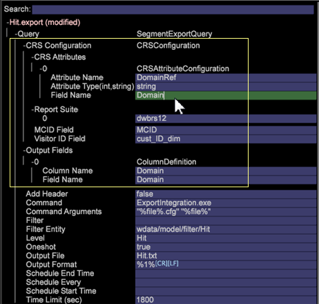

# Het uitvoeren aan de Diensten van de Kern van de Analyse{#exporting-to-analytics-core-services}

De de uitvoereigenschap van de Dienst van het Verslag van de Klant (CRS) laat u de gegevens van de Werkbank van Gegevens naar de Diensten van de Kern van de Analyse van Adobe uitvoeren om met de mogelijkheden van andere Analytics, met inbegrip van Rapporten &amp; Analytics te integreren.

>[!NOTE]
>
>Om de CRS-exportfunctie te laten werken, moet de analist-ID van een bezoeker gebaseerd zijn op de Experience Cloud ID Service (ECID). Hoewel ECID voor een bezoeker in de Data Workbench kan worden ingevuld, werkt de CRS-export niet voor die bezoeker als de client zich in de respijtperiode bevindt of als het cookie van de bezoeker niet is vervangen door ECID. Voor meer informatie, zie het [Identificeren van Bezoekers](https://docs.adobe.com/content/help/en/analytics/export/analytics-data-feed/data-feed-contents/datafeeds-visid.html) en de Periode van de Restitutie van de Dienst van [identiteitskaart](https://docs.adobe.com/content/help/en/id-service/using/reference/analytics-reference/grace-period.html).

Van een Lijst **van het** Detail (klik **[!UICONTROL Tools]** > **[!UICONTROL Detail Table]** in een werkruimte met de rechtermuisknop aan), kunt u attributenwaarden en de variabelen plaatsen die met de Rapporten &amp; de Analyse van de Analyse worden vereist te integreren (gebruikend de Diensten van de Pijpleiding van Adobe).

1. **Klik de lijstkopbal met de rechtermuisknop aan en klik de Nieuwe Dienst van het Verslag van de Klant.**

   

1. **Noem het de uitvoerdossier en bewaar.**

   Het venster Exportbestand bewerken wordt geopend.

1. **Open** **Vraag > CRS Configuratie**.
1. **Klik met de rechtermuisknop op CRS-kenmerken > Nieuw toevoegen.**
1. **Ga** de Attributen ***van*** CRS **parameters** in.

   Open de nieuwe ingang en ga of verifieer waarden in de sectie van de Attributen *van* CRS van het de uitvoerdossier in:

   

   <table id="table_8156A2C66C0E41D381C31F1082CCA479"> 
    <tbody> 
      <tr> 
      <td colname="col1"> 
<b>Naam kenmerk</b> 
 </td> 
      <td colname="col2">Naam van de variabele <i>Klantattributen</i> die in <i>Rapporten &amp; Analytics</i>wordt getoond. </td> 
      </tr> 
      <tr> 
      <td colname="col1"><b>Type kenmerk</b> </td> 
      <td colname="col2"> 
Deze parameter keurt waarden van (<i>int.</i>, <i>koord</i>) goed. 
 
Opmerking: Als een attribuut <b>niet</b> aan in Analytics wordt ingetekend: 
 
      <ul id="ul_B77BF6FDA3FB4F1BBF9380C2FD938270"> 
       <li id="li_3D099456AF6B4103B227D841C81AB936">Het attribuut zal met om het even welk geldig attributentype worden gecreeerd dat door Analytics wordt gesteund (voor deze versie is het beperkt tot slechts <i>koord</i> en <i>int.</i>). </li> 
       <li id="li_EA1DBDB2E6BE49278C6CD6A5503EDC8A">Als een ongeldig attributentype is ingegaan, dan zult u een fout verklarend een mislukking ontvangen om aan Analytics in te tekenen. </li> 
      </ul> 
 
Als een attribuut <b>reeds</b> aan in Analytics wordt geabonneerd: 
 
 
      <ul id="ul_16415B639F1C49A5AE9932C128184171"> 
       <li id="li_83C90D44FE5C4D979DEA786660C7F3EC">Zorg ervoor om het juiste attributentype voor reeds in te gaan ingetekend aan attributen. </li> 
       <li id="li_02C5024E335C4C59B4F7B0084232CC24">Als u het verkeerde type voor de attributen ingaat, dan zal zijn gedrag afhankelijk van de behandeling van de Analyse van attributentypes zijn. </li> 
      </ul> 
 
 </td> 
      </tr> 
      <tr> 
      <td colname="col1"> 
<b>Veldnaam</b> 
 </td> 
      <td colname="col2">Naam van de afmeting of metrisch waarvan de attributenwaarden worden geselecteerd. 
Opmerking: De naam <i><b>van het</b></i> Gebied onder de Attributen <i>van</i> CRS zou het zelfde moeten zijn als de Gebieden <b><i>van de</i> Output &gt; de Naam <i>van het</i></b> Gebied (die automatisch gebaseerd op de geselecteerde attributen bevolkt is). Als de naam <i>van het</i> Gebied ongeldig is dan zal de uitvoer niet lopen. 
 </td> 
      </tr> 
    </tbody> 
   </table>

1. Klik met de rechtermuisknop **[!UICONTROL Report Suite]** > **[!UICONTROL Add New]**.
1. Ga in **[!UICONTROL Report Suite ID]**.

   Open de nieuwe ingang en ga of verifieer waarden in de sectie van de Reeks van het *Rapport* van het de uitvoerdossier in:

   <table id="table_A3279CADB74C441DA2E062E2123CE9D4"> 
    <tbody> 
      <tr> 
      <td colname="col1"><b>Report Suite</b> </td> 
      <td colname="col2">Identiteitskaart van de rapportreeks in <i>Rapporten &amp; Analytics</i> die de variabelen identificeren van de Attributen <i>van de</i> Klant die worden uitgevoerd. 
 
Opmerking: Hoewel de <i>Rapporten &amp; de Analyse</i> u aan veelvoudige rapportreeksen laat toevoegen, zal de Werkbank 6.4 van Gegevens slechts één enkele rapportreeks uitvoeren die bij <i>index 0</i>wordt geïdentificeerd. 
De waarde van de rapportreeks ingegaan op dit gebied is identiteitskaart van de rapportreeks (en niet de naam van de rapportreeks). 
 
 
 </td> 
      </tr> 
    </tbody> 
   </table>

1. Voer de parameter ECID-veld in.

   **ECID-veld**: Naam van de afmeting in uw profiel dat identiteitskaart van de Wolk van de Ervaring van Adobe vertegenwoordigt. Dit is een verplicht veld en een ongeldige waarde voor de dimensie wordt niet geëxporteerd.

1. (facultatief) voltooi de parameter van het Gebied van identiteitskaart van de Bezoeker.

   **Bezoeker-ID-veld**: Als de gebruiker een andere douane-identiteitskaart voor een bezoeker in zijn/haar gegevens wenst te verzenden, is dit waar zij de naam van de afmeting ingaan die identiteitskaart van de douanebezoeker vertegenwoordigt. Dit is een facultatief gebied en kan leeg worden verlaten.
