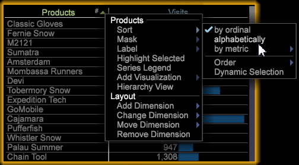

# Opmerkingen bij de release Data Workbench 6.1{#data-workbench-release-notes}

Data Workbench 6.1 de versienota&#39;s omvat nieuwe eigenschappen, verbeteringsvereisten, insectenmoeilijke situaties, en bekende kwesties.

## Nieuwe functies {#section-1225066ea8f44cf68e42e019d0bca816}

Data Workbench 6.1 bevat de volgende nieuwe functies:

| Functies | Beschrijving |
|--- |--- |
| 64-bits Windows-upgrade | De server van de gegevenswerkbank, rapportserver, en cliëntcomponenten worden bevorderd om slechts op werkende systemen met 64 bits van Vensters te lopen. |
| Score volheid | Door uw publiek te scoren, kunt u de loyaliteit van de klant identificeren en statistisch zien wie een verkoop waarschijnlijk zal omzetten of met een verhaal of een campagne zal communiceren. Het scoren van de dichtheid omvat nu deze visualisaties om modellen te bekijken en de veranderende correlatie van geselecteerde metriek te tonen.<ul><li>De ModelKijker onderzoekt een logistiek regressiemodel dat met het Scoren van de Volheid wordt geproduceerd, tonend de coëfficiëntgewichten van elke inputvariabele (met inbegrip van de constante termijn) en hun statistische foutenwaaier. </li><li>Lift- en verbreding-diagrammen worden gebruikt om de potentiële toename van een gescodeerd gegevensmodel te evalueren.</li><li>De fusiematrix geeft vier tellingen door de combinatie van Actual Positive (AP), Actual Negative (AN), Predicted Positive (PP), en Predicted Negative (PN).</li> <li>Vanaf v6.1 hebt u nu een optie voor Opslaan waarmee u op basis van twee typen machtigingsscores kunt opslaan: afmetingen, of afmetingen en metriek.</li><li>U kunt nu Ctrl+Alt ingedrukt houden en slepen en neerzetten om elementen toe te voegen in Volheid scoren en in de Cluster Builder. Voordat u tabelelementen toevoegde, moest u van de tabel naar het vak Elementen slepen.</li></ul> |
| Gegevenswerkbank nu in het Chinees | De werkbank Gegevens ondersteunt nu Vereenvoudigd Chinees voor de clienttoepassing. Gegevenswerkbank ondersteunt ook de invoermethode-editor (IME) als een secundair tekstinvoerproces voor internationale talen. |
| Wiskundige functies | U kunt wiskundige functies nu toevoegen aan metriek, wiskundige transformaties en werkbladcellen om gegevenssets verder te berekenen. |
| Statistische bijschriften | De lijsten bieden nu een statistische summiere vraag-uit voor metrische kolommen aan. De call-out kan het gemiddelde, standaardafwijking, minimum en maximumwaarden, variantie, en totale telling voor de kolom tonen. Bij elke selectie en evaluatie kan hiermee rekening worden gehouden. |
| Correlatiematrix, filter | De correlatiematrix is bijgewerkt met een binair filter zodat u de waarden voor een of beide gecorreleerde metriek kunt beperken, zodat u uw vergelijking beter kunt richten. U kunt nu ook Dimension-elementen toevoegen uit een Dimension-tabel door op Ctrl + Alt te klikken en elementen naar de te evalueren matrixkolom of -rij te slepen. |
| Label voor uitvallen verbergen in trechter-visualisatie | Schakel tussen het weergeven en verbergen van fallout-labels in een Trechter-visualisatie door met de rechtermuisknop op de titel te klikken en Fallout verbergen te selecteren. |

## Tabelkolommen sorteren{#sorting-table-columns}

Sorteer tabelkolommen alfabetisch of op rangtelwoorden.

Om elementen in een Dimension-tabel beter te selecteren, kunt u de eerste kolom alfabetisch of op rangtelwoorden rangschikken door de menuoptie **[!UICONTROL Sort]** te selecteren.

Het # karakter zal tonen wanneer een kolom door rangtelwoorden (het gebrek) wordt gesorteerd.

**Sorteeroptie selecteren**

Als u sorteeropties wilt wijzigen tussen normaal en alfabet, klikt u met de rechtermuisknop en selecteert u **[!UICONTROL Sort]**. Klik op de pijl om de volgorde om te keren.

>[!NOTE]
>
>U kunt andere kolommen sorteren door op de naam van de kolom te klikken.

## Fallout-labels verbergen in trechter

Schakel deze optie in en open fallout-labels in een Trechter-visualisatie.

De Trechter visualisatie identificeert waar een klant een marketing campagne verlaat of van een bepaald omzettingsweg terwijl het in wisselwerking staan met uw website of dwars-kanaalcampagne afwijkt. De linkerkant van de Trechter visualisatie toont de resultaten van een bezoek of bezoekers, terwijl de rechterkant de &quot;Vallout&quot;van degenen toont die een gespecificeerde weg verlaten.

In een **[!UICONTROL Funnel]**-visualisatie kunt u met de rechtermuisknop op de titel klikken en **[!UICONTROL Hide Fallout]** in het menu selecteren om de fallout-labels te verbergen.

## Bekende problemen {#section-ff2180c6871c413480e15fa915c253b9}

* Tijdens het importeren van een werkruimte wordt een foutbericht weergegeven, ook al is het importeren gelukt.

   Oplossing: Klik op OK om de fout te negeren. De werkruimte is geïmporteerd.

**Problemen met vereenvoudigde Chinese lokalisatie**

* De titel en het bericht van het dialoogvenster dat worden weergegeven nadat u op &quot;Verzenden&quot; hebt geklikt wanneer u het doel instelt in de scores-visualisatie, zijn onleesbaar.

   Oplossing: Geen.
* Wanneer u tekstomloop gebruikt in de werkbladvisualisatie, worden gelokaliseerde woorden niet correct omwikkeld. Er worden extra junktekens aan de tekenreeks toegevoegd.

   Oplossing: Geen
* Kan [!DNL Insight.exe] niet starten als de installatiemap een naam heeft met niet-Engelse tekens.

   Oplossing: Bewaar standaardnamen of wijzig de naam met alleen Engelse tekens in het mappad om uitvoerbare bestanden te starten.
