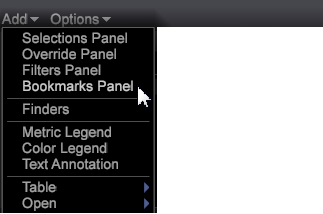

# Updates voor UI-updates voor datacWorkbench-client{#data-workbench-client-ui-updates}

Werkbank 6.2 van gegevens omvat nieuwe gebruikersinterfaceupdates aan het bladwijzerpaneel, nieuwe pictogrammen in de werkruimtekoolbar, de capaciteit om de werkruimte binnen het scherm te slepen, nieuwe snelle sleutels, en updates aan de visualisatie van het cirkeldiagram.

## Nieuwe bladwijzekenmerken {#section-e361b605441540ca8213c3fddb5e0718}

U kunt bladwijzer significante werkruimten nu snel tussen visualisaties en rapporten bewegen die in uw werkschema worden gebruikt.

**Werken met bladwijzers**

1. Referentie een werkruimte door het pictogram van de Referentie  in de hogere juiste hoek van de toolbar te klikken.
1. Klik **[!UICONTROL Add]** > **[!UICONTROL Bookmarks Panel]** in de linkerruit om een lijst van referenties te openen.

   

1. Om een bookmark werkruimte te openen, klik een werkruimtenaam in **[!UICONTROL Bookmark Panel]**.

   

   De geselecteerde werkruimte wordt geopend. Wanneer u op een andere werkruimte met favorieten klikt, wordt de vorige werkruimte gesloten en wordt de nieuw geselecteerde werkruimte geopend, zodat u snel door uw werkstroom kunt navigeren.

**Een bladwijzer verwijderen:**

* In het Comité van de Referentie, klik en selecteer **[!UICONTROL verwijderen met de rechtermuisknop aan<bookmark title>]**om een geselecteerde referentie te schrappen, of te selecteren **[!UICONTROL Clear All Bookmarks]**om alle referenties te schrappen.

* U kunt ook op de werkruimte in de duimnagelmening binnen de werktop met de rechtermuisknop klikken en selecteren **[!UICONTROL Clear Bookmark]**.

>[!IMPORTANT]
>
>* 25 bladwijzers kunnen worden opgeslagen.
>* Als u een referentie toevoegt en dan de plaats van de werkruimte beweegt, zal de referentie ongeldig zijn en moet van het Comité van de Referentie worden geschrapt en worden teruggesteld.
>

## Nieuwe pictogrammen in werkruimte {#section-c108bbd1661249e79c146727ff3d2470}

De Werkbank 6.2 van gegevens vervangt nu de tekst in de werkruimte met pictogrammen. U kunt nog over hangen en het bericht van het hulpmiddeluiteinde zien identificerend het pictogram, met inbegrip van, **[!UICONTROL File]**, **[!UICONTROL Add]** en **[!UICONTROL Export]**.

Een nieuw **[!UICONTROL Help]** pictogram wordt toegevoegd om tot de documentatie en andere kenniscentra, met inbegrip van de volgende verbindingen toegang te hebben:

<table id="table_64BBC67B1BB44B1197FF7E5E7B067696"> 
 <thead> 
  <tr> 
   <th colname="col1" class="entry"> Documentkoppelingen </th> 
   <th colname="col2" class="entry"> Beschrijving </th> 
  </tr>
 </thead>
 <tbody> 
  <tr> 
   <td colname="col1"> Marketingrapporten en -analyses </td> 
   <td colname="col2">Open aan de de  Hulp pagina van de Rapporten &amp; van de Analyse van Adobe van de Marketing van de Rapporten. </td> 
  </tr> 
  <tr> 
   <td colname="col1"> Ideëenuitwisseling </td> 
   <td colname="col2">Open aan login  van de Uitwisseling vanIdeeën. Dit online portaal staat gebruikers toe om updateveranderingen en verbeteringsideeën aan gegevenswerkbank te verstrekken. Deze klant-gerichte ideeën kunnen dan door alle gebruikers worden gestemd. </td> 
  </tr> 
  <tr> 
   <td colname="col1"> Hulp </td> 
   <td colname="col2">Open de documentatie  van de Werkbank vanGegevens. 
U kunt  &lt;F1&gt; ook drukken om hulp binnen een werkruimte te openen. 
 </td> 
  </tr> 
  <tr> 
   <td colname="col1"> Informatie </td> 
   <td colname="col2">Open om de  cliëntversie van gegevenswerkbank te identificeren. </td> 
  </tr> 
 </tbody> 
</table>

>[!NOTE]
>
>U kunt ook drukken `<F1>` om de documentatie van een werkruimte te openen.

## Werkruimteweergaven slepen {#section-9129c340c21d45a3864c923884cd4382}

Als een werkruimte groter is dan het viewable scherm, kunt u de mening bewegen om alle elementen binnen de werkruimte te zien. U kunt op de achtergrond (buiten de visualisaties en lijsten) klikken en het scherm slepen om het viewable gebied binnen de werkruimte te bewegen. De curseur zal in een handpictogram veranderen wanneer het slepen van de mening binnen het werkruimtekader.

## Sneltoetsen om werkruimteweergaven te wijzigen {#section-d8322f72423f437aa2e34f2188b1341c}

De nieuwe snelle sleutels laten u resize en werkruimten tussen venster en volledige paginameningen aanpassen. Zie de [Snelle Verwijzing](https://docs.adobe.com/content/help/en/data-workbench/using/client/visualizations/c-qk-ref.html) voor meer toetsenbordsneltoetsen.

<table id="table_A01C514C99F043338D183A6839E03DEA"> 
 <thead> 
  <tr> 
   <th colname="col1" class="entry"> Opdrachten </th> 
   <th colname="col2" class="entry"> Sneltoetsen </th> 
   <th colname="col3" class="entry"> Gecombineerde menuopdrachten </th> 
  </tr>
 </thead>
 <tbody> 
  <tr> 
   <td colname="col1"><b>Volledige het schermmening</b>. De werkruimte vult het scherm en past aan de nieuwe grootte terug. </td> 
   <td colname="col2"><b>Ctrl plus</b> 
CTRL + (op toetsenbord) 
 
<i>of</i> 
 
Ctrl Shift + (op toetsenbord) 
 </td> 
   <td colname="col3"> 
    <ul id="ul_C7C731B894D946D9916F50806F015857"> 
     <li id="li_452B4C119B1A40038A408CFFC53653A9">Bestand &gt; Paginaformaat &gt; Scherm vullen 
<i>gevolgd door</i> 
 </li> 
     <li id="li_DE9B8B31B9F24A6AA68A1D0DB886B501">Bestand &gt; Werkruimte verfijnen </li> 
    </ul> </td> 
  </tr> 
  <tr> 
   <td colname="col1"><b>De mening</b>van het venster. De vertoningen van de werkruimte in een standaardvenstermening en passen aan de nieuwe grootte terug. </td> 
   <td colname="col2"><b>Ctrl min</b> 
Ctrl - 
 </td> 
   <td colname="col3"> 
    <ul id="ul_3474B9EFD69343C09BC84E485D896C28"> 
     <li id="li_820BAED76FF24A5785E6D89C5C692DD5">Bestand &gt; Paginagrootte &gt; Standaard 
<i>gevolgd door</i> 
 </li> 
     <li id="li_337789F282CE4C2C990C67B115782454">Bestand &gt; Werkruimte verfijnen </li> 
    </ul> </td> 
  </tr> 
 </tbody> 
</table>

