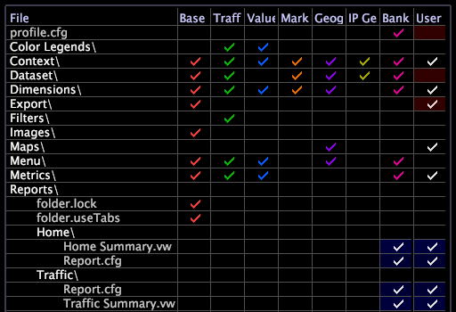

# Pas het Portaalgebruikersinterface van het Rapport{#customize-the-report-portal-user-interface} aan

De reeksen van het rapport moeten op een specifieke manier worden gevormd om rapporten te produceren die behoorlijk door het Portaal van het Rapport tonen.

De gebruikersinterface voor [!DNL Report Portal] is ontworpen om een lusje voor elke omslag van de rapportreeks te tonen die in de outputfolder verschijnt en in het [!DNL profiles.xml] dossier, evenals ingebouwde [!DNL Admin] tabel wordt vermeld, die aan [!DNL TopNavigation.xml] dossier moet worden toegevoegd om te tonen. Zie [Een uitvoermap koppelen aan een tabblad in de gebruiker voor meer informatie over het weergeven van de ingebouwde tab [!DNL Admin]..](../../../home/c-rpt-oview/c-install-rpt-port/c-rpt-port-user-inter.md#section-3f6bc47d37ed448e871f4f685f46acee).


* [Ervoor zorgen dat uw rapportsets compatibel zijn met Report Portal...](../../../home/c-rpt-oview/c-install-rpt-port/c-rpt-port-user-inter.md#section-2b141e5d198a4bbea455699126c24706)
* [Een uitvoermap koppelen aan een tabblad in de gebruiker...](../../../home/c-rpt-oview/c-install-rpt-port/c-rpt-port-user-inter.md#section-3f6bc47d37ed448e871f4f685f46acee)

## Ervoor zorgen dat uw rapportsets compatibel zijn met Report Portal {#section-2b141e5d198a4bbea455699126c24706}

Een rapportset definieert een geplande taak voor [!DNL Report]. Het bestaat uit twee posten:

* Een map die de verzameling werkruimten definieert die [!DNL Report] moet genereren als rapporten.
* Een configuratiebestand ( [!DNL Report.cfg]).

Het [!DNL Report.cfg]-bestand vertelt [!DNL Report] onder andere wanneer de rapporten moeten worden gegenereerd en waar de uitvoerbestanden moeten worden opgeslagen. Rapportsets bevinden zich in de map Rapporten op de gegevenswerkbankserver. Een profiel kan om het even welk aantal rapportreeksen tonen.

Om verenigbaarheid met [!DNL Report Portal] te verzekeren, moeten uw rapportreeksen aan de volgende vereisten voldoen:

* De outputfolder voor uw rapportreeksen moet een gevormd [!DNL profiles.xml] dossier bevatten.
* Elke rapportreeks moet een top-level rapport genoemd &quot;*ReportSetName* Samenvatting omvatten,&quot;waar *ReportSetName* de naam van de rapportreeks aanpast. Bijvoorbeeld, toont volgende [!DNL Profile Manager] twee rapportreeksen, &quot;Huis&quot;en &quot;Verkeer.&quot; Merk op dat elke rapportreeks een samenvattingsrapport ( [!DNL Home Summary.vw] en [!DNL Traffic Summary.vw], respectievelijk) bepaalt.



In [!DNL Report Portal], verschijnt het samenvattingsrapport op het lusje van de rapportreeks. Het samenvattingsrapport kan elke gewenste werkruimte, elk gewenst venster of elke gewenste visualisatie bevatten.

* Het samenvattingsrapport moet het enige rapport zijn in de map op het hoogste niveau voor een rapportset. Alle andere rapporten moeten in subfolders worden geplaatst. Als u andere rapporten in de top-level omslag plaatst, kunt u hen niet door het portaal bekijken.

## Een uitvoermap koppelen aan een tabblad in de gebruikersinterface {#section-3f6bc47d37ed448e871f4f685f46acee}

Als u de tabbladen wilt opgeven die [!DNL Report Portal] moet weergeven, moet u een [!DNL TopNavigation.xml]-bestand voor elk profiel configureren. Dit dossier bepaalt welke rapportreeksen als lusjes in het gebruikersinterface voor een bepaald profiel, evenals de orde van die lusjes verschijnen. Het [!DNL TopNavigation.xml]-bestand bevindt zich in de map \*PortalName*\PortalFiles\Core\TopNav\*profileName*.

**Het bestand TopNavigation.xml bewerken**

1. Op de machine waar IIS loopt, open het [!DNL TopNavigation.xml] dossier in een tekstredacteur zoals Blocnote.
1. Bewerk de lijst met `<TopNav>`-elementen zodat deze de namen en volgorde definieert van de rapportsets waarvan u de uitvoer wilt weergeven, zoals in het volgende voorbeeld:[!DNL Report Portal]

   ```
   <?xml version="1.0" encoding="UTF-8" standalone="no" ?>
   <TOPNAV_ELEMENTS>
   <TOPNAV>
       <NAME>Monthly Web</NAME>
     </TOPNAV>
     <TOPNAV>
       <NAME>Weekly Web</NAME>
     </TOPNAV>
   <TOPNAV> 
         <NAME>Admin</NAME> 
     </TOPNAV>
   </TOPNAV_ELEMENTS>
   ```

   >[!NOTE]
   >
   >Het tabblad [!DNL Admin] is een ingebouwd tabblad dat aanvullende functionaliteit biedt. Als u het niet opneemt in het [!DNL TopNavigation.xml]-bestand, wordt dit tabblad niet weergegeven en is de functionaliteit ervan niet beschikbaar.

1. Maak in de map \*PortalName*\PortalFiles\Core\TopNav\ folder een map voor uw volgende profiel.
1. Kopieer het [!DNL TopNavigation.xml]-bestand uit de eerste profielmap en plak het in de nieuwe map.
1. Bewerk indien nodig [!DNL TopNavigation.xml] en sla het bestand op.
1. Herhaal stap 3-5 voor alle andere profielen beschikbaar in uw portaal.
