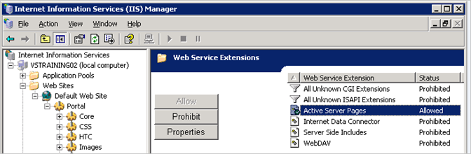

# Het Portaal van het Rapport van de toewijzing aan een Virtuele Folder (IIS 6.0){#mapping-report-portal-to-a-virtual-directory-iis}

Stappen om het Portaal van het Rapport aan een virtuele folder (IIS 6.0) in kaart te brengen.

Wanneer u [!DNL Report Portal] toewijst aan een virtuele map in IIS 6.0, hebt u drie aparte taken:

1. [Het configuratiebestand bewerken](../../../../home/c-rpt-oview/c-install-rpt-port/c-virtual-dir/c-map-rpt-port-vdir-6.md#section-eaf1c58935074cfa840dac33e1286520)
1. [Importeer het configuratiebestand in IIS](../../../../home/c-rpt-oview/c-install-rpt-port/c-virtual-dir/c-map-rpt-port-vdir-6.md#section-9d61f6bfa93846dcb96973fec5573b19)
1. [Active Server Pages (ASP&#39;s) inschakelen in IIS](../../../../home/c-rpt-oview/c-install-rpt-port/c-virtual-dir/c-map-rpt-port-vdir-6.md#section-a7725ec2afc64ffc854c5bd8c5c31802)

U moet alle drie de taken voltooien.

## Het configuratiebestand {#section-eaf1c58935074cfa840dac33e1286520} bewerken

1. Open \*PortalName*\ReportPortalSetup.xml in een teksteditor zoals Kladblok op de computer waarop [!DNL Report Portal] is geïnstalleerd.

1. Gebruik de vondst-en-vervangeigenschap van de redacteur om (allen vervangen) globaal het koord &quot;VSVirtualPortalName&quot;met de naam van uw portaal te vervangen. Bijvoorbeeld, als u &quot;VisualReportPortal&quot;als naam van uw [!DNL Report Portal] wilt gebruiken, zou u &quot;VSVirtualPortalName&quot;zoeken en het vervangen met &quot;VisualReportPortal.&quot;
1. Zoek het volgende element in dit bestand:

   ```
   <IIsWebVirtualDir Location= "/LM/W3SVC/1/Root/PortalName/Output" AccessFlags="AccessRead | AccessScript” AppFriendlyName="Output" . . . >
   ```

1. Plaats [!DNL Path] attributen van dit element aan de fysieke plaats van de folder waarin [!DNL Report Server] de output voor uw rapportreeksen bewaart.

   De outputomslag kan overal worden gevestigd, kan om het even wat worden genoemd, en bevat een subfolder voor elke rapportreeks.

   >[!NOTE]
   >
   >Dit moet de zelfde folder zijn die u in de parameter van de Wortel van de Output in het [!DNL Report.cfg] dossier voor een rapportreeks specificeert. Voor meer informatie, zie [Het vormen Report.cfg- Dossiers](../../../../home/c-rpt-oview/c-admin-rpt/c-config-rpt-files.md#concept-cf4b95344fcb4c8c877db91e5f1d345d).

   Het volgende codevoorbeeld toont hoe u het [!DNL Path] attribuut zou plaatsen als uw rapporten aan [!DNL E:\VSReport\ReportOutput] werden bewaard:

   ```
   < . . . 
   AppIsolated="2" 
       AppRoot="/LM/W3SVC/1/Root/PortalName/OutputFolder" 
       DirBrowseFlags="DirBrowseShowDate | DirBrowseShowTime |...  
       Path="E:\VSReport\ReportOutput"
   ```

   >[!NOTE]
   >
   >Het is kritiek dat het [!DNL Path] attribuut behoorlijk wordt geplaatst.

1. Als u het gebrek [!DNL Path] van het [!DNL Output] element veranderde, verplaats het [!DNL profiles.xml] dossier van *\ PortalName*\PortalFiles\Output folder to the output directory that you specified in Step 4. In het bovenstaande voorbeeld verplaatst u [!DNL profiles.xml] naar [!DNL E:\VSReport\ReportOutput].

1. Verifieer dat de [!DNL Path] attributen voor alle andere [!DNL IIsWebVirtualDir] elementen aan de correcte plaats door het zoeken naar alle instanties van [!DNL C:\Inetpub\wwwroot] en het vervangen van elk met de correcte weg in kaart worden gebracht.

1. Sla het bestand op. Als u het oorspronkelijke bestand wilt behouden, kunt u het configuratiebestand onder een andere naam opslaan.

## Om het dossier van de Configuratie in IIS {#section-9d61f6bfa93846dcb96973fec5573b19} in te voeren

1. Start IIS Manager op de computer waarop [!DNL Report Portal] is geïnstalleerd met **[!UICONTROL Start]** > **[!UICONTROL Administrative Tools]** > **[!UICONTROL Internet Information Systems (IIS) Manager]**.

1. Selecteer **[!UICONTROL (local computer)]** > **[!UICONTROL Web Sites]** > **[!UICONTROL Default Web Site]**.

1. Klik met de rechtermuisknop **[!UICONTROL Default Web Site]** en selecteer **[!UICONTROL New]** > **[!UICONTROL Virtual Directory]** (uit bestand).

1. Selecteer het **[!UICONTROL ReportPortalSetup.xml]** dossier en klik **[!UICONTROL Read File]**.

1. Verifieer dat zes virtuele folders voor uw [!DNL Report Portal] zoals aangetoond in het volgende voorbeeld worden vermeld.

   

   Als er geen zes virtuele mappen worden weergegeven of als u een foutbericht ontvangt, klikt u op **[!UICONTROL Cancel]** en controleert u het configuratiebestand op fouten.

1. Selecteer de eerste virtuele map in de lijst (de map die het bovenliggende item van de andere vijf is) en klik op **[!UICONTROL OK]**. IIS voert de afbeeldingen in en voegt de virtuele folders aan de StandaardWebsite toe.

   Zorg ervoor dat de resulterende mapstructuur één bovenliggende map (met dezelfde naam als uw portal) en vijf submappen heeft, zoals in het volgende voorbeeld wordt getoond.

   

1. Klik elke virtuele folder om ervoor te zorgen dat IIS van de fysieke folder kan de plaats bepalen het vertegenwoordigt. Als IIS een fout toont, klik de virtuele foldernaam met de rechtermuisknop aan en verifieer dat [!DNL Local Path] gebied aan de correcte fysieke folder richt.

## Active Server Pages (ASP&#39;s) inschakelen op IIS {#section-a7725ec2afc64ffc854c5bd8c5c31802}

Om [!DNL Report Portal] te gebruiken, moeten ASPs op IIS worden toegelaten. (Standaard zijn ASP&#39;s uitgeschakeld wanneer IIS 6.0 is geïnstalleerd.) Gebruik de volgende procedure om te verifiëren dat ASPs op uw IIS wordt toegelaten.

1. Selecteer **[!UICONTROL (local computer)]** > **[!UICONTROL Web Service Extensions]** in het venster IIS Manager.
1. Controleer of de extensie [!DNL Active Server Pages] is ingesteld op [!DNL Allowed].

   

1. Als hun status is verboden, selecteert u **[!UICONTROL Active Server Pages]** en klikt u op **[!UICONTROL Allow]**.
1. Sluit IIS Manager.
