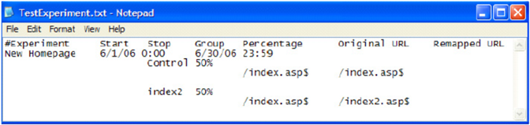

# Het vormen van en het Opstellen van de Experiment{#configuring-and-deploying-the-experiment}

Nadat u uw doel, hypothese, en experimentele details evenals creeerde uw testinhoud hebt bepaald, moet u Sensor vormen om het gecontroleerde experiment op te stellen.

## Het vormen van het Experimentele Dossier van de Configuratie {#section-037fe7dea9c94aee9cdc354dafdb7c03}

Om het experiment te vormen, moet u de spreadsheet voltooien van de experimentele configuratie die door Adobe ( [!DNL TestExperiment.xls] door gebrek wordt genoemd) wordt verstrekt. Dit dossier vormt [!DNL Sensor] om het experiment uit te voeren en is de versie van Excel van het tekstdossier dat u in het [Wijzigen van de Parameter](../../../home/c-undst-ctrld-exp/t-en-ctrld-exp/c-mod-expfile-prm.md#concept-25232b386a654870becc789d4f1fcc28)ExpFile specificeerde.

Dit dossier kan informatie over veelvoudige experimenten bevatten, die op het zelfde of op verschillende tijden kunnen lopen en verschillende groepen en percentages gebruiken, maar deze experimenten zijn gecorreleerd op geen enkele manier.

De gebruikers worden geplaatst in een groep voor elk experiment dat in het dossier wordt vermeld dat wordt gevormd om op dit ogenblik te lopen.

>[!NOTE]
>
>Elk experiment is onafhankelijk van alle andere experimenten. De veranderingen die u in één experiment aanbrengt beïnvloeden geen ander experiment, en hoewel de bezoekers in veelvoudige experimenten kunnen zijn, hebben de resultaten niet op elkaar betrekking. Als u denkt bestaat een correlatie tussen de veranderingen in veelvoudige experimenten, moet u een nieuw experiment tot stand brengen dat deze veranderingen samen test.

**Om uw experiment te vormen**

U zou dit dossier moeten voltooien alvorens het experiment begint en niet de informatie wijzigen terwijl het experiment loopt.

>[!NOTE]
>
>Elk experiment is onmiddellijk ongeldig als de definitie van het experiment verandert nadat het experiment is begonnen.

1. Als u beheerderstoegang tot uw Web of toepassingsservers hebt, navigeer aan de [!DNL Sensor] installatiemap op om het even welk [!DNL Sensor] systeem in uw Webcluster om tot het [!DNL TestExperiment.xls] dossier toegang te hebben. Als u beheerderstoegang niet hebt, contacteer uw de rekeningsmanager van Adobe om het [!DNL TestExperiment.xls] dossier te verzoeken.

1. Open het [!DNL TestExperiment.xls] dossier (u kunt dit dossier anders noemen indien gewenst) en voltooi de volgende gebieden:

<table id="table_FDD6AE631C614F97AD7AE8829E53CCAC"> 
 <thead> 
  <tr> 
   <th colname="col1" class="entry"> Veld </th> 
   <th colname="col2" class="entry"> Beschrijving </th> 
  </tr> 
 </thead>
 <tbody> 
  <tr> 
   <td colname="col1"> Experimenteren </td> 
   <td colname="col2"> 
Een beschrijvende naam voor het experiment. Elke naam van het experiment moet uniek zijn en kan geen ruimten bevatten. 
 
De namen van het experiment worden gebruikt wanneer het tonen van de resultaten van experimenten in  Insight . De namen verschijnen als eerste helft van de elementennamen in de gecontroleerde experimentele dimensie. De tweede helft van de elementennaam is de groepsnaam van het gebied van de Groep in dit dossier. Elke groep wordt genoemd in het volgende formaat gebruikend de experimentnaam die door de groepsnaam wordt gevolgd: 
 
<i>Naam van ExperimentName.Group</i> 
 
Bijvoorbeeld:  New_Homepage.Control  
 </td> 
  </tr> 
  <tr> 
   <td colname="col1"> Start </td> 
   <td colname="col2"> 
De datum en het tijdstip waarop het experiment moet beginnen. Als u geen waarden ingaat, begint het experiment onmiddellijk nadat het dossier wordt opgesteld. 
 
Formaat: MM/DD/JJJJ H:MM 
 
    <ul id="ul_FB8B50C688584683AC2226FCBED40AF9"> 
     <li id="li_223EF962CFC64454965444E66284F670">Als je de start- en stoptijden leeg laat, loopt het experiment voor onbepaalde tijd. </li> 
     <li id="li_0544C9A98635418CAECD85B67F345772">U kunt begin en ophouden tijden ruim vooraf bepalen van tevoren; daarom kunt u elk van uw experimenten voor het volgende jaar meteen vormen indien gewenst. </li> 
     <li id="li_BDFBB74B1D134E57B37DC5C3457AA1A9">De tijden van het begin en van het einde zijn gebaseerd op de systeemtijd van de Webserver. Als die klok om het even welke reden verandert, kan uw experiment onverwacht beginnen of ophouden. </li> 
     <li id="li_3295FE5B2AC64B6CA90CC7F31B808EB9">Als u een experiment als ingang van het configuratiedossier zou willen toevoegen maar niet het experiment in de nabije toekomst wilt lopen, kunt u de experimentele informatie opmerken gebruikend het aantalteken "#"of begin en eindetijden in het verleden bepalen. </li> 
    </ul> </td> 
  </tr> 
  <tr> 
   <td colname="col1"> Stoppen </td> 
   <td colname="col2"> 
De datum en het tijdstip waarop het experiment moet worden beëindigd. Wanneer de eindedatum en de tijd voorkomen,   zal de Sensor ophouden verzendend de koekjeswaarden die als testgroep aan de test URIs worden geïdentificeerd en zal alle koekjes naar de controlegroep URIs verzenden. 
 
Formaat: MM/DD/JJJJ H:MM 
 
Zie de nota's voor het  Begin  - gebied. 
 </td> 
  </tr> 
  <tr> 
   <td colname="col1"> Groep </td> 
   <td colname="col2"> 
Een beschrijvende naam voor elke groep bezoekers in het experiment. De namen van de groep kunnen geen ruimten bevatten. 
 
De namen van de groep worden gebruikt wanneer het tonen van de resultaten van experimenten in  Inzicht . Voor meer informatie, zie de het gebiedsbeschrijving van het Experiment. 
 
Een controlegroep kan impliciet of uitdrukkelijk worden bepaald gebaseerd op de waarde ingegaan op het gebied van het Percentage. 
 
 
Opmerking:  Om te voldoen aan het aantal bezoekers dat nodig is gedurende de vastgestelde periode voor het experiment om statistisch geldig te zijn, kan het nodig zijn om het betrouwbaarheidsniveau te verlagen of de tijdsperiode te verlengen. Bijvoorbeeld, als uw tijdkader vijf dagen is, is uw betrouwbaarheidsniveau 98%, en uw nodig aantal bezoekers overschrijdt het aantal dat voor die tijdspanne wordt verwacht, moet u of de tijdspanne verhogen of het betrouwbaarheidsniveau verminderen tot het aantal bezoekers dat wordt verwacht het aantal overschrijdt nodig om een statistisch geldig experiment uit te voeren. 
 
 </td> 
  </tr> 
  <tr> 
   <td colname="col1"> Percentage </td> 
   <td colname="col2"> 
Het percentage websitebezoekers om in elke bepaalde groep te omvatten. Deze waarden kunnen als of percentages of decimale waarden worden uitgedrukt. Bovendien moeten beide waarden of groter of minder dan één zijn. 
 
Bijvoorbeeld: 
 
33,3% en 66,7% 
 
.99 en .01 
 
Als de som voor alle groepen minder dan 100 is, blijft de niet gedefiniëerde bovenmatige gebreken aan een controlegroep. 
 </td> 
  </tr> 
  <tr> 
   <td colname="col1"> Originele URL </td> 
   <td colname="col2"> 
URI van de inhoud die moet worden opnieuw in kaart gebracht, door $ wordt gevolgd. Deze waarde is case-sensitive. 
 
Formaat: index.asp$ 
 
Originele URIs kan worden gespecificeerd gebruikend een dollarteken ($) aan het eind van URI om aan te geven dat een nauwkeurige gelijke van het dossier - naam wordt vereist. Bijvoorbeeld, past de uitdrukking  /product/product_view.asp$  die nauwkeurige pagina slechts aan, terwijl  /product om het even welke pagina in de  /product  folder  aanpast en kon worden gebruikt om die volledige subboom opnieuw in kaart te brengen. De originele Url- ingangen die niet het $ karakter aan het eind van het dossier specificeren - de naam wordt genegeerd door het experiment tenzij de parameter ExpPartialMatch aan "op is geplaatst." Voor meer informatie over deze parameter, zie het <a href="../../../home/c-undst-ctrld-exp/t-en-ctrld-exp/c-mod-expplmth-prm.md#concept-9c817c4c49b74287b0f70d6a1a37655e"> Wijzigen van de Parameter ExpPartialMatch (Facultatief) </a>. 
 
De gecontroleerde experimentele functionaliteit negeert om het even welke vraagkoorden die aan de stam van URI worden toegevoegd. Bijvoorbeeld de pagina 
 
  /product/product_view.asp?production=53982  is geen geldig URI, maar de pagina  /product/product_view.asp  is een geldige URI. 
 </td> 
  </tr> 
  <tr> 
   <td colname="col1"> Aangepaste URL </td> 
   <td colname="col2"> 
URI van de afwisselende inhoud. 
 
Formaat: index2.asp 
 
Zie de nota's voor het Originele Url- gebied. 
 </td> 
  </tr> 
 </tbody> 
</table>

Het volgende is een voorbeeld van een voltooide [!DNL TextExperiment.xls] spreadsheet:

>[!NOTE]
>
>Wijzig de kolomposities in de spreadsheet niet.

Dit voorbeeld wijst erop dat het &quot;New_Homepage&quot;experiment op 1 Juni, 2006 begint, op 30 Juni eindigt, 2006, en bevat een controlegroep met 50% van de bezoekers en een testgroep met 50% van de bezoekers, die verschillende inhoud voor één URI zien.

>[!NOTE]
>
>Hoewel het steekproefdossier hierboven een expliciete bepaalde controlegroep heeft, is het niet noodzakelijk om een controlegroep uitdrukkelijk te bepalen — het experiment leidt automatisch tot de controlegroep. Als de som van de percentages voor alle groepen in een experiment minder dan 100% is, wordt een impliciete controlegroep toegewezen aan gebruikers die niet in één van de expliciete groepen vallen.

1. Om commentaren op te nemen om extra informatie over specifieke experimenten te verstrekken, begin de cel met een aantalteken (#) en volg met uw commentaren. De commentaren kunnen overal in het dossier worden opgenomen.
1. Nadat u de variabelen in de spreadsheet van de experimentele configuratie hebt voltooid, sparen de veranderingen, dan sparen het dossier in lusje-afgebakende tekstformaat ( [!DNL *.txt]) gebruikend de naam die u in de parameter ExpFile in het [!DNL Sensor] configuratiedossier specificeerde. Zie het [Wijzigen van de Parameter](../../../home/c-undst-ctrld-exp/t-en-ctrld-exp/c-mod-expfile-prm.md#concept-25232b386a654870becc789d4f1fcc28)ExpFile.

   Het volgende is een voorbeeld van een de tekstdossier van de experimentele configuratie:

   

   >[!NOTE]
   >
   >Wegens de lusjes die in dit dossier worden vereist, geef niet het de tekstdossier van de experimentele configuratie door hand uit. Als u veranderingen in het dossier moet aanbrengen, breng de veranderingen in het dossier van Excel van de experimentele configuratie aan en sla het dossier als lusje-afgebakend tekstdossier opnieuw op.

Als u de tijden van het Begin en van het Einde hebt bepaald, is er geen reden om een experiment van het dossier van de experimentele configuratie ooit te schrappen. Het houden van al uw experimenten die in het dossier van de experimentconfiguratie worden vermeld is eigenlijk een goede manier om een verslag bij te houden van hoe u elk van uw experimenten bepaalde.

## Het opstellen van het Dossier van de Configuratie en de Inhoud van de Test {#section-34ff29649f584b93bc6129b75084b37c}

U moet het dossier van de experimentele configuratie aan elke machine in uw Webcluster opstellen die een [!DNL Sensor] en het dienen van de pagina&#39;s in werking stelt betrokken bij het experiment. U kunt dit doen gebruikend of een handprocedure of uw bestaand systeem van het inhoudsbeheer.

**Om uw testinhoud op te stellen**

* Voor elke toepassing of Webserver die een [!DNL Sensor] die pagina&#39;s in werking stelt betrokken bij het experiment in werking stelt, gebruik uw bestaand het publiceren proces om de testinhoud aan de aangewezen plaats op te stellen.

   Bijvoorbeeld, als u de pagina van de testgroep [!DNL index2.asp] aan de testomslag voor uw website ( [!DNL mysite.com]) wilt publiceren, zou u het dossier aan publiceren [!DNL www.mysite.com/test].

   >[!NOTE]
   >
   >Koppel niet rechtstreeks vanaf een pagina op uw website naar een van uw testbestanden. Het doen maakt dit uw testresultaten en uw indexscores ongeldig.

**Om uw experiment te implementeren**

* Voor elke toepassing of Webserver die een [!DNL Sensor] die pagina&#39;s in werking stelt betrokken bij het experiment in werking stelt, plaats het de tekstdossier van de experimentele configuratie in de folder die u in de parameter ExpFile in het [!DNL Sensor] configuratiedossier specificeerde. Zie het [Wijzigen van de Parameter](../../../home/c-undst-ctrld-exp/t-en-ctrld-exp/c-mod-expfile-prm.md#concept-25232b386a654870becc789d4f1fcc28)ExpFile.

[!DNL Sensor] selecteert willekeurig websitebezoekers voor elke groep die op de percentages wordt gebaseerd die u in het dossier bepaalde en dient de test of inhoud van de controlegroep aan hen zoals aangewezen.
