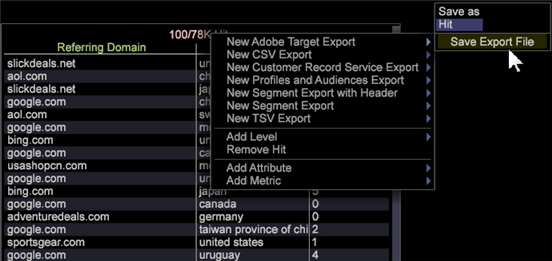

# De Integratie van de Werkbank van gegevens met het Doel van Adobe

De integratie van de Werkbank van de Gegevens van Adobe met het Doel van Adobe werd gemakkelijker met de eigenschappen van de Werkbank van Gegevens om gegevenssegmenten uit te voeren en automatisch de uitvoerdossiers te bevolken.

De Werkbank van de Gegevens van Adobe verstrekt gesloten-lijnintegratie met het Doel van Adobe voor het delen van gegevens en het produceren van rapporten. Binnen de Werkbank van Gegevens kunt u populaties voor zinvolle segmenten analyseren gebruikend alle beschikbare gegevens, met inbegrip van off-line omzettingen door kanalen zoals telefoon, een opslag, etc.

Bijvoorbeeld, zoekt een bezoeker schoenen op uw website maar zet niet om. In plaats daarvan downloadt de bezoeker een coupon voor 20 procent van zijn volgende aankoop en koopt hij vervolgens een shirt in je winkel. Met behulp van Data Workbench kunt u die gegevens verzamelen en vervolgens die profielgegevens naar Target duwen om aan te tonen dat de bezoeker een shirt offline heeft gekocht. Je kunt je dan richten op een campagne die een ketting aanbiedt aan die bezoeker, wanneer Target normaal gesproken zou kunnen proberen om schoenen opnieuw op de markt te brengen voor die bezoeker.

## De Werkbank van de Gegevens van de opstelling met het Doel van Adobe

1. Klik de kopbal in het [!UICONTROL Detail Table] venster met de rechtermuisknop aan.

   

1. Selecteer **[!UICONTROL New Target Export]** en ga de naam van een nieuw de uitvoerdossier onder het **[!UICONTROL Save As]** bevel in het menu in.

1. Klik op **[!UICONTROL Save Export File]**.

   Een venster van het de uitvoermalplaatje zal openen.

   Alle informatie van het Doel van Adobe wordt automatisch bevolkt. Het bouwt omhoog de parameterlijst die op wat wordt gebaseerd u in de segmentuitvoer zet. Wanneer volledig, zal de Werkbank van Gegevens de gegevens naar de server van het Doel van Adobe verzenden.

   **Opmerking:** Het dossier van het Malplaatje zou door moeten worden gevormd [!UICONTROL Profile Architect]. Het [!UICONTROL Client Name], [!UICONTROL Domain Postfix], [!UICONTROL Mbox Host], en [!UICONTROL Mbox Name] moet zijn ingegaan. Als u veelvoudige plaatsen hebt, dan vul veelvoudige malplaatjes in en bewaar hen aan de server. De sjablonen van Profielbeheer bevinden zich in `Context\FileNew\Detail Table\Export\Copy`.

   

1. Specificeer de [!UICONTROL mboxPC] vraagparameter.

   Als de naam van de attributen van de Werkbank van Gegevens iets buiten [!UICONTROL mboxPC]is, moet u de aangewezen Parameter van de Vraag uitgeven en het anders noemen aan _mboxPC_.

   

   Wanneer u sparen het de uitvoerdossier aan de server de uitvoer zal beginnen. Wanneer voltooid, zal de [!UICONTROL TnTSend.exe] toepassing lanceren en zal beginnen verzendend gegevens naar de rekening van het Doel.

## Het vormen de Werkbank van Gegevens voor Doel

Voltooi de volgende taken in het Doel van Adobe:

De Werkbank van gegevens gaat gebruikersprofielen tot het Doel van Adobe over. Om voor de uitvoer naar Doel te vormen, moet u aan opstelling toelaten en zijn API toelaten en de **[!UICONTROL clientname]** en **[!UICONTROL domain postfix]** parameters verstrekken voor het dossier van de de uitvoerconfiguratie (`export.cfg`).

Een nieuwe geroepen optie Van Boole **[!UICONTROL Oneshot]** is toegevoegd aan de dossiers van de segmentuitvoer. Deze optie is inbegrepen in het malplaatjedossier dat met het nieuwe profiel wordt verdeeld. Als [!UICONTROL Oneshot] aan _waar_ wordt geplaatst, dan zal het `.export` dossier aan worden anders genoemd `.export.done-TIMESTAMP` nadat de uitvoer wordt voltooid, ervoor zorgend dat het segment nooit meer dan eens zal worden uitgevoerd. Dit is belangrijk wanneer het uitvoeren naar het Doel van Adobe.

**Opmerking:** Een vraag van de Werkbank van Gegevens aan de tellingen van het Doel van Adobe als [!UICONTROL mbox] vraag, die één vraag vereist voor elk verzonden profiel. Derhalve stijgen de kosten als de veelvoudige vraag tussen de twee oplossingen wordt vereist.

Een onvolledige configuratie veroorzaakt de volgende foutenmelding in het logboek:

```
TNT-040615-133212-Adobe-Target-Product-Test.log:
TnT Configuration left out these empty fields:
ClientName,MboxHost,MboxName
```

## Het vormen het Doel van Adobe voor de Werkbank van Gegevens

Binnen het Doel van Adobe, is geen speciale configuratie nodig voor een klant om profielgegevens te verzenden. De profielinformatie voor een gebruiker wordt typisch overgegaan in het regelmatige [!UICONTROL mbox] verzoek, en de servers zullen de profielparameters voor een gerichte campagneopstelling als standaardfunctionaliteit zonder enige extra opstelling beschikbaar maken.

Het Doel van Adobe heeft de ingebouwde integratie van de Werkbank van Gegevens, die van de Super-gebruiker pagina van de Details van de Cliënt kan worden toegelaten. Het toelaten van de optie zal segmenten oppervlakten die van de Werkbank van Gegevens binnen het Doel van Adobe worden gedeeld om het voor het richten beschikbaar te maken.

## Het vastgestelde logboek van HTTP dat in ExportIntegration.exe meldt

Verminder lange rapportering aan [!UICONTROL HTTP.log] wanneer het gebruiken [!UICONTROL ExportIntegration.exe] om de integratiedossiers van het Doel van Adobe uit te voeren.

Een nieuw die [!UICONTROL httpLoggingEI.cfg] configuratiedossier (bij `server\Admin\Export\httpLoggingEI.cfg`) wordt gevestigd laat u breedteloze registreren aan het [!UICONTROL HTTP.log] dossier verminderen voor wanneer het uitvoeren van gegevens gebruikend [!UICONTROL ExportIntegration.exe]. Dit staat u toe om breedsprakig verzoek/reactieregistreren tegen te houden.

Het registreren van de verbose wordt reeds gevangen in [!UICONTROL TnTSend.log] dossiers.

_Waar_ plaatst breedsprakig registreren, en de _Vals_ houdt het breedste registreren aan [!UICONTROL HTTP.log] dossier tegen.

In het Vals plaatsen, slechts zal een waarschuwingsbericht naar het [!UICONTROL HTTP.log] dossier (de inhoud van Info niet verzonden) worden verzonden.