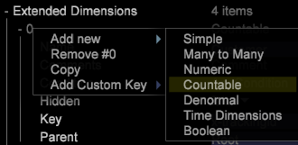

# Telbare structuren voor schemaontwerp{#schema-design-countable-structures}

Verklaring van Tellingen in DataWorkbench (DWB) voor het ontwerpen van en het uitvoeren van het schema.

## Inzicht in telbaar in Data Workbench {#section-6e6b8d1c17634d669e62c91a80a0bc62}

Op het hoogste niveau zijn de dimensies te tellen. De telbare afmetingen hebben twee belangrijke functies. Ten eerste zijn het dimensies waarvan u de elementen wilt tellen. Met andere woorden, tellen beantwoorden de vragen als:

* Hoeveel bezoekers hebben uw homepage bezocht?

* Hoeveel bezoeken zijn er gekomen van Google.com?

`<discoiqbr>`De telbare afmetingen worden typisch gebruikt om samenvattingsmetriek tot stand te brengen, die de telling, of de som, van alle elementen van de afmeting terugkeren. U kunt aftelbare afmetingen definiëren om instanties zoals boekingen of productbestellingen te tellen. U kunt bijvoorbeeld de aftelbare afmetingsvolgorde definiëren waarvan de elementen (logbestandvermeldingen die overeenkomen met bestellingen van uw online winkel) kunnen worden geteld. Als u een telling van orden binnen een visualisatie wilt tonen, zou u de orde metrische som bepalen, die over een afmeting kan worden geëvalueerd of filters hebben op het worden toegepast.

De tellende afmetingen kunnen ouders van andere dimensies of kinderen van andere telbare afmetingen zijn.

Hoewel uw wortel telbare afmeting niet met het volgen IDs in de gegevens moet worden geassocieerd, adviseert Adobe dat u de wortel telbare afmeting van uw dataset vormt om het volgende gebied van identiteitskaart (x-trackingid) te gebruiken aangezien het Sleutel is. Dientengevolge, wordt elk element van de wortel telbaar geassocieerd met een unieke waarde van x-trackingid, en alle gegevens over elk element worden gegroepeerd.

De telbare afmetingen worden bepaald door de volgende parameters:

<table id="table_5E00B72CFDD645368ADCC25AB9B5E53D"> 
 <thead> 
  <tr> 
   <th colname="col1" class="entry"> Parameter </th> 
   <th colname="col2" class="entry"> Beschrijving </th> 
   <th colname="col3" class="entry"> Standaard </th> 
  </tr>
 </thead>
 <tbody> 
  <tr> 
   <td colname="col1"> Naam </td> 
   <td colname="col2"> Beschrijvende naam van de dimensie die de gebruiker in de werkbank voor gegevens ziet. De naam van de dimensie mag geen afbreekstreepje (-) bevatten. </td> 
   <td colname="col3"> </td> 
  </tr> 
  <tr> 
   <td colname="col1"> 
Opmerkingen 
 </td> 
   <td colname="col2"> 
Optioneel. Opmerkingen over de uitgebreide dimensie.

    &lt;/p> &lt;/td>
<td colname="col3"> </td> 
  </tr> 
  <tr> 
   <td colname="col1"> 
Voorwaarde 
 </td> 
   <td colname="col2"> 
De omstandigheden waaronder het inputgebied tot de verwezenlijking van de telbare dimensie bijdraagt. Indien gespecificeerd, beperkt een voorwaarde de reeks logboekingangen zichtbaar aan de dimensie en al zijn kinderen in het datasetschema. 
 </td> 
   <td colname="col3"> </td> 
  </tr> 
  <tr> 
   <td colname="col1"> Verborgen </td> 
   <td colname="col2"> Hiermee wordt bepaald of de dimensie wordt weergegeven in de interface van de gegevenswerkbank. Deze parameter is standaard ingesteld op false. Als de afmeting bijvoorbeeld alleen als basis van een metrische waarde moet worden gebruikt, kunt u deze parameter instellen op true om de afmeting te verbergen in de weergave op de werkbank. </td> 
   <td colname="col3"> false </td> 
  </tr> 
  <tr> 
   <td colname="col1"> Sleutel </td> 
   <td colname="col2"> 
Optioneel. De naam van het veld dat als sleutel moet worden gebruikt. Als u deze parameter definieert, bestaat er een element van de aftelbare dimensie voor elke combinatie van een element van het bovenliggende element van de aftelbare dimensie en een specifieke waarde van het veld dat als de sleutel is opgegeven. 
 
Elk element van de telbare dimensie wordt vereist om op een aangrenzende reeks logboekingangen betrekking te hebben. Daarom als de logboekingangen niet door de sleutel worden bevolen, wordt een element van de telbare dimensie gecreeerd telkens als de belangrijkste gebiedsveranderingen. Om deze situatie te voorkomen, raadt Adobe u aan een unieke sleutel te gebruiken die in de tijdvolgorde aaneengesloten is. 
 </td> 
   <td colname="col3"> </td> 
  </tr> 
  <tr> 
   <td colname="col1"> Bovenliggend </td> 
   <td colname="col2"> 
 De naam van de bovenliggende dimensie. Elke aftelbare dimensie kan een bovenliggende dimensie zijn. Om een afmeting de top-level afmeting in het schema van de dataset te maken, plaats de parameter aan "wortel." De bepaalde afmeting wordt de wortel telbare afmeting voor de dataset. Bijvoorbeeld, als u met Plaats werkt, is de dimensie van de Bezoeker de wortel telbare dimensie voor uw dataset. 
 
Opmerking: Hoewel uw wortel telbare afmeting niet met het volgen IDs in de gegevens moet worden geassocieerd, adviseert Adobe dat u de wortel telbare afmeting van uw dataset vormt om het volgende gebied van identiteitskaart (x-trackingid) als zijn Sleutel te gebruiken. Dientengevolge, wordt elk element van de wortel telbaar geassocieerd met een unieke waarde van x-trackingid, en alle gegevens over elk element worden gegroepeerd. Als u uw dataset verschillend zou willen vormen, contacteer Adobe. 
 </td> 
   <td colname="col3"> </td> 
  </tr> 
 </tbody> 
</table>

In dit voorbeeld wordt de definitie van een aftelbare dimensie getoond aan de hand van gebeurtenisgegevens die uit websiteverkeer zijn verzameld. De aftelbare dimensie telt de gebeurtenissen van de Webcampagne binnen een bepaalde zitting. De aanname is dat alle bronnen voor e-mailcampagnes worden aangevraagd bij de webserver met &quot;email=&quot; als onderdeel van cs-uri-query. In het voorbeeld is het aantal keren dat de bezoeker reageert op een e-mailcampagne tijdens een bepaalde sessie van belang, niet de werkelijke waarde van het veld cs-uri-query(e-mail).

De tweede belangrijkste functie van tellingslijsten is dat zij de backbone van uw structuur van het datasetschema vormen. Uw gegevensschema en alle andere dimensies worden georganiseerd om onder worden gegroepeerd, en behoren tot een telbare. Met andere woorden, als we dimensies beschouwen als &quot;categorieën&quot;, dan zijn teletabellen de manier waarop we deze &quot;categorieën&quot; organiseren in groepen.
Wanneer dimensies worden gegroepeerd onder een aftelbare dimensie, worden ze geacht zich op het &quot;niveau&quot; van de aftelbare dimensie te bevinden. In de onderstaande afbeelding ziet u bijvoorbeeld dat E-mailadres zich op bezoekersniveau bevindt en dat Browser zich op bezoekersniveau bevindt. &quot;Bovenliggend&quot; en &quot;onderliggend&quot; hebben betrekking op de relatie tussen de telbare en de onderliggende dimensies. Bezoeker is bijvoorbeeld een &#39;bovenliggend&#39; e-mailadres. Het e-mailadres is daarentegen een &quot;onderliggend&quot; lid van de Bezoeker.  

## Tabellen maken in Data Workbench {#section-491f3e8e4fbc429e95d6c97f012a208e}

Voer de volgende stappen uit om tot de Countable in DataWorkbench te leiden:

1. Profielbeheer openen
1. Onder de omslag van de Transformatie, creeer een config- dossier en open het in werkstation.
1. Klik met de rechtermuisknop onder Uitgebreide Dimension en kies Nieuw toevoegen -> Telbaar, zoals hieronder wordt getoond: 

1. Ga Naam voor nieuwe Teller in. In het onderstaande voorbeeld is de klantentabel gedefinieerd. Als het het Hoogste niveau Teller is, dan in de Ouder schrijft Wortel. 

   Als de Teller niet hoogste niveau één is, dan op het oudergebied de naam van de Parent Countable. In het onderstaande voorbeeld wordt Betrokkenheid aftelbaar gemaakt en de ouder voor deze aftelbare tabel is Klant. 

Voor extra informatie over de architectuur van de Data Workbench voor schemaontwerp, telbare structuren, en off-line configuraties van de gegevensvoer, zie [Dataset de Interface van het Schema](https://experienceleague.adobe.com/docs/data-workbench/using/client/admin-ui/c-dtst-sch-intrf.html).
