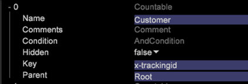

# Telbare structuren van het ontwerp van het schema{#schema-design-countable-structures}

Uitleg van Countables in Dataworkbench (DWB) voor het ontwerpen van en het uitvoeren van het schema.

## Begrijpend Tellend in de Werkbank van Gegevens {#section-6e6b8d1c17634d669e62c91a80a0bc62}

Op het hoogste niveau zijn er talloze dimensies. De meetbare afmetingen dienen twee belangrijke functies. Eerst, zijn zij afmetingen de waarvan elementen u wilt tellen. Met andere woorden, beantwoordt de tellers de vragen als:

* Hoeveel bezoekers hebben je homepage bezocht?

* Hoeveel bezoeken kwamen van Google.com?

`<discoiqbr>`De tellbare afmetingen worden typisch gebruikt om samenvattingsmetriek tot stand te brengen, die de telling, of de som, van alle elementen van de afmeting terugkeren. U kunt telbare afmetingen bepalen om instanties zoals reserveringsboekingen of productorden te tellen. Bijvoorbeeld, kon u de telbare afmetingsorden bepalen de waarvan elementen (logboekingangen die aan orden van uw online opslag beantwoorden) zouden kunnen worden geteld. Als u een telling van orden binnen een visualisatie wilt tonen, zou u de orde metrisch bepalen, die over een afmeting kan worden geëvalueerd of filters hebben die op het worden toegepast.

Veelzijdige dimensies kunnen ouders van andere dimensies of kinderen van andere aftelbare afmetingen zijn.

Hoewel uw wortel telbare afmeting niet met het volgen IDs in de gegevens moet worden geassocieerd, adviseert Adobe dat u de wortel telbare afmeting van uw dataset vormt om het volgende identiteitskaart- gebied (x-trackingid) te gebruiken aangezien het Sleutel is. Dientengevolge, wordt elk element van de wortel telbaar geassocieerd met een unieke waarde van x-trackingid, en alle gegevens over elk element wordt gegroepeerd.

De meetbare afmetingen worden bepaald door de volgende parameters:

<table id="table_5E00B72CFDD645368ADCC25AB9B5E53D"> 
 <thead> 
  <tr> 
   <th colname="col1" class="entry"> Parameter </th> 
   <th colname="col2" class="entry"> Beschrijving </th> 
   <th colname="col3" class="entry"> Standaard </th> 
  </tr>
 </thead>
 <tbody> 
  <tr> 
   <td colname="col1"> Naam </td> 
   <td colname="col2"> Beschrijvende naam van de afmeting zoals aan de gebruiker in gegevenswerkbank verschijnt. De afmetingsnaam kan geen koppelteken (-) omvatten. </td> 
   <td colname="col3"> </td> 
  </tr> 
  <tr> 
   <td colname="col1"> 
Opmerkingen 
 </td> 
   <td colname="col2"> 
Optioneel. Opmerkingen over de uitgebreide dimensie.

    &lt;/p> &lt;/td>
<td colname="col3"> </td> 
  </tr> 
  <tr> 
   <td colname="col1"> 
Toestand 
 </td> 
   <td colname="col2"> 
De omstandigheden waaronder het inputgebied tot de verwezenlijking van de tellbare dimensie bijdraagt. Indien gespecificeerd, beperkt een voorwaarde de reeks logboekingangen zichtbaar tot de afmeting en elk van zijn kinderen in het datasetschema. 
 </td> 
   <td colname="col3"> </td> 
  </tr> 
  <tr> 
   <td colname="col1"> Verborgen </td> 
   <td colname="col2"> Bepaalt of de afmeting in de interface van de gegevenswerkbank verschijnt. Door gebrek, wordt deze parameter geplaatst aan vals. Als, bijvoorbeeld, de afmeting slechts als basis van metrisch moet worden gebruikt, kunt u deze parameter aan waar plaatsen om de afmeting van de vertoning van de gegevenswerkbank te verbergen. </td> 
   <td colname="col3"> vals </td> 
  </tr> 
  <tr> 
   <td colname="col1"> Sleutel </td> 
   <td colname="col2"> 
Optioneel. De naam van het gebied aan gebruik als sleutel. Als u deze parameter bepaalt, bestaat een element van de telbare afmeting voor elke combinatie van een element van de ouder van de telbare afmeting en een verschillende waarde van het gebied dat als sleutel wordt gespecificeerd. 
 
Elk element van de telbare afmeting wordt vereist om op een aangrenzende reeks logboekingangen betrekking te hebben. Daarom als de logboekingangen niet door de sleutel worden bevolen, wordt een element van de telbare dimensie gecreeerd telkens als de belangrijkste gebiedsveranderingen. Om deze situatie te verhinderen, adviseert Adobe dat u een unieke sleutel gebruikt die aangrenzend in tijdorde is. 
 </td> 
   <td colname="col3"> </td> 
  </tr> 
  <tr> 
   <td colname="col1"> Ouder </td> 
   <td colname="col2"> 
 De naam van de ouderafmeting. Om het even welke telbare afmeting kan een ouderafmeting zijn. Om een afmeting te maken de top-level afmeting in het schema van de dataset, plaats de parameter aan "wortel." De bepaalde afmeting wordt de wortel telbare afmeting voor de dataset. Bijvoorbeeld, als u met Plaats werkt, is de dimensie van de Bezoeker de wortel telbare afmeting voor uw dataset. 
 
Opmerking: Hoewel uw wortel telbare afmeting niet met het volgen IDs in de gegevens moet worden geassocieerd, adviseert Adobe dat u de wortel telbare afmeting van uw dataset vormt om het volgende identiteitskaart- gebied (x-trackingidentiteitskaart) als zijn Sleutel te gebruiken. Dientengevolge, wordt elk element van de wortel telbaar geassocieerd met een unieke waarde van x-trackingid, en alle gegevens over elk element wordt gegroepeerd. Als u uw dataset verschillend zou willen vormen, contacteer Adobe. 
 </td> 
   <td colname="col3"> </td> 
  </tr> 
 </tbody> 
</table>

Dit voorbeeld illustreert de definitie van een telbare dimensie gebruikend gebeurtenisgegevens die van websiteverkeer worden verzameld. De telbare afmeting telt de gebeurtenissen van de Webcampagne binnen een bepaalde zitting. De veronderstelling is dat alle middelen van de e-mailcampagne van de Webserver met &quot;email=&quot;als deel van cs-uri-vraag worden gevraagd. In het voorbeeld, is het aantal tijden dat de bezoeker aan een e-mailcampagne tijdens een bepaalde zitting antwoordt van belang, niet de daadwerkelijke waarde van het cs-uri-vraag (e-mail) gebied.

De tweede belangrijke functie van tellers is dat zij de backbone van uw structuur van het datasetschema vormen. Uw gegevensschema en alle andere dimensies worden georganiseerd om onder worden gegroepeerd, en behoren tot een aftelbare. Met andere woorden, als we dimensies als &quot;categorieën&quot; beschouwen, dan zijn tellen de manier waarop we deze &quot;categorieën&quot; in groepen organiseren.
Wanneer de afmetingen onder een telbare dimensie worden gegroepeerd, zouden zij op het &quot;niveau&quot;van de telbare dimensie zijn. Bijvoorbeeld, in het hieronder cijfer kunt u zien dat het &quot;E-mailadres&quot;op het niveau van de Bezoeker is en &quot;Browser&quot;op het niveau van het Bezoek is. &quot;Ouder&quot; en &quot;kind&quot; verwijzen naar de relatie tussen de meetbare en de afmetingen die eronder zijn gegroepeerd. Bijvoorbeeld, is de Bezoeker een &quot;ouder&quot;van E-mailadres. Het e-mailadres daarentegen is een &quot;kind&quot; van de bezoeker.  

## Tabellen maken in Data Workbench {#section-491f3e8e4fbc429e95d6c97f012a208e}

Voer de volgende stappen uit om de Countable in de bank van Gegevens tot stand te brengen:

1. Profielbeheer openen
1. Onder de omslag van de Transformatie, creeer een config dossier en open het in werkstation.
1. Onder Uitgebreide Afmetingen, klik met de rechtermuisknop en kies toevoegen nieuw -> Teller zoals hieronder getoond: 

1. Ga Naam voor nieuwe Teller in. In het voorbeeld hieronder, wordt de Tellende van de Klant bepaald. Als het de Hoogste vlakke Telling is, dan in de Ouder schrijf Wortel. 

   Als de Teller niet hoogste niveau één is, dan op het oudergebied geef de naam van de Tellende van de Ouder. In het voorbeeld hieronder, wordt de Aantelbare van de Overeenkomst gecreeerd en de Ouder voor deze telbare is Klant. 

Voor extra informatie over de architectuur van de Werkbank van Gegevens voor schemaontwerp, telbare structuren, en de off-line configuraties van het gegevensvoer, zie de Interface [van het Schema van de](https://docs.adobe.com/content/help/en/data-workbench/using/client/admin-ui/c-dtst-sch-intrf.html) Dataset en de [Afmetingen en de Verwijzing](../../assets/insight_sc_implementation.pdf)van Metriek.
