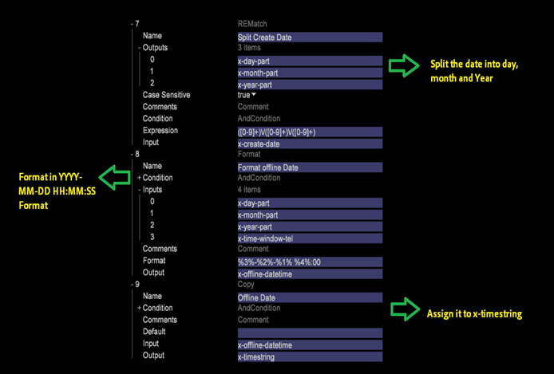

# Tijd van gebeurtenis instellen{#setting-up-event-time}

{{eol}}

Deze sectie verklaart hoe te om timestamps voor een dataset van de Data Workbench tot stand te brengen.

## De tijd van de gebeurtenis {#section-e10ef2b5b6244dc5b215836e3c77d663}

De Tijd van de gebeurtenis is de datum en de tijd waarop het verzoek (of de gebeurtenis) voorkomt.

Gewoonlijk, voor online gegevens, *x_hit_time_gmt* wordt gebruikt als tijdstempelveld. De tijd van de vraag kan als timestamp voor off-line gegevens (zoals de gegevens van het vraagcentrum) worden gebruikt. Dit is een verplicht veld en alle gegevensbronnen moeten één veld bevatten dat als tijdstempel kan worden gebruikt. Deze informatie moet door uw organisatie worden verstrekt.

In DWB leggen de volgende vooraf gedefinieerde variabelen het tijdstempel vast:

<table id="table_C24BD56CEB4E42F68D645EBB65585D16"> 
 <tbody> 
  <tr> 
   <td colname="col1"><i>x-timestamp</i> </td> 
   <td colname="col2"> 
 De datum en tijd (GMT) waarop het verzoek door de server is ontvangen. De tijd wordt uitgedrukt als het aantal 100 nanoseconden sinds 1 januari 1600. 
 
Voorbeeld: 12771098932000000 <i>x-timestamp</i> waarde voor 11:28:52.000000 op dinsdag 13 september 2005. 
 </td> 
  </tr> 
  <tr> 
   <td colname="col1"><i>x-timestring</i> </td> 
   <td colname="col2"> <i>x-timestamp</i> in de notatie YYYY-MM-DD HH:MM:SS.mmm. </td> 
  </tr> 
  <tr> 
   <td colname="col1"><i>x-unixtime</i> </td> 
   <td colname="col2"> <i>x-unixtime</i> is de epoc-tijd die het aantal seconden vertegenwoordigt dat is verstreken sinds 1 januari 1970, op 00:00:01. </td> 
  </tr> 
 </tbody> 
</table>

Op basis van de notatie van het datumveld wordt x-timestamp of x-unixtime of x-timestring gebruikt. Als de binnenkomende gegevens bijvoorbeeld de notatie YYYY-MM-DD hebben, moet de x-timetekenreeks worden gebruikt.

De tijdstempel wordt gedefinieerd in een van de indelingen en DWB genereert intern de andere twee indelingen. Dit zijn ook vooraf gedefinieerde DWB-velden en dezelfde naam mag niet worden gebruikt voor andere velden.

## Tijdzones gedefinieerd in DWB {#section-3cdd12254342442b917376661e1d9c9f}

Als het datumveld een van de onderstaande tijdzones bevat, neemt DWB de volledige rij in die specifieke tijdzone in overweging. Voor één bestand is de datum bijvoorbeeld gedefinieerd als 2015-01-01 00:00:00 gmtand een ander bestand heeft de waarde 2015-01-01 00:00:00 cst, dan zal de datum van het eerste dossier in GMT timezone worden overwogen terwijl de datum van het tweede dossier in CET timezone zal zijn.

| Code | Tijdzone |
|---|---|
| gmt | Greenwich Mean |
| testen | Eastern Standard |
| edt | Oosters daglicht |
| cst | Centrale standaard |
| cdt | Centraal daglicht |
| mst | Mountain Standard |
| mdt | Berg daglicht |
| pst | Pacific Standard |
| pdt | Pacific Daylight |

>[!NOTE]
>
>DWB verwerkt alleen de bovengenoemde tijdzones.

## Aangepaste tijdzones instellen {#section-7c351921f22b439b81c73f40d5b47536}

DWB verwerkt de verschuiving niet in de tijdzone. Als u de verschuiving in Tijdzone wilt overwegen, moeten de gegevens worden opgemaakt in die tijdzone voor verschuiving.

Voorbeeld: om het datumformaat in CST tijdzone te overwegen, zouden de gegevens in JJJJ-MM-DD HH moeten komen:MM:SS UTC +/-HMM formaat van de cliënt.

2015-10-18 05:00:00 UTC -0200

## Tijd/tijdstempel voor gebeurtenis instellen {#section-81507080f0b44ae6b83d3650ba019812}

Gebaseerd op de datumveldindeling, *x-timestamp, x-unixtime* of *x-timestring* variable wordt gebruikt. In het onderstaande voorbeeld, sinds *x-hit_time_gmt* komt in unix epoc formaat, *x-unixtime* wordt gebruikt.

In de DWB [!DNL foundation.cfg] bestand (of een ander configuratiebestand in de map Dataset log processing), gebruikt u de transformatie Copy om de tijd van de gebeurtenis in te stellen zoals wordt weergegeven:

Op basis van de datumveldindeling wordt een x-timestamp-, x-unixtime- of x-timestring-variabele gebruikt. In het onderstaande voorbeeld wordt x-unixtime gebruikt, aangezien de x-hit_time_gmt in de unix epoc-indeling wordt geleverd.

In stight foundation.cfg (of een andere config onder Datasetà logverwerkingsomslag), gebruik de transformatie van het Exemplaar om de Tijd van de Gebeurtenis zoals hieronder getoond te plaatsen: 

Als de datum in YYYY-MM-DD HH is:MM:In de notatie SS.mmm wordt x-timestring gebruikt. Voorbeeld: Als het datumveld een andere notatie heeft dan in DWB is gedefinieerd, bijvoorbeeld YYYY/MM/DD, moet u het eerst opmaken in een van de tijdstempelnotatie die door de DWB wordt geaccepteerd en vervolgens toewijzen aan de corresponderende variabele. In het onderstaande schermafbeelding wordt de datum eerst omgezet in de notatie JJJJ-MM-DD en vervolgens toegewezen aan *x-timestring *variable. 
