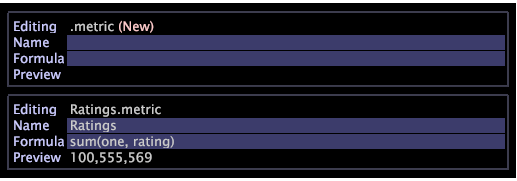

# Metrische instelling{#metrics-setup}

{{eol}}

In deze sectie wordt uitgelegd hoe u metriek kunt maken in de Data Workbench.

## Werken met metriek {#section-f0412e851fcb4ac9886dca4003d42cec}

De metriek zijn kwantitatieve informatie over klantenactiviteit, zoals Bekijken, Orden, aantal gemaakte vraag, en Inkomsten. De metriek zijn de stichting van rapporten en helpen u gegevensverhoudingen bekijken en begrijpen.

Met Metrische Dimension kunt u metrische tellingen groeperen op een specifiek niveau. Het staat u ook toe om metrische tellingen door een specifiek niveau te groeperen.

## Nieuwe metriek maken {#section-60a413899d1b4707965e06fb5ef7fc4e}

Voer de onderstaande stappen uit om een nieuwe metrische waarde te maken:

1. Klikken **Gereedschap** > **Metrische editor**.

1. In de metrische redacteur, ga de nieuwe Metrische naam en de formule in. 

1. Sla het bestand op in de map Metrics. 

## Afgeleide metriek maken en bewerken {#section-ebdcd3ec652f485e90e001d694eab6d0}

Gebruik een metrische editor om een nieuwe metrische waarde te definiëren op naam, formule en indeling, die wordt opgeslagen in de [!DNL User\profile_name\Metrics] voor later gebruik.

1. Open een nieuwe metrische editor met de **Beheer > Profiel** of door met de rechtermuisknop op de kolom Gebruiker te klikken voor de map waarin u de metrische waarde wilt maken en op **Maken > Nieuw metrisch**. Er wordt een metrische editor weergegeven.

1. In de *Naam* typt u een naam voor de nieuwe metrische waarde.

   >[!NOTE]
   >
   >Spaties ( ) zijn toegestaan terwijl onderstrepingstekens (_) dat niet doen. Bovendien kunt u de volgende symbolen niet gebruiken: + - &#42; /

   

1. In de *Formule* parameter, typt u een expressie voor de nieuwe metrische waarde.

   >[!NOTE]
   >
   >Filters moeten tussen haakjes worden gedefinieerd [ ] in de expressie. Voor extra metrische regels van de uitdrukkingssyntaxis, zie [Syntaxis voor metrische expressies.](https://experienceleague.adobe.com/docs/data-workbench/using/client/qry-lang-syntx/c-syntx-mtrc-exp.html)

   Deze lijst verstrekt steekproefuitdrukkingen voor uitgebreide metriek. 

   >[!NOTE]
   >
   >Wanneer een aangewezen uitdrukking is ingegaan, toont de voorproeflijn de waarde van nieuwe metrisch. Als de expressie een fout bevat, wordt een foutbericht weergegeven in de voorbeeldregel.

1. Klik met de rechtermuisknop en selecteer **Opslaan**. Wanneer u metrisch bewaart, wordt een dossier dat nieuwe metrisch vertegenwoordigt gecreeerd op uw computer in DWB *Installatiemap \Gebruiker\profielnaam\Metriek* map.

## Bestaand afgeleide gegevens bewerken {#section-4b5b7baf885b45cc8b358d1bd774e925}

1. Klik in Profielbeheer of Metriekbeheer in de kolom Profielnaam met de rechtermuisknop op het vinkje voor het metrische bestand dat u wilt bewerken en klik op **Lokaal maken**.
1. Klik met de rechtermuisknop op het vinkje voor het metrische bestand in de kolom Gebruiker en klik op **Openen** van de werkbank.

   >[!NOTE]
   >
   >U kunt een Metrische Redacteur ook openen door om het even welk metrisch-verwant gebied binnen een visualisatie met de rechtermuisknop aan te klikken om het metrische menu te tonen.

1. In de **Metrische editor** Bewerk en sla de metrische definitie indien nodig op met Stap 2-4 in *Nieuwe afgeleide metriek maken*.

   Als u wilt dat alle gebruikers van het profiel de metrische waarde gebruiken die u hebt bewerkt, moet u deze naar het werkprofiel publiceren met behulp van Profielbeheer.

Raadpleeg de documentatie voor meer hulp:

[Syntaxis voor metrische expressies](https://experienceleague.adobe.com/docs/data-workbench/using/client/qry-lang-syntx/c-syntx-mtrc-exp.html)

[Afgeleide metriek maken en bewerken](https://experienceleague.adobe.com/docs/data-workbench/using/client/admin-ui/profile-mgr/c-drvd-mtrcs.html)
