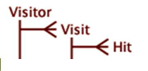

# De Veranderingen van de configuratie voor Nieuw Schema{#configuration-changes-for-new-schema}

Dit document verklaart hoe te om alle configuraties van de Werkbank van standaardGegevens te veranderen nadat het nieuwe schema op zijn plaats is.

## Het begrip van het Schema van de Dataset {#section-2ffac5170c894781bc943565af7ad479}

De stichting van het datasetschema bestaat uit een zeer belangrijke reeks verhoudingen die de backbone van het schema van de het Webanalyse van de Werkbank van Gegevens vormen. In het volgende voorbeeld, verstrekt het typische schema van de Webanalyse een idee van het verband tussen een bezoeker, een bezoek, en een paginamening. 

* Elke bezoeker kan een of meer bezoeken afleggen.
* Een bepaald bezoek wordt door slechts één bezoeker gegenereerd.
* Een bepaald bezoek kan een of meer paginaweergaven bevatten.
* Om het even welke bepaalde paginamening behoort tot slechts één bezoek. `<discoiqbr>`

Naarmate het web en het bedrijfsleven zich in de loop der jaren hebben ontwikkeld, zijn ook de behoeften aan web- en gegevensanalyse veranderd. De websites begonnen als plaatsen om inhoud te bekijken. Nu, je kan naar inhoud kijken; op elkaar inwerkend door letters, video, of voorlegging corresponderen; aankoopproducten; en nog veel meer. Bovendien willen de ondernemingen nu hun Webgegevens met andere kanalen van gegevens in hun zaken integreren om een betere mening van hun zaken als geheel te bereiken. Bijvoorbeeld, kunnen de zaken hun Web, call centre, e-mail, sociale, en opslag en klantengegevens willen integreren samen. Met deze integratie van off-line en online kanalen zijn de datasetschema&#39;s geëvolueerd over de jaren waar geen twee datasetschema&#39;s het zelfde zijn.

`<discoiqbr>`Wanneer u de online en off-line gegevens integreert, lijkt de term &quot;bezoeker&quot;niet altijd aangewezen. Dientengevolge, wordt de term &quot;klant&quot;soms gebruikt in plaats van de bezoeker.  

Het niveau &quot;van de Overeenkomst&quot;wordt gebruikt om één enkele mening van tijd toe te laten, wanneer u gegevens uit veelvoudige gegevensbronnen hebt. Bijvoorbeeld, veronderstel u slechts één enkele gegevensbron hebt: e-commercegegevens verzameld door bezoekersactiviteit op uw website. In dat geval, wijst het niveau van het Bezoek op bezoeken aan uw plaats van die bezoekers. Merk op dat de afmetingen van de tijd - &#39;Dag&#39;, &#39;Week&#39;, &#39;Maand&#39;, enz. - doorgaans worden vastgelegd op het niveau &quot;Bezoek&quot;.

Op dezelfde manier brengt het niveau van de &quot;Gebeurtenis&quot;alle gebeurtenissen (paginamening, vraag die aan call centre wordt gemaakt etc.) tijdens een overeenkomst gebeurde. Het combineert alle online en off-line gebeurtenissen voor een klant tijdens een overeenkomst.

## Nieuwe Countable Structure in DWB {#section-b77638ec04e4441cb51c56fd3d4abeb6}

De nieuwe schemastructuur vervangt Bezoeker door Klant, Bezoek door Overeenkomst en Hit door Gebeurtenis. 

## De Veranderingen van de configuratie zoals per Nieuw Schema van de Dataset {#section-27135515be5c471ba2ee879d1ef4771f}

Om het datasetschema van bezoeker in klant te veranderen, moet u de volgende configuratiedossiers veranderen:

1. Alle configuratiedossiers onder de omslag van de Dataset waar de telbare en uitgebreide afmetingen worden bepaald. 

1. Configuratiebestanden in de map Dimension, waar de &quot;bezoeker&quot;, het &quot;bezoek&quot; of de &quot;gebeurtenis&quot; worden gebruikt als Niveau.

   Voorbeeld: Campaign.cfg-bestand. In het profiel van Adobe SC, wordt de Campagne bepaald op het niveau van het Bezoek. 

   Het volgende voorbeeld verstrekt een idee van de verandering van het ouderschema van Bezoek aan Overeenkomst: 

1. Aangezien sommige metriek worden afgeleid of uit tellen gecreeerd, moeten de configuratiedossiers onder de omslag van Metriek worden gewijzigd of worden gecreeerd.

   Bijvoorbeeld: creeer nieuwe metrisch [!DNL Customers.metric with formula = sum(one,customer)] of als Pagina Views.metric om het op het klapniveau te *bepalen* . Wijzig metrisch, en verander dan het niveau in Gebeurtenis in plaats van Hit.

   Metirc van de Metirc van de Meningen van de Pagina van Adobe SC die op het niveau van Hits wordt bepaald: 

   `<discoiqbr>` `<discoiqbr>`Het volgende zal metrisch de Meningen van de Pagina zoals per het nieuwe schema zijn: 

1. Verander *order.txt* in de metriekomslag zodat het op de nieuwe of gewijzigde metriek met betrekking tot de Klant, de Overeenkomst en de Gebeurtenis wijst.

   Adobe *SC order.txt* -bestand. 

   *Order.txt* - dossier met nieuwe schemaveranderingen: 

1. Alle configuratiedossiers (.vw) onder de omslag van de Visualisatie zou moeten worden veranderd om naar nieuwe niveaus te verwijzen: Klant, service en gebeurtenis. Bijvoorbeeld: 2D-proceskaart, 3D-proceskaart, enz.

   De standaard van Adobe SC URI.vw voor 2D procesKaart wordt bepaald op het niveau van de Hit en de Groep van het Bezoek zoals hieronder getoond: 

   De veranderingen die in URI.vw voor nieuw schema moeten worden aangebracht: 

