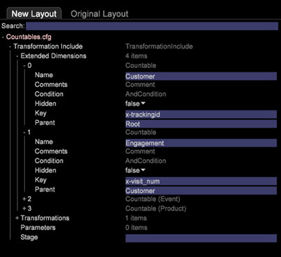
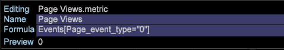

# Wijzigingen in configuratie voor nieuw schema{#configuration-changes-for-new-schema}

{{eol}}

Dit document verklaart hoe te om alle standaardconfiguraties van de Data Workbench te veranderen nadat het nieuwe schema op zijn plaats is.

## Het schema van de Dataset begrijpen {#section-2ffac5170c894781bc943565af7ad479}

De stichting van het datasetschema bestaat uit een zeer belangrijke reeks verhoudingen die de backbone van het schema van de het Webanalyse van de Data Workbench vormen. In het volgende voorbeeld biedt een standaard webanalytisch schema een idee van de relaties tussen een bezoeker, een bezoek en een paginaweergave. 

* Elke bezoeker kan een of meer bezoekers hebben.
* Een bepaald bezoek wordt door slechts één bezoeker gegenereerd.
* Een bepaald bezoek kan een of meer paginaweergaven bevatten.
* Elke gegeven paginaweergave behoort tot slechts één bezoek. `<discoiqbr>`

Naarmate het web en het bedrijfsleven zich in de loop der jaren hebben ontwikkeld, zijn ook de behoeften van web- en gegevensanalyse veranderd. Websites zijn begonnen als plaatsen om de inhoud te bekijken. Nu, kunt u inhoud bekijken; interactief corresponderen via chats, video of inzendingen; de aankoop van producten; en nog veel meer. Bovendien willen de ondernemingen nu hun Webgegevens met andere kanalen van gegevens in hun zaken integreren om een beter overzicht van hun zaken als geheel te krijgen. Bedrijven willen bijvoorbeeld hun web-, call center-, e-mail-, sociale en winkelgegevens en klantgegevens integreren. Met deze integratie van off-line en online kanalen zijn de datasetschema&#39;s geëvolueerd in de jaren waarin geen twee datasetschema&#39;s het zelfde zijn.

`<discoiqbr>`Wanneer u de online en offline gegevens integreert, lijkt de term &quot;bezoeker&quot;niet altijd aangewezen. Hierdoor wordt soms de term &quot;klant&quot; gebruikt in plaats van de bezoeker.  

Het niveau van de &quot;Betrokkenheid&quot;wordt gebruikt om één enkele mening van tijd toe te laten, wanneer u gegevens uit veelvoudige gegevensbronnen hebt. Stel dat u slechts één gegevensbron hebt: e-commercegegevens die door bezoekersactiviteit op uw website worden verzameld. In dat geval geeft het bezoekniveau aan dat deze bezoekers uw site bezoeken. Merk op dat tijdafmetingen - &#39;Dag&#39;, &#39;Week&#39;, &#39;Maand&#39;, enz. - doorgaans op bezoekniveau worden vastgelegd.

Op dezelfde manier brengt het niveau van de &quot;Gebeurtenis&quot;alle gebeurtenissen (paginamening, vraag die aan callcenter wordt gemaakt enz.) tijdens een overeenkomst gebeurde. Het combineert alle online en offline gebeurtenissen voor een klant tijdens een overeenkomst.

## Nieuwe telbare structuur in DWB {#section-b77638ec04e4441cb51c56fd3d4abeb6}

De nieuwe schemastructuur vervangt Bezoeker door Klant, Bezoek door Betrokkenheid en Actief door Gebeurtenis. 

## De Veranderingen van de configuratie zoals per Nieuw Dataset Schema {#section-27135515be5c471ba2ee879d1ef4771f}

Om het datasetschema van bezoeker in klant te veranderen, moet u de volgende configuratiedossiers veranderen:

1. Alle configuratiedossiers onder de omslag van de Dataset waar telbare en uitgebreide afmetingen worden bepaald. 

1. De dossiers van de configuratie onder de omslag van Dimension, waar &quot;bezoeker&quot;, &quot;bezoek&quot;of &quot;gebeurtenis&quot;als Niveau worden gebruikt.

   Voorbeeld: Campaign.cfg, bestand. In het profiel Adobe SC wordt Campagne gedefinieerd op Bezoek. 

   In het volgende voorbeeld wordt een idee gegeven van de wijziging van het bovenliggende schema van Visit in Engagement: 

1. Aangezien sommige metriek worden afgeleid of uit tellen gecreeerd, moeten de configuratiedossiers onder de omslag van Metriek worden gewijzigd of worden gecreeerd.

   Bijvoorbeeld: een nieuwe metrische waarde maken [!DNL Customers.metric with formula = sum(one,customer)] of als Paginaweergaven.metrisch naar *definiëren* op het raakniveau. Wijzig metrisch, en verander dan het niveau in Gebeurtenis in plaats van Actief.

   Metirc voor weergave van Adobe SC-pagina gedefinieerd op Hits-niveau: 

   `<discoiqbr>` `<discoiqbr>`Hieronder ziet u de metrische weergave van paginaweergaven volgens het nieuwe schema: 

1. Wijzig de *order.txt* in de map Metrics zodat deze de nieuwe of gewijzigde metriek weerspiegelt die betrekking heeft op de klant, betrokkenheid en gebeurtenis.

   Adobe *SC order.txt* bestand. 

   *Order.txt* bestand met nieuwe schemawijzigingen: 

1. Alle configuratiebestanden (.vw) in de map Visualization moeten worden gewijzigd om naar nieuwe niveaus te verwijzen: Klant, betrokkenheid en gebeurtenis. Bijvoorbeeld: 2D-procestoewijzing, 3D-procestoewijzing enz.

   Adobe SC standaard URI.vw voor 2D procesKaart wordt bepaald op het niveau van het Actief en de Groep van het Bezoek zoals hieronder getoond: 

   Wijzigingen die moeten worden aangebracht in URI.vw voor nieuw schema: 
